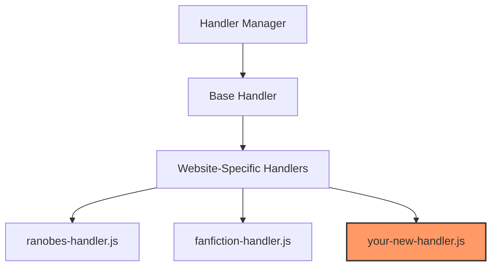
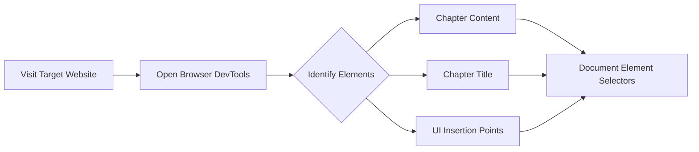
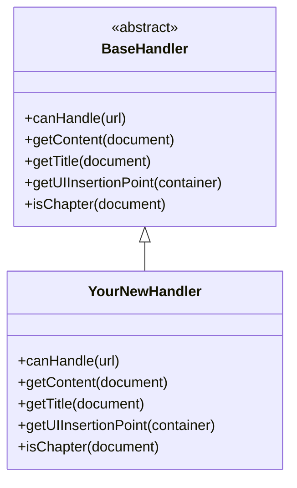
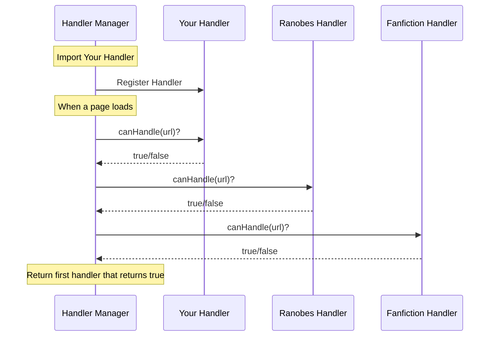
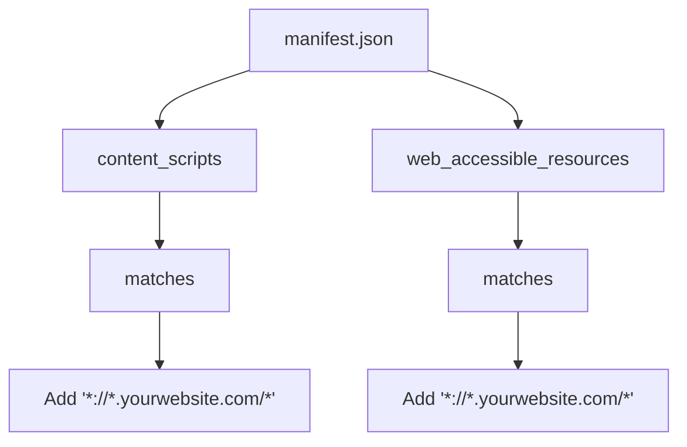
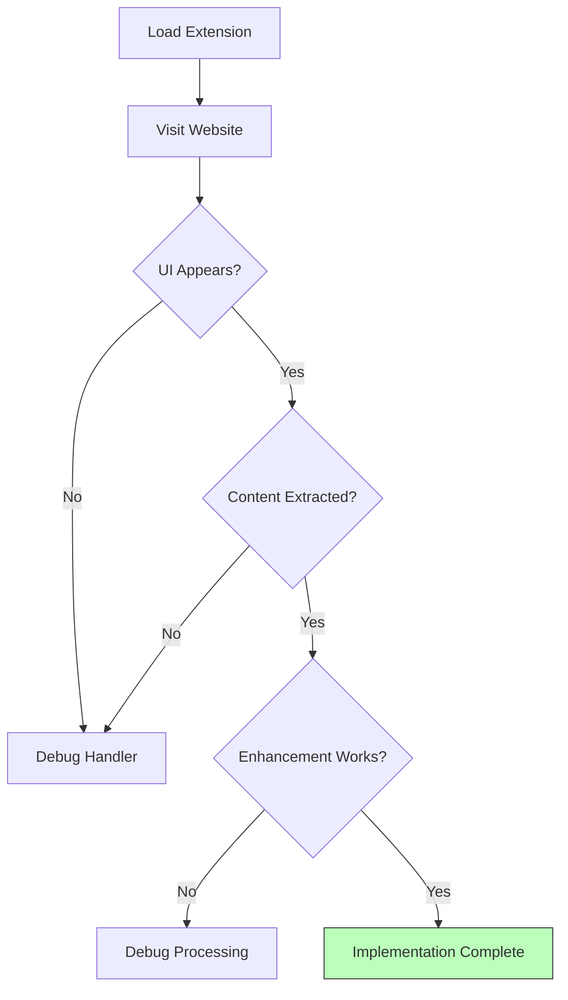

# Adding Support for New Websites

This guide explains how to add support for new novel websites to the Ranobe Gemini Firefox extension.

## Overview

Ranobe Gemini uses a modular website handler system that allows it to support different websites through specialized handler classes. Each handler knows how to extract content from a specific website's DOM structure.



## Step-by-Step Process

### 1. Identify the Website's DOM Structure



First, you need to understand how the target website structures its content:

1. Visit a chapter page on your target website
2. Open your browser's DevTools (F12 or right-click > Inspect)
3. Identify the DOM elements that contain:
   - The chapter content (main text)
   - The chapter title
   - Good places to insert the extension's UI elements
4. Note the CSS selectors or DOM traversal needed to reliably locate these elements

### 2. Create a New Handler File

Create a new file in `utils/website-handlers/` named after the website (e.g., `royalroad-handler.js`).

### 3. Implement the Handler Class



Here's a template for your new handler:

```javascript
// Import the base handler
import BaseHandler from './base-handler.js';

class YourWebsiteHandler extends BaseHandler {
    // Determine if this handler can process the current URL
    canHandle(url) {
        return url.includes('yourwebsite.com');
    }

    // Check if the current page is a chapter page
    isChapter(document) {
        // Return true if this page contains a chapter
        // Example: return document.querySelector('.chapter-content') !== null;
    }

    // Extract the chapter content
    getContent(document) {
        const contentElement = document.querySelector('selector-for-content');
        if (!contentElement) return null;

        // Return the text content or innerHTML as appropriate
        return contentElement.textContent;
    }

    // Extract the chapter title
    getTitle(document) {
        const titleElement = document.querySelector('selector-for-title');
        if (!titleElement) return 'Unknown Chapter';

        return titleElement.textContent.trim();
    }

    // Determine where to insert the extension's UI
    getUIInsertionPoint(container) {
        const insertionPoint = document.querySelector('selector-for-insertion');

        return {
            element: insertionPoint || container,
            position: 'before' // or 'after', 'prepend', 'append'
        };
    }
}

export default YourWebsiteHandler;
```

### 4. Register Your Handler



Open `utils/website-handlers/handler-manager.js` and register your new handler:

```javascript
import YourWebsiteHandler from './your-website-handler.js';

// In the registerHandlers method
registerHandlers() {
    // ...existing handlers...
    this.registerHandler(new YourWebsiteHandler());
}
```

### 5. Update the Manifest File



Update the `manifest.json` file to include your new website in the content script matching patterns:

```json
"content_scripts": [
    {
        "matches": [
            "*://*.ranobes.top/*",
            "*://*.fanfiction.net/*",
            "*://*.yourwebsite.com/*"  // Add your website's pattern
        ],
        "js": ["content/content.js"],
        "css": ["content/content.css"],
        "run_at": "document_idle"
    }
],
"web_accessible_resources": [
    {
        "resources": [
            "icons/*.png",
            "utils/*.js",
            "utils/website-handlers/*.js"
        ],
        "matches": [
            "*://*.ranobes.top/*",
            "*://*.fanfiction.net/*",
            "*://*.newsite.com/*" // Add new site match pattern
        ]
    }
]
```

### 6. Test Your Implementation



1. Load your modified extension in Firefox (about:debugging)
2. Visit a chapter page on your target website
3. Check if:
   - The extension UI appears
   - It correctly extracts the chapter content
   - Enhancement and summarization work as expected
4. Fix any issues in your handler implementation

### 7. Submit Your Contribution

When your implementation is working correctly, submit a pull request with your changes.

## Common Challenges and Solutions

### Challenge: Complex Content Structure

Some websites have complex content structures with advertisements, annotations, or multi-part content.

**Solution**: You may need to combine multiple DOM elements or remove unwanted elements:

```javascript
getContent(document) {
    const contentBlocks = document.querySelectorAll('.chapter-paragraph');
    if (!contentBlocks.length) return null;

    let content = '';
    contentBlocks.forEach(block => {
        // Filter out advertisements or special blocks
        if (!block.classList.contains('ad-block')) {
            content += block.textContent + '\n\n';
        }
    });

    return content;
}
```

### Challenge: Dynamic Content Loading

Some websites load chapter content dynamically after the page loads.

**Solution**: Implement a wait and retry mechanism:

```javascript
async getContent(document) {
    let attempts = 0;
    const maxAttempts = 5;

    while (attempts < maxAttempts) {
        const content = document.querySelector('.chapter-content');
        if (content && content.textContent.length > 0) {
            return content.textContent;
        }

        // Wait and try again
        await new Promise(resolve => setTimeout(resolve, 1000));
        attempts++;
    }

    return null; // Content not found after all attempts
}
```

### Challenge: Protected Content

Some websites have measures to prevent content extraction.

**Solution**: Focus on visible text rather than trying to bypass protections:

```javascript
getContent(document) {
    // Get visible text only - works with most protection systems
    // that hide text using CSS or obscure HTML structure
    const visibleText = Array.from(document.querySelectorAll('p, div'))
        .filter(el => {
            const style = window.getComputedStyle(el);
            return style.display !== 'none' &&
                   style.visibility !== 'hidden' &&
                   el.textContent.trim().length > 0;
        })
        .map(el => el.textContent.trim())
        .join('\n\n');

    return visibleText.length > 100 ? visibleText : null;
}
```

## Guidelines for Good Handlers

1. **Robustness**: Your handler should work across different chapter formats on the same site
2. **Performance**: Minimize DOM queries and processing
3. **Maintainability**: Add comments explaining any complex logic
4. **Respect**: Don't bypass paywalls or access protected content
5. **Testing**: Test your handler on various chapters and book types
