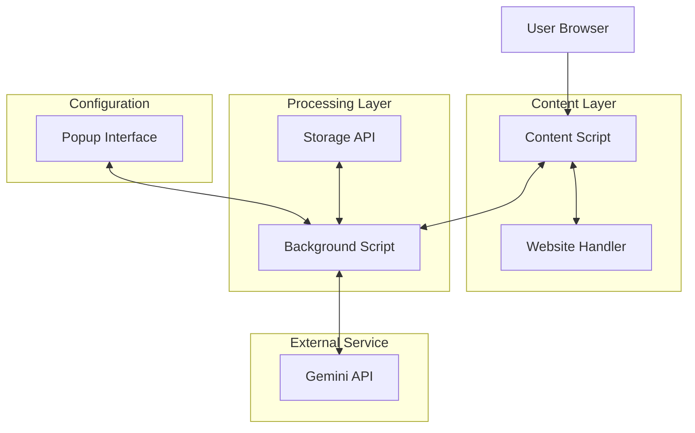
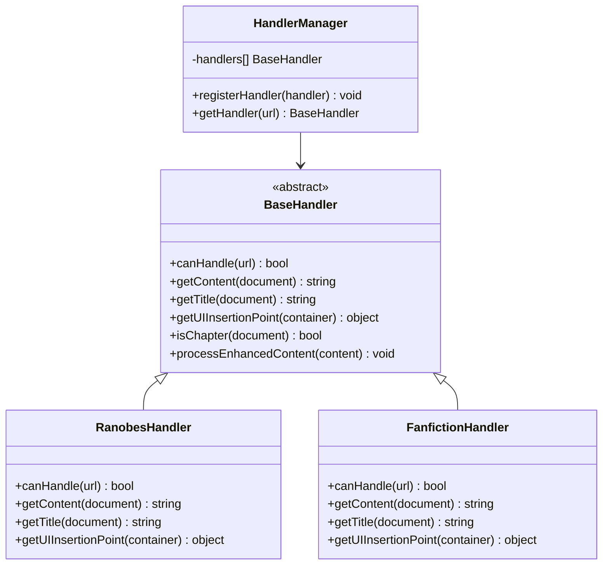
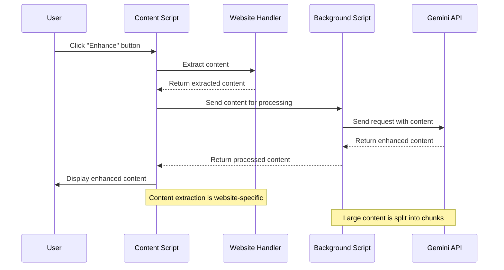
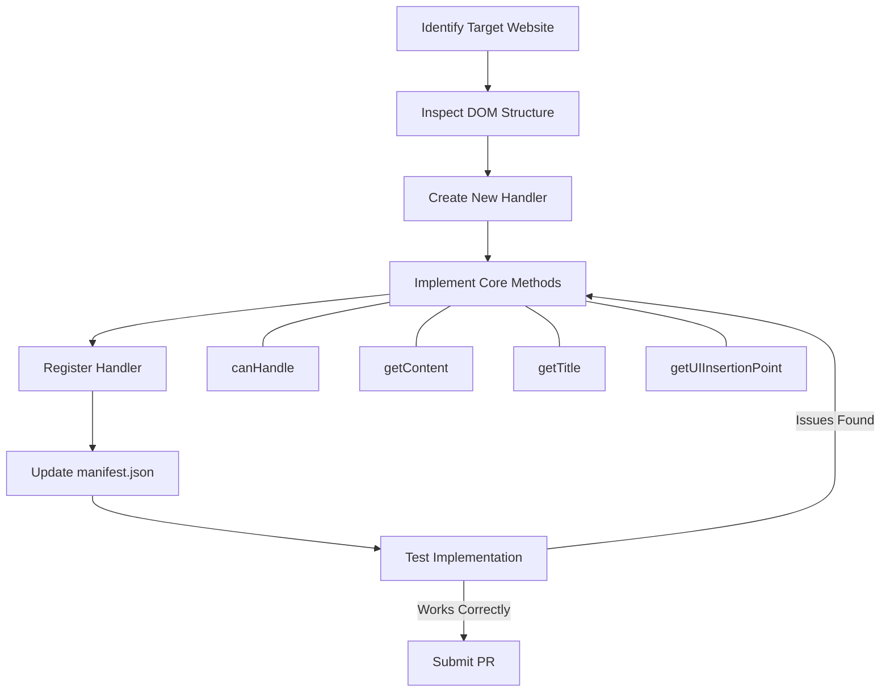

# Ranobe Gemini Architecture

This document provides an overview of the Ranobe Gemini Firefox extension's architecture, explaining how the different components work together and the design principles behind the system.

## Overview

Ranobe Gemini is a Firefox extension designed to enhance the reading experience on web novel sites using Google's Gemini AI. The extension integrates with various novel reading websites to extract chapter content, process it via Gemini API, and then enhance or summarize the content.

## System Architecture

## Extension Components

The extension is organized into several key components:

### 1. Content Scripts (`content/`)

Content scripts are injected into web pages to interact with and modify the page content.

- **content.js**: The main script that:
  - Detects and extracts chapter content using website-specific handlers
  - Injects UI elements (Enhance/Summarize buttons) into the page
  - Handles user interactions with these elements
  - Processes content through Gemini AI via the background script
  - Replaces or augments page content with AI-enhanced versions
  - Provides adaptive layout for both mobile and desktop interfaces

- **content.css**: Contains all styles for:
  - Button appearances
  - Summary display formatting
  - Enhanced content styling
  - Status messages and notifications
  - Theme integration (light/dark mode support)
  - Responsive design styles for mobile and desktop layouts

### 2. Background Script (`background/`)

The background script runs persistently in the extension context.

- **background.js**: Responsible for:
  - Managing the Gemini API connections
  - Handling API key storage and validation
  - Processing content through different Gemini models
  - Implementing chunking strategies for large content
  - Managing token limits and context size
  - Coordinating communication between popup and content scripts

### 3. Popup Interface (`popup/`)

The browser action popup provides user configuration options.

- **popup.html/js**: The user interface for:
  - API key configuration
  - Model selection
  - Customizing enhancement and summary prompts
  - Setting advanced options like token limits
  - Testing connection to Gemini API

### 4. Website Handlers (`utils/website-handlers/`)

Modular components that provide website-specific extraction logic.

- **base-handler.js**: The abstract base class defining the handler interface
- **handler-manager.js**: Factory that selects the appropriate handler for a given website
- **Website-specific handlers**: Implement extraction logic for different websites:
  - **ranobes-handler.js**: Handler for ranobes.top website
  - **fanfiction-handler.js**: Handler for fanfiction.net website
  - Additional handlers can be added for new websites

### 5. Utility Modules (`utils/`)

Supporting modules that provide shared functionality.

- **constants.js**: Configuration constants like API endpoints, default settings
- **content.js**: Helper functions for content processing

## Data Flow

1. **Content Detection**:
   - Content script loads and detects if the current page contains novel content
   - Website-specific handler is selected based on the current domain
   - Chapter content is automatically extracted

2. **User Interaction**:
   - User clicks the "Enhance" or "Summarize" button
   - Content script extracts the chapter content if not already done

3. **API Processing**:
   - Content is sent to the background script via message passing
   - Background script validates API key and processes the content through Gemini
   - For large content, the background script splits it into manageable chunks
   - Background script receives the processed content and sends it back to the content script

4. **Content Display**:
   - Content script replaces or augments the page with processed content
   - User can toggle between original and enhanced content

## Design Principles

1. **Progressive Enhancement**: The extension enhances existing functionality without breaking the original experience.

2. **Modularity**: Components are designed to be independent and maintainable.

3. **Adaptability**: The system can adapt to different websites through the handler architecture.

4. **Responsiveness**: The UI adapts to both mobile and desktop environments.

5. **Theme Integration**: The extension styling integrates with site themes and respects dark/light mode preferences.

## Adding Support for New Websites

To add support for a new website:

1. Create a new handler file in the `utils/website-handlers/` directory
2. Extend the base-handler class to implement website-specific extraction logic
3. Register the new handler in handler-manager.js
4. Test thoroughly on the target website

For detailed instructions, see [ADDING_NEW_WEBSITES.md](ADDING_NEW_WEBSITES.md).

## Technical Constraints

- **Browser API Compatibility**: Limited to Firefox extension APIs (browser.* namespace)
- **Cross-Origin Restrictions**: Content scripts can only modify content on the page they're injected into
- **Gemini API Limits**: Processing is constrained by Gemini API token limits and rate limits

## Future Architecture Considerations

Areas for potential architectural improvement:

- Improved caching strategy for processed content
- Service worker implementation for better resource management
- Manifest V3 compatibility planning
- Support for additional AI models beyond Gemini
