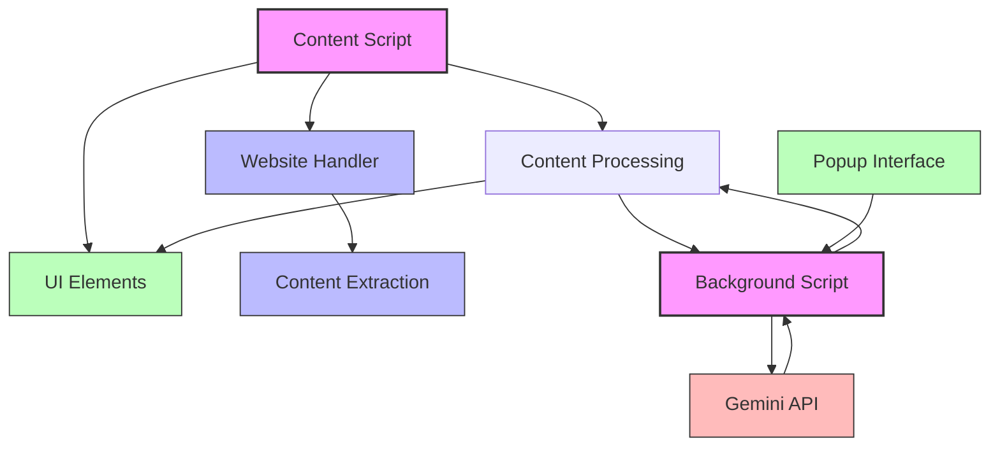
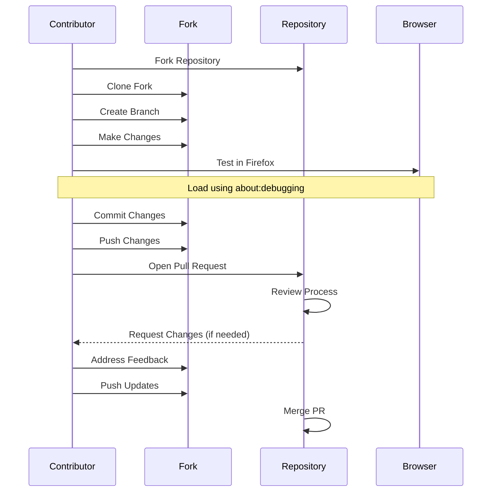
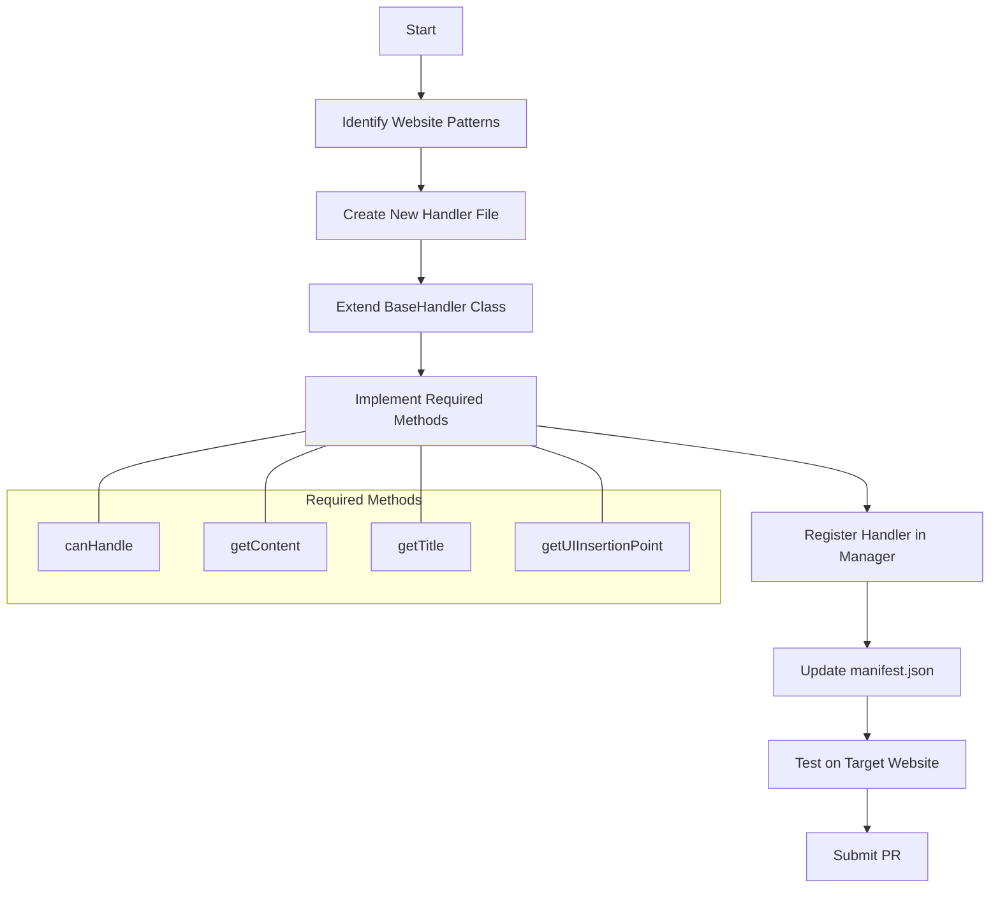

# Contributing to Ranobe Gemini

Thank you for your interest in contributing to the Ranobe Gemini Firefox extension!

We welcome contributions in various forms, including bug reports, feature requests, documentation improvements, and code contributions.

## Understanding the Codebase

Before making contributions, it's recommended to familiarize yourself with the extension's architecture:

* **Architecture Overview**: The [ARCHITECTURE.md](ARCHITECTURE.md) document provides a comprehensive overview of the extension's components, data flow, and design principles.
* **Website Handler System**: If adding support for new websites, see [ADDING_NEW_WEBSITES.md](ADDING_NEW_WEBSITES.md).
* **Version History**: Check the [CHANGELOG.md](CHANGELOG.md) to understand recent changes and improvements.

### Extension Architecture Diagram

## How to Contribute

1.  **Reporting Issues**: If you find a bug or have a suggestion, please check the [GitHub Issues](https://github.com/Life-Experimentalist/RanobeGemini/issues) page to see if it has already been reported. If not, feel free to open a new issue, providing as much detail as possible (browser version, steps to reproduce, screenshots, etc.).

2.  **Suggesting Enhancements**: For feature requests or ideas, please open an issue and describe the enhancement you'd like to see.

3.  **Code Contributions**: If you'd like to contribute code:
    *   **Fork the Repository**: Create your own fork of the [RanobeGemini repository](https://github.com/Life-Experimentalist/RanobeGemini).
    *   **Create a Branch**: Create a new branch for your feature or bug fix (e.g., `git checkout -b feature/add-new-website` or `git checkout -b fix/summary-bug`).
    *   **Make Changes**: Implement your changes, following the project's coding style and structure.
        *   If adding support for a new website, please follow the guide in [ADDING_NEW_WEBSITES.md](ADDING_NEW_WEBSITES.md).
        *   Ensure your code is well-commented.
    *   **Test Your Changes**: Load the extension temporarily in Firefox (`about:debugging`) and thoroughly test your modifications.
    *   **Commit Your Changes**: Use clear and descriptive commit messages.
    *   **Push to Your Fork**: Push your changes to your forked repository.
    *   **Open a Pull Request (PR)**: Submit a pull request from your branch to the `main` branch of the original repository. Provide a clear description of the changes in your PR.

### Contribution Workflow

## Development Setup

*   The core code for the Firefox extension resides in the `src/` directory.
*   Load the extension temporarily in Firefox using `about:debugging` and selecting the `src/manifest.json` file.
*   Use the browser console (Ctrl+Shift+J) for debugging messages.

## Testing Guidelines

* Test on both desktop and mobile layouts
* Verify compatibility with both light and dark themes
* Check that features work with and without an API key
* Test on large chapters (10,000+ words) for chunking functionality
* Ensure cross-browser compatibility if applicable

## Adding Support for New Websites

Adding support for a new website involves creating a handler that inherits from the base handler class. Here's the workflow:

## Code Style

*   Please try to follow the existing code style (formatting, naming conventions).
*   Use clear variable and function names.
*   Add comments where necessary to explain complex logic.
*   Maintain responsive design principles for UI elements.
*   Respect theme integration with both light and dark modes.

## License

By contributing to this project, you agree that your contributions will be licensed under the Apache License, Version 2.0, as detailed in the [LICENSE](LICENSE) file.

We appreciate your contributions to making Ranobe Gemini better!