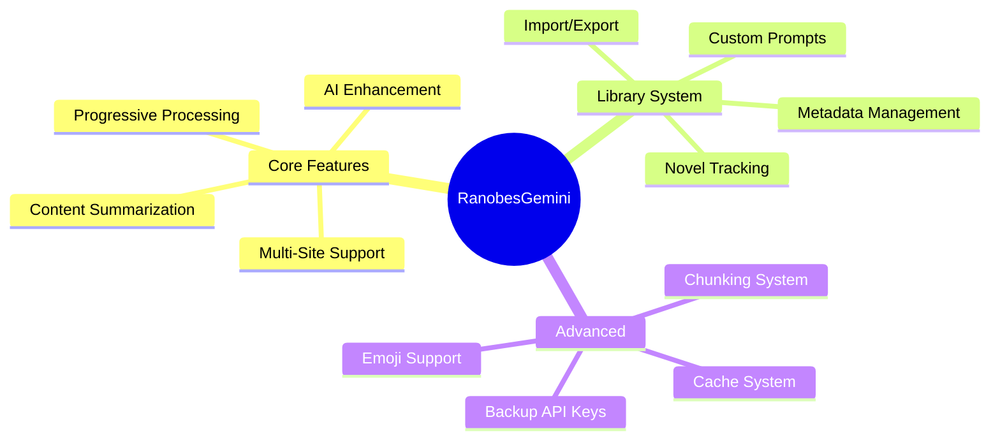
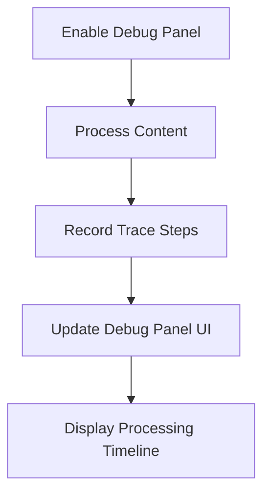

# RanobesGemini Documentation

> **Index:**

- [RanobesGemini Documentation](#ranobesgemini-documentation)
	- [📚 Welcome to RanobesGemini Documentation](#-welcome-to-ranobesgemini-documentation)
	- [🗂️ Documentation Structure](#️-documentation-structure)
		- [🏗️ Architecture](#️-architecture)
		- [✨ Features](#-features)
		- [📖 Guides](#-guides)
		- [🔧 Development](#-development)
	- [🚀 Quick Start](#-quick-start)
		- [For Users](#for-users)
		- [For Developers](#for-developers)
	- [📊 Feature Overview](#-feature-overview)
		- [Core Features](#core-features)
	- [🎯 Documentation by Role](#-documentation-by-role)
		- [I'm a User](#im-a-user)
		- [I'm a Contributor](#im-a-contributor)
		- [I'm a Developer](#im-a-developer)
		- [I'm a Maintainer](#im-a-maintainer)
	- [📖 Documentation Standards](#-documentation-standards)
		- [Structure](#structure)
		- [Diagrams](#diagrams)
		- [Formatting](#formatting)
	- [🗺️ Documentation Map](#️-documentation-map)
	- [🔍 Finding What You Need](#-finding-what-you-need)
		- [Common Questions](#common-questions)
		- [Search by Component](#search-by-component)
	- [🤝 Contributing to Documentation](#-contributing-to-documentation)
		- [Types of Contributions](#types-of-contributions)
		- [Contribution Process](#contribution-process)
		- [Documentation Standards Checklist](#documentation-standards-checklist)
	- [📊 Documentation Status](#-documentation-status)
		- [Completion Overview](#completion-overview)
		- [Recent Updates](#recent-updates)
	- [📞 Getting Help](#-getting-help)
		- [For Users](#for-users-1)
		- [For Developers](#for-developers-1)
		- [For Contributors](#for-contributors)
		- [Contact](#contact)
	- [🔄 Version Information](#-version-information)
		- [Version History](#version-history)

**Version:** 3.0.0
**Last Updated:** 2025-01-15
**Maintainer:** VKrishna04

---

## 📚 Welcome to RanobesGemini Documentation

This is the comprehensive documentation hub for the RanobesGemini Firefox extension - an AI-powered web novel enhancement tool using Google's Gemini AI.

---

## 🗂️ Documentation Structure

The documentation is organized into four main categories:

### 🏗️ [Architecture](./architecture/)

**Technical architecture, design patterns, and system components**

- [System Architecture](./architecture/ARCHITECTURE.md) - Comprehensive architectural overview
- [Dynamic Domains](./architecture/DYNAMIC_DOMAINS.md) - Multi-domain support system
- Component diagrams, data flow sequences, handler system

**For:** Developers, Contributors, Technical Users

---

### ✨ [Features](./features/)

**Detailed documentation for each major feature**

- Novel Library System
- Backup API Keys & Rotation
- Chunking & Progressive Enhancement
- Emoji Support
- Summary Modes (Long & Short)
- Custom Prompts

**For:** All Users, Feature Exploration

---

### 📖 [Guides](./guides/)

**Step-by-step guides for users and contributors**

- [Adding New Websites](./guides/ADDING_NEW_WEBSITES.md) - Complete handler creation guide
- Getting Started (planned)
- Configuration Guide (planned)
- Troubleshooting (planned)

**For:** New Users, Contributors, Troubleshooters

---

### 🔧 [Development](./development/)

**Development workflows, roadmap, and technical notes**

- [TODO](./development/TODO.md) - Feature roadmap and bug tracking
- Development setup, testing, release process

**For:** Developers, Contributors, Maintainers

---

## 🚀 Quick Start

### For Users

1. **Get API Key:** Visit [Google AI Studio](https://aistudio.google.com/app/apikey)
2. **Install Extension:** Load in Firefox from `about:debugging`
3. **Configure:** Open popup → Settings → Enter API key
4. **Enhance:** Visit a supported website and click "Enhance" on any chapter

**Supported websites:**
- ranobes.net (10+ domains)
- fanfiction.net (desktop & mobile)
- archiveofourown.org
- webnovel.com

### For Developers

1. **Clone:** `git clone https://github.com/Life-Experimentalist/RanobeGemini.git`
2. **Install:** `npm install`
3. **Develop:** `npm run watch`
4. **Load:** Firefox → `about:debugging` → Load `src/manifest.json`

**Read:** [Development Documentation](./development/README.md) | [Architecture](./architecture/ARCHITECTURE.md)

---

## 📊 Feature Overview



### Core Features

| Feature                    | Description                                       | Documentation                                   |
| -------------------------- | ------------------------------------------------- | ----------------------------------------------- |
| **AI Enhancement**         | Grammar correction, flow improvement, readability | [Architecture](./architecture/ARCHITECTURE.md)  |
| **Summarization**          | Long and short format chapter summaries           | [Features](./features/README.md)                |
| **Multi-Site Support**     | Extensible handler system for multiple websites   | [Adding Sites](./guides/ADDING_NEW_WEBSITES.md) |
| **Progressive Processing** | Real-time chunk-based processing with live UI     | [Features](./features/README.md)                |
| **Novel Library**          | Track reading progress, manage collections        | [Features](./features/README.md)                |
| **Backup Keys**            | Automatic failover, key rotation strategies       | [Features](./features/README.md)                |
| **Custom Prompts**         | Per-novel and global prompt customization         | [Features](./features/README.md)                |

---

## 🎯 Documentation by Role

### I'm a User

**I want to use the extension and understand its features**

1. ~~Getting Started Guide~~ → **Current:** Main project [README](../README.md)
2. ~~Configuration Guide~~ → **Current:** Extension popup help tab
3. [Features Overview](./features/README.md) - Learn about all features
4. ~~Troubleshooting Guide~~ → **Planned**

### I'm a Contributor

**I want to add support for a new website**

1. [Adding New Websites Guide](./guides/ADDING_NEW_WEBSITES.md) - Complete walkthrough
2. [Dynamic Domains](./architecture/DYNAMIC_DOMAINS.md) - Domain registration
3. [Development Workflow](./development/README.md) - Testing and submission

### I'm a Developer

**I want to understand or modify the codebase**

1. [Architecture Overview](./architecture/ARCHITECTURE.md) - System architecture
2. [Component Details](./architecture/ARCHITECTURE.md#extension-components) - Each component explained
3. [Processing Pipeline](./architecture/ARCHITECTURE.md#content-processing-pipeline) - Data flow
4. [Development Guide](./development/README.md) - Development workflows
5. [TODO](./development/TODO.md) - Current work and roadmap

### I'm a Maintainer

**I want to manage the project and releases**

1. [Development Documentation](./development/README.md) - Full dev workflows
2. [TODO](./development/TODO.md) - Feature backlog and priorities
3. [Changelog](./release/CHANGELOG.md) - Release history

---

## 📖 Documentation Standards

All documentation in this project follows these conventions:

### Structure

- **Index placeholder** at the top (marked `<!-- TO BE FILLED -->`)
- **Version and date** metadata
- **Table of contents** for documents >3 sections
- **Navigation links** at bottom

### Diagrams

- **Mermaid diagrams** for all visual representations
- **Component tables** below each diagram
- **Clear labels** and descriptions

### Formatting

- **Markdown**: GitHub-flavored markdown
- **Naming**: UPPERCASE.md for major docs
- **Headings**: Clear hierarchy with semantic structure
- **Tables**: For structured information
- **Code blocks**: PowerShell for Windows commands

---

## 🗺️ Documentation Map

```file-structure
docs/
├── README.md                    # This file - Documentation hub
├── CHANGELOG.md                 # Version history and changes
├── PRESENTATION.md              # Project presentation and showcase
│
├── architecture/                # Technical architecture
│   ├── README.md               # Architecture gateway
│   ├── ARCHITECTURE.md         # Comprehensive system architecture
│   └── DYNAMIC_DOMAINS.md      # Domain management system
│
├── features/                    # Feature documentation
│   └── README.md               # Features gateway (docs planned)
│
├── guides/                      # User and contributor guides
│   ├── README.md               # Guides gateway
│   └── ADDING_NEW_WEBSITES.md  # Website handler creation guide
│
└── development/                 # Development documentation
    ├── README.md               # Development gateway
    └── TODO.md                 # Roadmap and bug tracking
```

---

## 🔍 Finding What You Need

### Common Questions

| Question                         | Answer                        | Reference                                                                             |
| -------------------------------- | ----------------------------- | ------------------------------------------------------------------------------------- |
| **How does the extension work?** | System architecture overview  | [Architecture](./architecture/ARCHITECTURE.md)                                        |
| **How do I add a new website?**  | Step-by-step handler guide    | [Adding Websites](./guides/ADDING_NEW_WEBSITES.md)                                    |
| **What features are available?** | Complete feature list         | [Features](./features/README.md)                                                      |
| **What's planned next?**         | Roadmap and TODO items        | [TODO](./development/TODO.md)                                                         |
| **How do I set up development?** | Development environment guide | [Development](./development/README.md)                                                |
| **How does chunking work?**      | Processing pipeline details   | [Architecture - Pipeline](./architecture/ARCHITECTURE.md#content-processing-pipeline) |
| **How does the library work?**   | Library system architecture   | [Architecture - Library](./architecture/ARCHITECTURE.md#novel-library-system)         |
| **How do backup keys work?**     | API integration details       | [Architecture - API](./architecture/ARCHITECTURE.md#api-integration-architecture)     |

### Search by Component

| Component             | Primary Documentation                                                             |
| --------------------- | --------------------------------------------------------------------------------- |
| **Content Scripts**   | [Architecture - Components](./architecture/ARCHITECTURE.md#extension-components)  |
| **Background Script** | [Architecture - Components](./architecture/ARCHITECTURE.md#extension-components)  |
| **Handlers**          | [Architecture - Handlers](./architecture/ARCHITECTURE.md#handler-features)        |
| **Storage**           | [Architecture - Storage](./architecture/ARCHITECTURE.md#storage-architecture)     |
| **Library**           | [Architecture - Library](./architecture/ARCHITECTURE.md#novel-library-system)     |
| **API Integration**   | [Architecture - API](./architecture/ARCHITECTURE.md#api-integration-architecture) |

---

## 🤝 Contributing to Documentation

We welcome documentation improvements! Here's how:

### Types of Contributions

1. **Fix errors:** Typos, outdated information, broken links
2. **Add examples:** Code samples, use cases, screenshots
3. **Improve clarity:** Rewrite confusing sections, add diagrams
4. **Create new docs:** Fill in planned documentation gaps
5. **Translate:** Help translate docs to other languages (future)

### Contribution Process

1. **Identify:** Find what needs improvement
2. **Discuss:** Open an issue for major changes
3. **Edit:** Make changes following documentation standards
4. **Review:** Check formatting, links, and accuracy
5. **Submit:** Create pull request with clear description

### Documentation Standards Checklist

- [ ] Index placeholder at top
- [ ] Version and date metadata
- [ ] Table of contents (if >3 sections)
- [ ] Mermaid diagrams with component tables
- [ ] Navigation links at bottom
- [ ] UPPERCASE.md naming for major docs
- [ ] Clear section hierarchy
- [ ] PowerShell for Windows commands

---

## 📊 Documentation Status

### Completion Overview

| Category         | Status        | Completeness | Priority |
| ---------------- | ------------- | ------------ | -------- |
| **Architecture** | ✅ Complete    | 95%          | Critical |
| **Features**     | 🔄 In Progress | 20%          | High     |
| **Guides**       | 🔄 In Progress | 40%          | High     |
| **Development**  | ✅ Complete    | 90%          | Medium   |

### Recent Updates

**2025-01-15:**
- ✅ Comprehensive ARCHITECTURE.md overhaul
- ✅ Created all gateway README files
- ✅ Reorganized docs into subdirectories
- ✅ Updated main docs/README.md

**Next Steps:**
- ⏳ Create individual feature documentation
- ⏳ Write user configuration guide
- ⏳ Add troubleshooting guide
- ⏳ Update TODO.md with current state

---

## 📞 Getting Help

### For Users

- Check extension popup → Info & FAQ tab
- Review [Features](./features/README.md) for capability overview
- ~~See Troubleshooting Guide~~ (planned)

### For Developers

- Read [Architecture](./architecture/ARCHITECTURE.md) for system understanding
- Check [Development Guide](./development/README.md) for workflows

### For Contributors

- Follow [Adding Websites Guide](./guides/ADDING_NEW_WEBSITES.md)
- Check [TODO](./development/TODO.md) for current priorities
- Read [Development Guide](./development/README.md) for contribution process

### Contact

- **GitHub:** [Life-Experimentalist/RanobeGemini](https://github.com/Life-Experimentalist/RanobeGemini)
- **Issues:** [GitHub Issues](https://github.com/Life-Experimentalist/RanobeGemini/issues)
- **Profile:** [VKrishna04](https://github.com/VKrishna04)

---

## 🔄 Version Information

**Extension Version:** 3.0.0
**Documentation Version:** 3.0.0
**Last Major Update:** 2025-01-15

### Version History

- **v3.0.0** (2025-01) - Novel Library System, major documentation overhaul
- **v2.8.0** (2024-12) - Backup API keys, emoji support, short summaries
- **v2.7.x** (2024-11) - Chunking improvements, progressive enhancement
- **v2.4.0** (2024-10) - Content splitting improvements
- **v2.0.0** (2024-09) - Multi-site support, handler system

See [CHANGELOG.md](./release/CHANGELOG.md) for complete history.

---

**Navigation:** [Architecture →](./architecture/README.md) | [Features →](./features/README.md) | [Guides →](./guides/README.md) | [Development →](./development/README.md)


