# RanobeGemini Architecture Documentation

> **Index:** <!-- TO BE FILLED -->

**Version:** 3.0.0
**Last Updated:** 2025-01-15
**Maintainer:** VKrishna04

---

## Table of Contents

- [RanobeGemini Architecture Documentation](#ranobegemini-architecture-documentation)
	- [Table of Contents](#table-of-contents)
	- [Overview](#overview)
		- [Core Capabilities](#core-capabilities)
	- [System Architecture](#system-architecture)
		- [System Architecture Components](#system-architecture-components)
	- [Extension Components](#extension-components)
		- [1. Content Script Layer (`content/`)](#1-content-script-layer-content)
		- [Content Script Components](#content-script-components)
		- [2. Background Script (`background/`)](#2-background-script-background)
		- [Background Script Components](#background-script-components)
		- [3. Popup Interface (`popup/`)](#3-popup-interface-popup)
		- [Popup Components](#popup-components)
		- [4. Website Handlers (`utils/website-handlers/`)](#4-website-handlers-utilswebsite-handlers)
		- [Handler System Components](#handler-system-components)
		- [Handler Features](#handler-features)
	- [Content Processing Pipeline](#content-processing-pipeline)
		- [Processing Pipeline Components](#processing-pipeline-components)
	- [Storage Architecture](#storage-architecture)
		- [Storage Schema](#storage-schema)
		- [Novel Library Schema](#novel-library-schema)
	- [API Integration Architecture](#api-integration-architecture)
		- [API Integration Components](#api-integration-components)
		- [API Request Format](#api-request-format)
	- [Novel Library System](#novel-library-system)
		- [Novel Library Components](#novel-library-components)
	- [Feature Architecture](#feature-architecture)
		- [Chunking System](#chunking-system)
		- [Chunking System Components](#chunking-system-components)
		- [Emoji Enhancement](#emoji-enhancement)
		- [Backup API Key System](#backup-api-key-system)
		- [Backup Key Components](#backup-key-components)
	- [File Structure](#file-structure)
	- [Technology Stack](#technology-stack)
	- [Performance and Security](#performance-and-security)
		- [Performance Considerations](#performance-considerations)
		- [Security Considerations](#security-considerations)

---

## Overview

RanobeGemini is a Firefox extension (v3.0.0) that enhances web novel reading experiences using Google's Gemini AI. The extension features a modular architecture with dynamic handler registration, progressive content processing, and a comprehensive novel library system.

### Core Capabilities

- **AI Enhancement**: Grammar correction, flow improvement, readability optimization
- **Content Summarization**: Long and short format chapter summaries
- **Multi-Site Support**: Modular handler system for extensible website support
- **Progressive Processing**: Chunk-based processing with real-time UI updates
- **Library Management**: Novel tracking, metadata storage, cross-device sync
- **API Key Management**: Primary + backup keys with automatic failover
- **Emoji Support**: Optional emotional emoji insertion in dialogues
- **Custom Prompts**: Per-novel custom enhancement instructions

---

## System Architecture

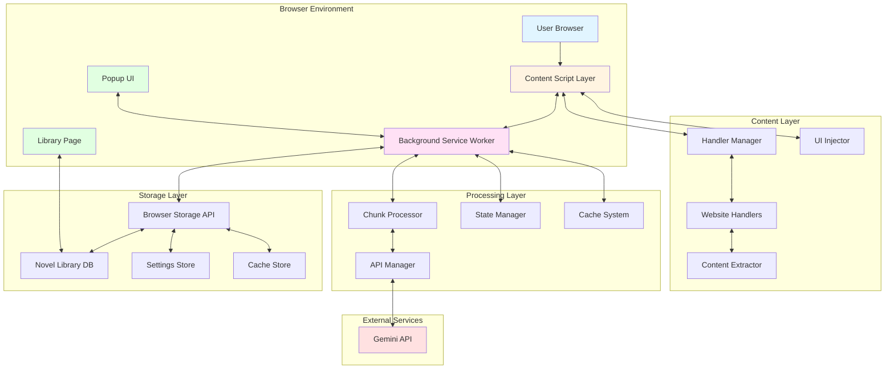

### System Architecture Components

| Component                     | Type               | Responsibilities                                  | Communication                                |
| ----------------------------- | ------------------ | ------------------------------------------------- | -------------------------------------------- |
| **User Browser**              | Environment        | Firefox runtime, extension APIs, DOM rendering    | Hosts all extension components               |
| **Content Script Layer**      | Injected Script    | Page interaction, DOM manipulation, UI injection  | Messages to background, manipulates page DOM |
| **Background Service Worker** | Persistent Service | API calls, state management, chunking logic       | Listens to messages, manages API requests    |
| **Popup UI**                  | Browser Action     | Settings configuration, API key management        | Direct storage access, sends commands        |
| **Library Page**              | Extension Page     | Novel management, metadata editing, import/export | Accesses storage, displays library data      |
| **Handler Manager**           | Factory            | Website detection, handler selection              | Routes to appropriate handler                |
| **Website Handlers**          | Strategy Pattern   | Site-specific content extraction                  | Implements extraction logic                  |
| **Content Extractor**         | Utility            | Text extraction, cleaning, normalization          | Called by handlers                           |
| **UI Injector**               | DOM Manipulator    | Button insertion, status display, progressive UI  | Creates and manages UI elements              |
| **Chunk Processor**           | Processing Engine  | Content splitting, chunk orchestration            | Manages processing queue                     |
| **API Manager**               | Integration Layer  | Request formatting, key rotation, error handling  | Communicates with Gemini API                 |
| **State Manager**             | State Tracker      | Processing state, progress tracking               | Maintains in-memory state                    |
| **Cache System**              | Performance        | Enhanced content caching, 7-day TTL               | Reduces redundant API calls                  |
| **Browser Storage API**       | Data Layer         | Persistent storage interface                      | Syncs data across sessions                   |
| **Novel Library DB**          | Database           | Novel metadata, reading progress                  | JSON-based storage                           |
| **Settings Store**            | Configuration      | User preferences, API keys, prompts               | Key-value storage                            |
| **Cache Store**               | Temporary Storage  | Enhanced chapters, partial results                | Time-based expiration                        |
| **Gemini API**                | External Service   | AI processing, content enhancement                | RESTful API calls                            |

---

## Extension Components

### 1. Content Script Layer (`content/`)

The content script is injected into supported web pages to provide the enhancement interface.

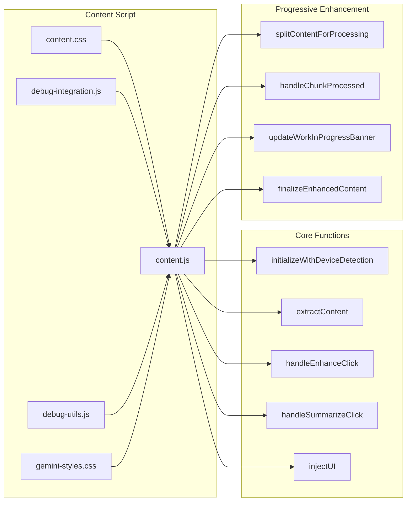

### Content Script Components

| Component                           | Purpose                 | Key Features                                                                           |
| ----------------------------------- | ----------------------- | -------------------------------------------------------------------------------------- |
| **content.js**                      | Main script             | Device detection, content extraction, handler selection, UI injection, message passing |
| **content.css**                     | Main styles             | Button styling, summary display, status messages, responsive layouts                   |
| **debug-integration.js**            | Debug UI                | Debug panel integration, trace logging, performance monitoring                         |
| **debug-utils.js**                  | Debug utilities         | Logging helpers, state inspection, error tracking                                      |
| **gemini-styles.css**               | Enhanced content styles | Typography, paragraph spacing, enhanced text formatting                                |
| **initializeWithDeviceDetection()** | Entry point             | Detects mobile/desktop, initializes appropriate UI                                     |
| **extractContent()**                | Content extractor       | Uses handler to extract chapter text and metadata                                      |
| **handleEnhanceClick()**            | Enhancement trigger     | Starts enhancement flow, manages chunking, progressive UI                              |
| **handleSummarizeClick()**          | Summary trigger         | Generates long or short summaries                                                      |
| **injectUI()**                      | UI builder              | Creates and inserts enhancement buttons and controls                                   |
| **splitContentForProcessing()**     | Content splitter        | Splits large content into processable chunks                                           |
| **handleChunkProcessed()**          | Chunk handler           | Receives processed chunks, updates progressive display                                 |
| **updateWorkInProgressBanner()**    | Progress indicator      | Shows processing progress with percentage                                              |
| **finalizeEnhancedContent()**       | Finalization            | Completes progressive enhancement, removes banners                                     |

### 2. Background Script (`background/`)

Persistent service worker handling API communication, processing orchestration, and extension lifecycle management.

> **See also:** [Keep-Alive Architecture](./KEEP_ALIVE.md) for detailed documentation on service worker persistence mechanisms.

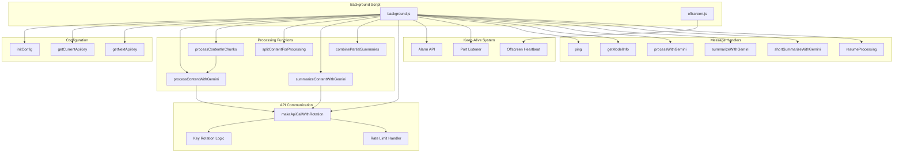

### Background Script Components

| Component                        | Purpose                 | Details                                                                      |
| -------------------------------- | ----------------------- | ---------------------------------------------------------------------------- |
| **background.js**                | Service worker          | Persistent background process, manages all API interactions                  |
| **offscreen.js/offscreen.html**  | Keep-alive mechanism    | Offscreen document for Chrome MV3 service worker persistence (20s heartbeat) |
| **initConfig()**                 | Configuration loader    | Loads settings from storage, applies defaults                                |
| **getCurrentApiKey()**           | Key selector            | Returns current API key based on rotation strategy                           |
| **getNextApiKey()**              | Failover handler        | Gets next backup key on rate limit/error                                     |
| **processContentWithGemini()**   | Single-shot processor   | Processes content in one API call                                            |
| **processContentInChunks()**     | Chunked processor       | Splits and processes large content progressively                             |
| **splitContentForProcessing()**  | Content splitter        | Intelligently splits at paragraph boundaries                                 |
| **summarizeContentWithGemini()** | Summarizer              | Generates chapter summaries (long or short)                                  |
| **combinePartialSummaries()**    | Summary combiner        | Merges multiple part summaries into one                                      |
| **makeApiCallWithRotation()**    | API caller              | Handles API requests with automatic key rotation                             |
| **Key Rotation Logic**           | Failover system         | Round-robin or failover key selection                                        |
| **Rate Limit Handler**           | Error handler           | Detects 429 errors, switches keys, schedules retries                         |
| **Keep-Alive Alarm**             | Service worker lifeline | 30s alarm prevents Chrome MV3 termination                                    |
| **Port Listener**                | Content script bridge   | Accepts long-lived port connections for keep-alive pings                     |
| **Message Handlers**             | IPC                     | Listens for content script messages, routes to functions                     |

### 3. Popup Interface (`popup/`)

Browser action popup for user configuration and settings management.

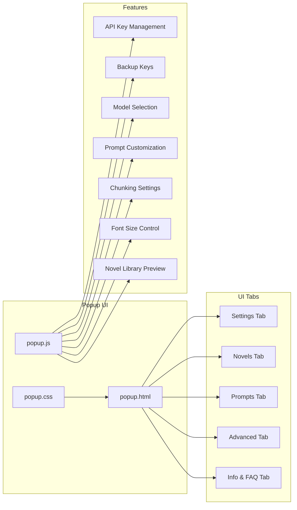

### Popup Components

| Component                 | Purpose           | Features                                                         |
| ------------------------- | ----------------- | ---------------------------------------------------------------- |
| **popup.html**            | UI structure      | Tab layout, form controls, FAQ accordion                         |
| **popup.js**              | UI logic          | Settings management, API key validation, novel library preview   |
| **popup.css**             | UI styling        | Modern design, dark mode support, responsive layout              |
| **Settings Tab**          | Primary config    | API key (primary), model selection, basic options                |
| **Novels Tab**            | Library preview   | Recent novels, stats, "Open Full Library" button                 |
| **Prompts Tab**           | Prompt editor     | Enhancement, summary, short summary, permanent prompts           |
| **Advanced Tab**          | Advanced settings | Chunking, font size, temperature, top-P, top-K, max tokens       |
| **Info & FAQ Tab**        | Help system       | Feature list, troubleshooting, parameter explanations            |
| **API Key Management**    | Key config        | Primary key input, save, test functionality                      |
| **Backup Keys**           | Failover keys     | Add/remove backup keys, rotation strategy (failover/round-robin) |
| **Model Selection**       | Model picker      | Dropdown with Gemini 2.0/2.5 Flash and Pro models                |
| **Prompt Customization**  | Prompt editor     | Textareas for all prompt types, reset to defaults                |
| **Chunking Settings**     | Processing config | Chunk threshold, chunk size sliders with live validation         |
| **Font Size Control**     | Display settings  | Slider to adjust enhanced content font size (80%-150%)           |
| **Novel Library Preview** | Quick access      | Shows recent novels, library stats, opens full library page      |

### 4. Website Handlers (`utils/website-handlers/`)

Modular, extensible system for site-specific content extraction.

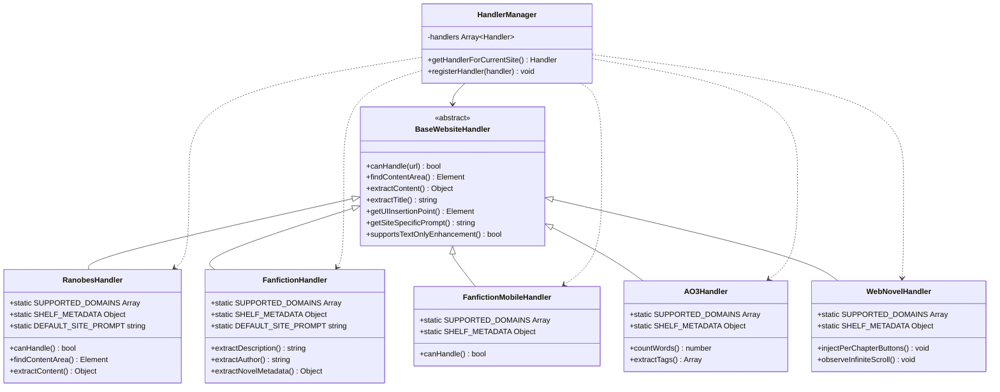

### Handler System Components

| Class                       | Type           | Supported Sites              | Special Features                                      |
| --------------------------- | -------------- | ---------------------------- | ----------------------------------------------------- |
| **BaseWebsiteHandler**      | Abstract Base  | N/A                          | Defines handler interface, common utilities           |
| **HandlerManager**          | Factory/Router | All                          | Detects site, returns appropriate handler instance    |
| **RanobesHandler**          | Concrete       | ranobes.net (10+ domains)    | Multi-domain support, Cyrillic text handling          |
| **FanfictionHandler**       | Concrete       | www.fanfiction.net           | Description extraction, author metadata, cover images |
| **FanfictionMobileHandler** | Concrete       | m.fanfiction.net             | Mobile-optimized selectors, shares library shelf      |
| **AO3Handler**              | Concrete       | archiveofourown.org, ao3.org | Word counting, tag extraction, work metadata          |
| **WebNovelHandler**         | Concrete       | webnovel.com                 | Infinite scroll support, per-chapter button injection |

### Handler Features

| Feature                           | Description           | Implementation                                           |
| --------------------------------- | --------------------- | -------------------------------------------------------- |
| **SUPPORTED_DOMAINS**             | Static domain list    | Array of exact domains and wildcards (*.domain.com)      |
| **SHELF_METADATA**                | Library integration   | { id, name, icon, color, novelIdPattern, primaryDomain } |
| **DEFAULT_SITE_PROMPT**           | Site-specific prompts | Custom instructions for AI processing per site           |
| **canHandle()**                   | Site detection        | Returns true if handler can process current page         |
| **findContentArea()**             | Content selector      | Returns DOM element containing chapter text              |
| **extractContent()**              | Content extractor     | Returns { title, text, metadata }                        |
| **extractTitle()**                | Title extractor       | Returns chapter/work title                               |
| **getUIInsertionPoint()**         | UI positioning        | Returns element where buttons should be inserted         |
| **getSiteSpecificPrompt()**       | Prompt provider       | Returns site-specific enhancement instructions           |
| **supportsTextOnlyEnhancement()** | Enhancement mode      | Returns true if should preserve original DOM structure   |

---

## Content Processing Pipeline

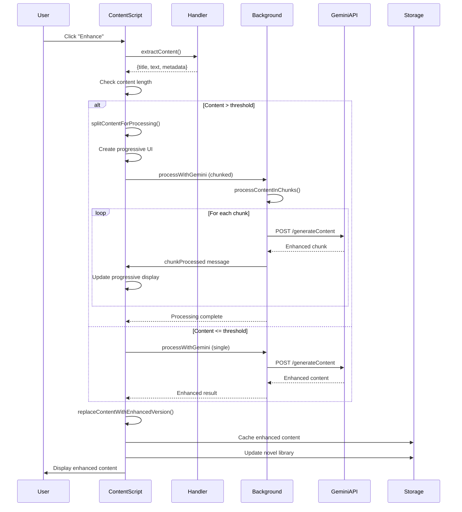

### Processing Pipeline Components

| Stage                  | Component     | Actions                                                   | Error Handling                      |
| ---------------------- | ------------- | --------------------------------------------------------- | ----------------------------------- |
| **1. Trigger**         | User Action   | Clicks "Enhance" button                                   | Button disabled during processing   |
| **2. Extraction**      | Handler       | Extracts title, text, metadata from page                  | Falls back to default selectors     |
| **3. Size Check**      | ContentScript | Compares length to chunk threshold                        | Uses default if setting missing     |
| **4. Splitting**       | ContentScript | Splits at paragraph boundaries if needed                  | Returns single chunk if split fails |
| **5. UI Setup**        | ContentScript | Creates progressive containers (enhanced, WIP, remainder) | Fallback to simple replacement      |
| **6. API Request**     | Background    | Sends to Gemini with prompts, site context                | Key rotation on failure             |
| **7. Processing**      | GeminiAPI     | Enhances content using selected model                     | Retries up to 3 times               |
| **8. Chunk Streaming** | Background    | Sends each chunk as processed                             | Tracks failed chunks                |
| **9. UI Update**       | ContentScript | Inserts enhanced, removes remainder, moves WIP banner     | Shows error disclaimer if partial   |
| **10. Finalization**   | ContentScript | Removes WIP banner, adds toggle button                    | Cleans up on error                  |
| **11. Caching**        | Storage       | Saves enhanced content with 7-day TTL                     | Clears expired entries              |
| **12. Library Update** | Storage       | Updates novel metadata, chapter count                     | Creates new entry if needed         |

---

## Storage Architecture

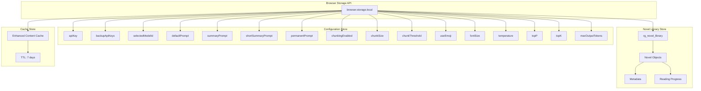

### Storage Schema

| Key                    | Type          | Purpose                                        | Default                      |
| ---------------------- | ------------- | ---------------------------------------------- | ---------------------------- |
| **apiKey**             | string        | Primary Gemini API key                         | ""                           |
| **backupApiKeys**      | `Array<string>` | Backup keys for failover                       | []                           |
| **apiKeyRotation**     | string        | Rotation strategy: "failover" or "round-robin" | "failover"                   |
| **currentApiKeyIndex** | number        | Current key index for round-robin              | 0                            |
| **selectedModelId**    | string        | Gemini model identifier                        | "gemini-2.0-flash-exp"       |
| **modelEndpoint**      | string        | Full API endpoint URL                          | "https://..."                |
| **defaultPrompt**      | string        | Enhancement prompt template                    | DEFAULT_PROMPT               |
| **summaryPrompt**      | string        | Long summary prompt                            | DEFAULT_SUMMARY_PROMPT       |
| **shortSummaryPrompt** | string        | Short summary prompt                           | DEFAULT_SHORT_SUMMARY_PROMPT |
| **permanentPrompt**    | string        | Always-applied instructions                    | DEFAULT_PERMANENT_PROMPT     |
| **chunkingEnabled**    | boolean       | Enable chunk processing                        | true                         |
| **chunkSize**          | number        | Characters per chunk                           | 20000                        |
| **chunkThreshold**     | number        | Minimum chars to trigger chunking              | 20000                        |
| **useEmoji**           | boolean       | Add emotional emojis to dialogue               | false                        |
| **fontSize**           | number        | Enhanced content font size %                   | 100                          |
| **temperature**        | number        | AI creativity (0.0-2.0)                        | 0.7                          |
| **topP**               | number        | Nucleus sampling (0.0-1.0)                     | 0.95                         |
| **topK**               | number        | Token limit per step (1-40)                    | 40                           |
| **maxOutputTokens**    | number        | Maximum response length                        | 8192                         |
| **debugMode**          | boolean       | Enable debug logging                           | false                        |
| **rg_novel_library**   | Object        | Novel library database                         | {}                           |

### Novel Library Schema

```javascript
{
  "rg_novel_library": {
    "novels": {
      "[shelfId]_[novelId]": {
        "id": "fanfiction_12025721",
        "shelfId": "fanfiction",
        "novelId": "12025721",
        "title": "Lush Life",
        "author": "Nautical Paramour",
        "url": "https://www.fanfiction.net/s/12025721/1/",
        "description": "After separating from the Weasley siblings...",
        "coverUrl": "https://www.fanfiction.net/image/7336148/180/",
        "status": "completed",
        "genres": ["Romance", "Friendship"],
        "rating": "M",
        "addedDate": "2025-11-28T10:30:00.000Z",
        "lastVisited": "2025-11-28T12:45:00.000Z",
        "chaptersEnhanced": 1,
        "totalChapters": 1,
        "customPrompt": "",
        "notes": ""
      }
    }
  }
}
```

---

## API Integration Architecture

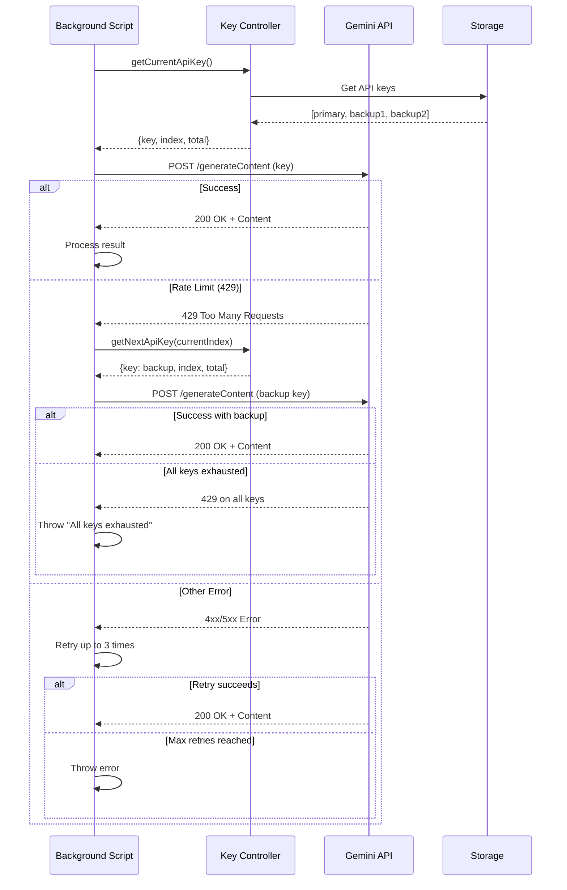

### API Integration Components

| Component                     | Responsibility     | Error Handling                          |
| ----------------------------- | ------------------ | --------------------------------------- |
| **makeApiCallWithRotation()** | Primary API caller | Implements key rotation, retry logic    |
| **getCurrentApiKey()**        | Key selector       | Returns current key based on strategy   |
| **getNextApiKey()**           | Failover provider  | Gets next available backup key          |
| **Rate Limit Detection**      | Error classifier   | Identifies 429 status codes             |
| **Retry Logic**               | Resilience         | 3 attempts per key, exponential backoff |
| **Error Propagation**         | Exception handling | Detailed error messages to UI           |

### API Request Format

```javascript
{
  "system_instruction": {
    "parts": [
      {
        "text": "[Combined prompt: permanent + default + site-specific + novel-specific]"
      }
    ]
  },
  "contents": [
    {
      "role": "user",
      "parts": [
        {
          "text": "[Chapter content]"
        }
      ]
    }
  ],
  "generationConfig": {
    "temperature": 0.7,
    "maxOutputTokens": 8192,
    "topP": 0.95,
    "topK": 40
  }
}
```

---

## Novel Library System

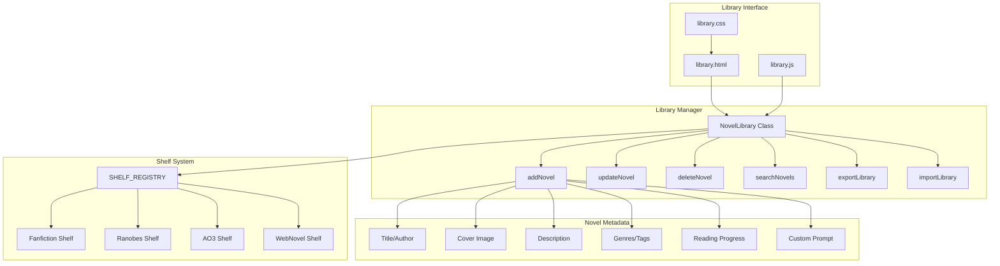

### Novel Library Components

| Component              | Purpose           | Features                                                 |
| ---------------------- | ----------------- | -------------------------------------------------------- |
| **library.html**       | Full library page | Grid layout, search, filters, sort options               |
| **library.js**         | Library logic     | Novel CRUD, search, import/export                        |
| **library.css**        | Library styling   | Card design, responsive grid, modal styles               |
| **NovelLibrary Class** | Data manager      | Singleton pattern, storage abstraction                   |
| **addNovel()**         | Novel creator     | Auto-creates from first enhancement                      |
| **updateNovel()**      | Novel updater     | Updates metadata, progress, custom settings              |
| **deleteNovel()**      | Novel remover     | Removes novel and associated data                        |
| **searchNovels()**     | Search engine     | Searches title, author, description                      |
| **exportLibrary()**    | Data export       | JSON export with timestamp                               |
| **importLibrary()**    | Data import       | Merge or replace mode                                    |
| **SHELF_REGISTRY**     | Shelf registry    | Dynamically built from handler SHELF_METADATA            |
| **Shelf Objects**      | Shelf definitions | { id, name, icon, color, novelIdPattern, primaryDomain } |

---

## Feature Architecture

### Chunking System

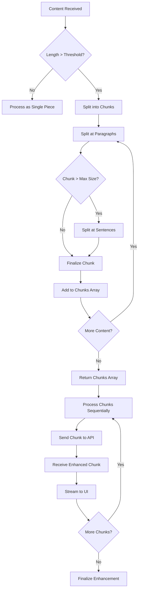

### Chunking System Components

| Component                       | Purpose           | Configuration                                          |
| ------------------------------- | ----------------- | ------------------------------------------------------ |
| **chunkThreshold**              | Size trigger      | Default: 20,000 chars (user configurable 5k-50k)       |
| **chunkSize**                   | Chunk target size | Default: 12,000 chars (user configurable 5k-30k)       |
| **splitContentForProcessing()** | Splitter          | Splits at paragraphs (\n\n), then sentences if needed  |
| **Paragraph Splitting**         | Primary method    | Keeps natural breaks, maintains readability            |
| **Sentence Splitting**          | Fallback          | Used when paragraphs exceed max chunk size             |
| **Sequential Processing**       | Processing order  | Maintains context, conversation history between chunks |
| **Progressive UI**              | User feedback     | Shows WIP banner, percentage, moves as chunks complete |
| **Error Recovery**              | Resilience        | Tracks failed chunks, allows resume                    |

### Emoji Enhancement

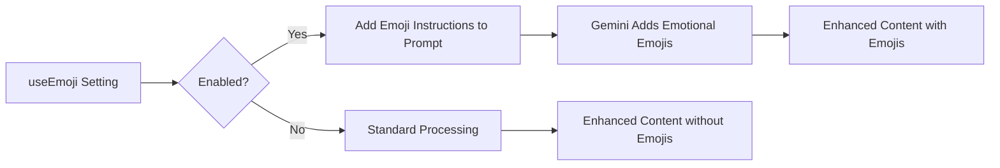

### Backup API Key System

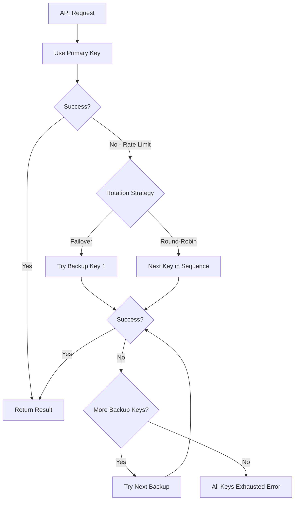

### Backup Key Components

| Component                | Purpose          | Behavior                                            |
| ------------------------ | ---------------- | --------------------------------------------------- |
| **Primary Key**          | Main API key     | Always tried first                                  |
| **Backup Keys Array**    | Failover keys    | Additional keys for rate limit handling             |
| **Rotation Strategy**    | Key selection    | "failover" (sequential) or "round-robin" (rotating) |
| **Failover Mode**        | Default strategy | Primary → Backup 1 → Backup 2 → ... → Error         |
| **Round-Robin Mode**     | Balanced usage   | Rotates through all keys evenly                     |
| **Rate Limit Detection** | Error handling   | Detects 429 status, triggers key switch             |
| **Key Index Tracking**   | State management | Tracks current key for round-robin                  |

---

## File Structure

```file-structure
RanobeGemini/
├── src/
│   ├── background/
│   │   └── background.js        # Service worker, API integration
│   ├── content/
│   │   ├── content.js            # Main content script
│   │   ├── content.css           # Content script styles
│   │   ├── debug-integration.js  # Debug panel integration
│   │   ├── debug-utils.js        # Debug utilities
│   │   └── gemini-styles.css     # Enhanced content styles
│   ├── popup/
│   │   ├── popup.html            # Popup UI
│   │   ├── popup.js              # Popup logic
│   │   └── popup.css             # Popup styles
│   ├── library/
│   │   ├── library.html          # Library page UI
│   │   ├── library.js            # Library logic
│   │   └── library.css           # Library styles
│   ├── utils/
│   │   ├── constants.js          # Constants, defaults, prompts
│   │   ├── domain-constants.js   # Domain registry
│   │   ├── storage-manager.js    # Storage abstraction
│   │   ├── logger.js             # Logging utilities
│   │   ├── content.js            # Content utilities
│   │   ├── debug-panel.js        # Debug panel
│   │   ├── novel-library.js      # Novel library manager
│   │   └── website-handlers/     # Handler modules
│   │       ├── base-handler.js
│   │       ├── handler-manager.js
│   │       ├── ranobes-handler.js
│   │       ├── fanfiction-handler.js
│   │       ├── fanfiction-mobile-handler.js
│   │       ├── ao3-handler.js
│   │       └── webnovel-handler.js
│   ├── config/
│   │   └── config.js             # Configuration
│   ├── icons/                    # Extension icons
│   └── manifest.json             # Extension manifest
├── docs/                         # Documentation
│   ├── architecture/             # Architecture docs
│   ├── features/                 # Feature docs
│   ├── guides/                   # User guides
│   └── development/              # Development docs
├── dev/                          # Build scripts
│   ├── build.js
│   ├── watch.js
│   ├── package-firefox.js
│   ├── package-source.js
│   └── generate-manifest-domains.js
└── releases/                     # Packaged versions
```

---

## Technology Stack

| Layer            | Technologies                                                        |
| ---------------- | ------------------------------------------------------------------- |
| **Runtime**      | Firefox Extension (Manifest V3), JavaScript ES6+                    |
| **APIs**         | WebExtension APIs, Gemini AI API, Browser Storage API               |
| **Architecture** | Service Worker, Content Scripts, MVC Pattern                        |
| **Patterns**     | Strategy (Handlers), Factory (Handler Manager), Singleton (Library) |
| **Storage**      | browser.storage.local (JSON-based)                                  |
| **UI**           | HTML5, CSS3, Vanilla JavaScript                                     |
| **Processing**   | Async/Await, Promise-based, Message Passing                         |
| **Build**        | Node.js scripts, npm tasks                                          |

---

## Performance and Security

### Performance Considerations

| Aspect                   | Strategy                                 | Benefit                                |
| ------------------------ | ---------------------------------------- | -------------------------------------- |
| **Chunking**             | Split large content into 12k char chunks | Avoids token limits, enables streaming |
| **Progressive UI**       | Show enhanced chunks as they arrive      | Better UX, perceived performance       |
| **Caching**              | 7-day TTL for enhanced content           | Reduces API calls, faster re-reads     |
| **Handler Selection**    | Early exit on site match                 | Minimal overhead per page              |
| **Storage Optimization** | Single JSON object for library           | Efficient read/write                   |
| **API Key Rotation**     | Automatic failover                       | Maintains service during rate limits   |
| **Lazy Loading**         | Load handlers only when needed           | Faster extension startup               |

### Security Considerations

| Concern                | Mitigation                                             |
| ---------------------- | ------------------------------------------------------ |
| **API Key Storage**    | Stored in browser.storage.local (encrypted by browser) |
| **XSS Prevention**     | Content sanitization, CSP headers                      |
| **HTTPS Only**         | All API calls use HTTPS                                |
| **No Data Collection** | No telemetry, no external data transmission            |
| **Local Processing**   | All data stays in browser except API calls             |
| **Permission Scope**   | Minimal permissions requested                          |
| **Input Validation**   | URL and content validation before processing           |
| **Error Messages**     | No sensitive data in error logs                        |

---

**Navigation:** [Back to Top](#ranobegemini-architecture-documentation) | [Main Documentation](../README.md)
