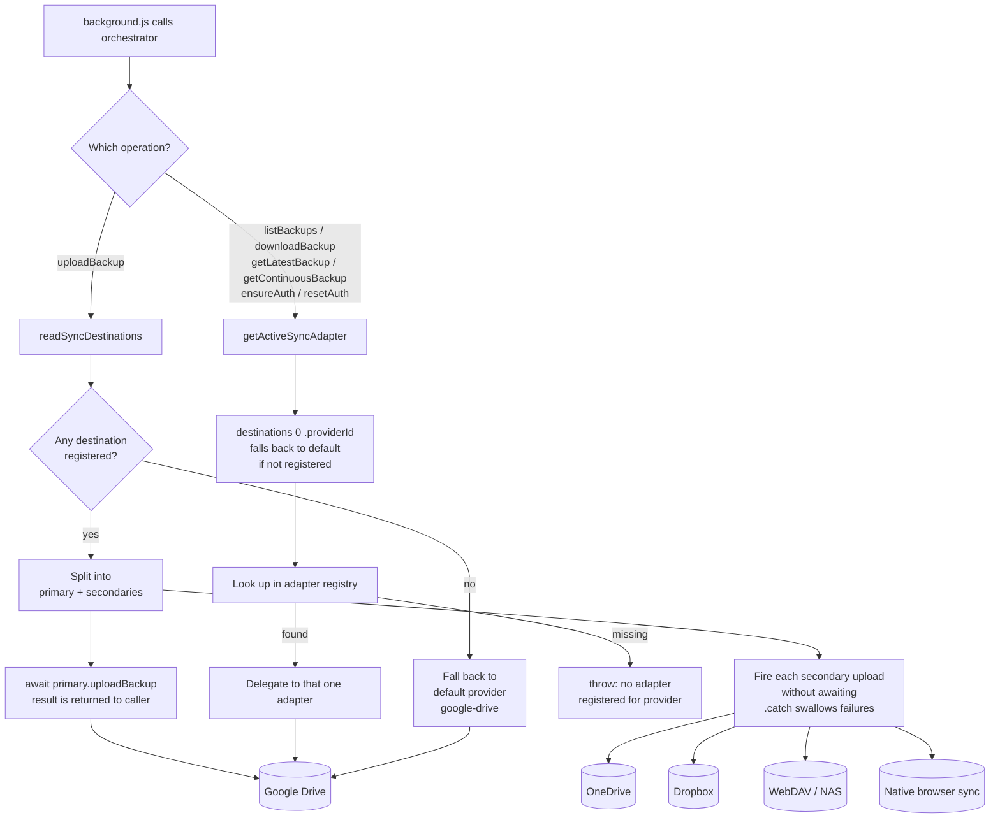
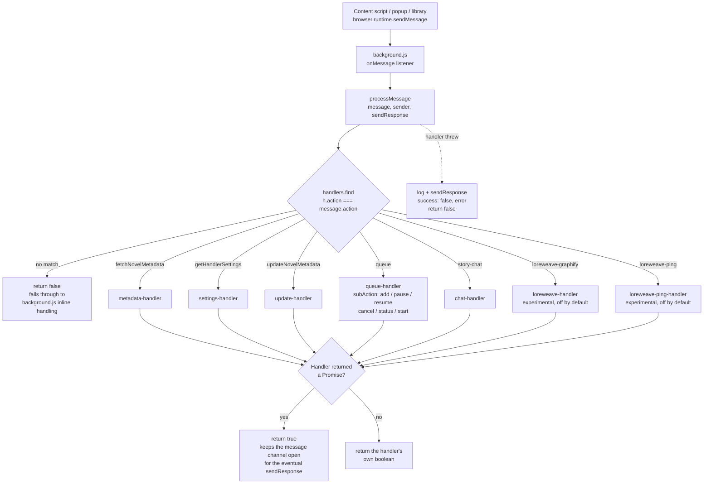
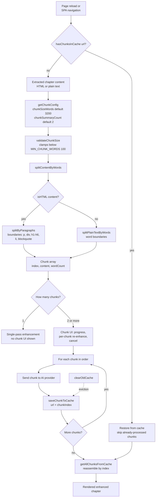
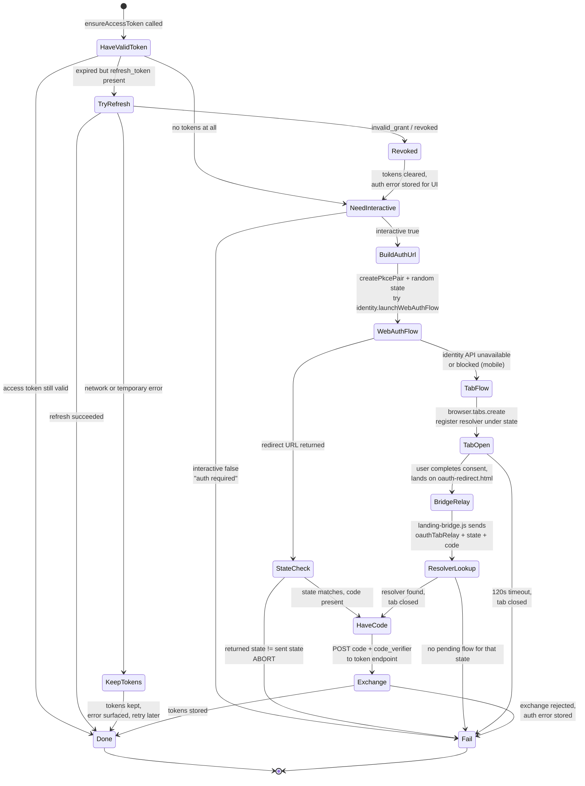

# Data Flows

> Applies to the 5.x line.

Four subsystems in this codebase are hard to follow by reading the source alone,
because in each one the control flow crosses a boundary — a module registry, a
message channel, a browser API, a network round trip. This document diagrams
those four. Everything here is drawn from the code cited above each diagram; if
they disagree, the code is right and this file is stale.

- [Storage sync fan-out](#storage-sync-fan-out)
- [Background message routing](#background-message-routing)
- [Chunking pipeline](#chunking-pipeline)
- [OAuth flows](#oauth-flows)

---

## Storage sync fan-out

Source: [`src/background/storage/storage-orchestrator.js`](../../src/background/storage/storage-orchestrator.js),
[`src/background/storage/storage-interface.js`](../../src/background/storage/storage-interface.js),
[`src/background/storage/adapters/`](../../src/background/storage/adapters/)

The orchestrator is the only thing the rest of the background script talks to.
It holds a `Map` of adapters registered at startup and picks between them using
the user's `syncDestinations` array in `browser.storage.local`.

The asymmetry is the point: **writes fan out to every destination, reads only
ever touch the first one.** A backup can therefore exist on three services while
`listBackups()` shows you only what is on the primary.

**Diagram elements**

- **`readSyncDestinations`** — reads `syncDestinations` (the multi-sync array).
  If it is absent or empty, falls back to the legacy `activeSync` string, and
  failing that to `google-drive`. Every entry is `{ providerId, customPath? }`.
- **primary vs secondaries** — `validDestinations[0]` is the primary. Its upload
  is awaited and its result is what the caller sees.
- **secondary uploads** — dispatched without `await` and with `.catch(() => {})`.
  A secondary destination that is down, out of quota, or unauthenticated fails
  **silently**; the caller still sees success. This is deliberate (one broken
  destination must not block the backup) but it means "backup succeeded" only
  ever refers to the primary.
- **read operations** — all six go through `getActiveSyncAdapter()` and touch the
  primary only. Restoring after switching primaries will not see backups written
  to the old one.
- **adapter registry** — populated once in `background.js` at startup. Each
  adapter is checked by `validateStorageSyncAdapterRuntime()` on registration, so
  a malformed adapter fails at load rather than at first sync.
- **`ensureAuth` / `resetAuth`** — optional on the interface. The orchestrator
  throws a named error if the active adapter does not implement them (WebDAV uses
  basic auth and has no OAuth handshake to perform).

---

## Background message routing

Source: [`src/background/message-handlers/index.js`](../../src/background/message-handlers/index.js),
[`src/background/message-handlers/`](../../src/background/message-handlers/)

`processMessage` is a flat linear search over a handler array, matching on
`message.action`. There is no namespacing and no wildcard: an action either
matches a registered handler exactly or falls through.

**Diagram elements**

- **Flat `find` over an array** — order in the `handlers` array does not matter
  because actions are unique, but a duplicate action would silently shadow the
  later one. Nothing currently checks for that.
- **`return true` substitution** — the critical detail. An async handler returns
  a Promise, which is truthy but does **not** keep the message channel open in
  Firefox and is unreliable in Chrome MV3. `processMessage` detects a thenable
  and returns the literal `true` instead, which is what the runtime actually
  requires.
- **`return false` on no match** — not an error. Several actions are still
  handled inline in `background.js` and have not been extracted into the
  registry; falling through is how they get reached.
- **thrown errors** — caught, logged, and converted into a
  `{ success: false, error }` response. The caller always gets a reply rather
  than a hung channel.
- **LoreWeave handlers** — registered unconditionally, but the feature is gated
  as experimental and off by default; the handlers no-op unless the user has
  enabled it.

---

## Chunking pipeline

Source: [`src/utils/chunking/`](../../src/utils/chunking/)

Chapters longer than the configured chunk size are split, processed one chunk at
a time, cached per chunk, and reassembled. The cache is keyed by
`(url, chunkIndex)`, which is what makes a partially-processed chapter resumable
after a reload.

**Diagram elements**

- **`getChunkConfig`** — reads the user's values from storage, falling back to
  `DEFAULT_CHUNK_SIZE_WORDS` (3200) and `DEFAULT_CHUNK_SUMMARY_COUNT` (2) in
  [`chunk-config.js`](../../src/utils/chunking/chunk-config.js).
- **`validateChunkSize`** — a non-numeric or too-small value silently becomes
  `MIN_CHUNK_WORDS` (100) rather than failing. Chunk size is user-editable, so
  this is the guard against a 0 or a typo producing an unbounded chunk count.
- **HTML vs plain text** — decided by `isHTML()`. HTML splits on block-element
  boundaries so a chunk never begins mid-paragraph; plain text splits on words.
- **balancing rule** — under one chunk size stays a single chunk; under two chunk
  sizes splits into two roughly equal halves; beyond that the final two chunks
  are balanced against each other, so a chapter never ends with a 40-word
  fragment.
- **per-chunk cache** — `saveChunkToCache(url, chunkIndex, data)`. Because each
  chunk lands independently, a reload mid-processing resumes rather than
  restarting, and a single bad chunk can be re-enhanced without redoing the rest.
- **reassembly** — `getAllChunksFromCache(url)` returns chunks sorted by index;
  order comes from the index, not from completion time.
- **`clearOldCache`** — background eviction of stale entries; it is why a
  chapter left half-processed for long enough will start over.

---

## OAuth flows

Source: [`src/utils/oauth-pkce.js`](../../src/utils/oauth-pkce.js),
[`src/utils/drive.js`](../../src/utils/drive.js),
[`src/content/landing-bridge.js`](../../src/content/landing-bridge.js)

Every OAuth provider here uses authorization-code + PKCE with a fixed redirect
to `https://ranobe.vkrishna04.me/oauth-redirect.html`. There are two ways the
code gets back to the extension, and which one runs depends entirely on whether
`browser.identity.launchWebAuthFlow` exists and works in the current browser.

**Diagram elements**

- **PKCE pair** — `createPkcePair()` produces a `verifier` kept in memory and an
  S256 `challenge` sent in the authorization request. The verifier never leaves
  the extension until the token exchange.
- **`state`** — a fresh 16-byte random string per attempt. Both paths check it,
  and both **abort** on mismatch rather than proceeding. Without this check a
  crafted redirect could inject an authorization code belonging to someone else's
  account, and the resulting token would be stored as the user's own.
- **`launchWebAuthFlow` (preferred)** — the browser owns the popup and hands back
  the redirect URL directly. Nothing needs to cross a content script.
- **tab flow (fallback)** — used when the identity API is unavailable or blocked,
  which in practice means mobile. A tab is opened, and the resolver is registered
  in the `pendingAuthFlows` map **keyed by `state`**. That map is the state check
  for this path: a relay carrying an unknown state finds no resolver and is
  dropped.
- **`landing-bridge.js`** — a content script on the project site. It reads `code`
  and `state` off the redirect URL and calls `browser.runtime.sendMessage`. The
  bridge already knows its own extension ID, so nothing has to be smuggled
  through the redirect URI as a query parameter.
- **120-second timeout** — the tab flow rejects and closes the tab if no relay
  arrives. Without it, an abandoned sign-in would leave a resolver pinned in the
  map for the life of the service worker.
- **refresh failure is not one case but two** — `invalid_grant`/`revoked` means
  the user really did revoke access, so tokens are cleared and re-auth is
  required. Any other failure (network, 5xx) **keeps** the refresh token and only
  surfaces an error, because discarding it would force an unnecessary sign-in
  every time the network hiccuped.
