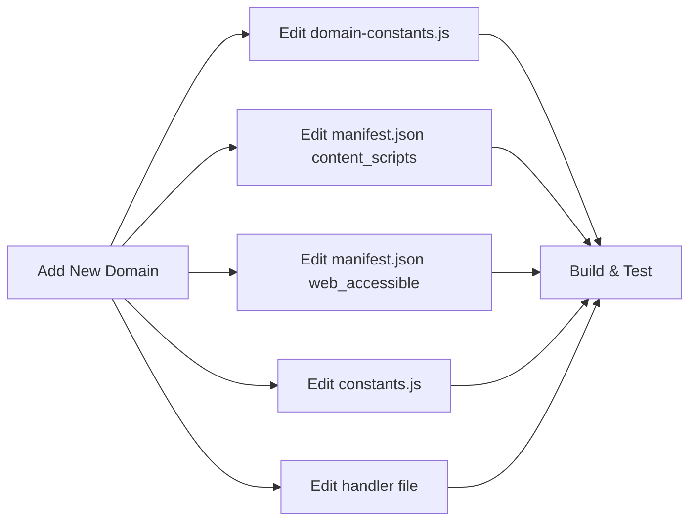
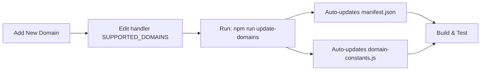
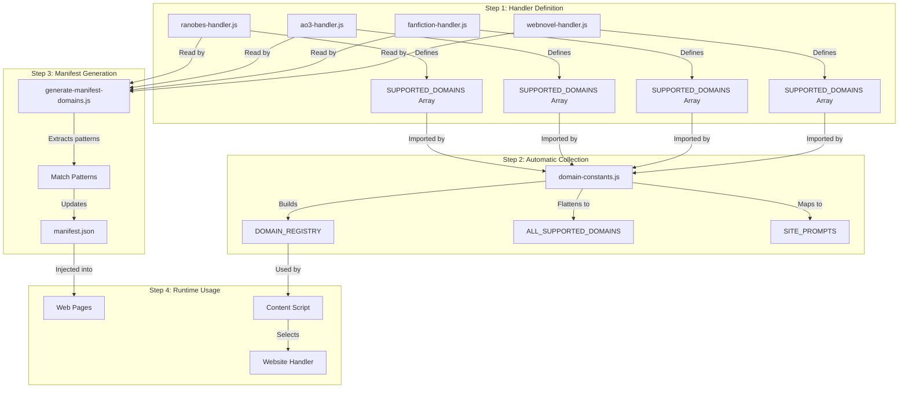

# Dynamic Domain Management System

## Overview

The RanobeGemini extension now uses a **dynamic domain management system** that automatically collects supported domains from website handlers. This eliminates the need to manually update multiple files when adding new domains or handlers.

## Table of Contents

- [Dynamic Domain Management System](#dynamic-domain-management-system)
	- [Overview](#overview)
	- [Table of Contents](#table-of-contents)
	- [How It Works](#how-it-works)
		- [1. Handler Configuration](#1-handler-configuration)
		- [2. Automatic Collection](#2-automatic-collection)
		- [3. Manifest Generation](#3-manifest-generation)
	- [Adding a New Website](#adding-a-new-website)
		- [Step 1: Create the Handler](#step-1-create-the-handler)
		- [Step 2: Register the Handler](#step-2-register-the-handler)
		- [Step 3: Update Domain Constants](#step-3-update-domain-constants)
		- [Step 4: Generate Manifest](#step-4-generate-manifest)
	- [Benefits](#benefits)
		- [Before (Manual System)](#before-manual-system)
		- [Manual System Workflow Steps](#manual-system-workflow-steps)
		- [After (Dynamic System)](#after-dynamic-system)
		- [Dynamic System Workflow Steps](#dynamic-system-workflow-steps)
	- [API Reference](#api-reference)
		- [Exported Constants](#exported-constants)
		- [Helper Functions](#helper-functions)
		- [Example Usage](#example-usage)
	- [Subdomain Handling](#subdomain-handling)
	- [Maintenance](#maintenance)
		- [Updating Domains](#updating-domains)
		- [Viewing Current Domains](#viewing-current-domains)
		- [Debugging](#debugging)
	- [Migration Guide](#migration-guide)
		- [Old Code](#old-code)
		- [New Code (Recommended)](#new-code-recommended)
		- [Backward Compatible](#backward-compatible)
	- [Architecture Diagram](#architecture-diagram)
		- [Dynamic Domain System Components](#dynamic-domain-system-components)
	- [Future Enhancements](#future-enhancements)

## How It Works

### 1. Handler Configuration

Each website handler (e.g., `ranobes-handler.js`, `ao3-handler.js`) defines:

```javascript
export class MyWebsiteHandler extends BaseWebsiteHandler {
	// Supported domains (including subdomains)
	static SUPPORTED_DOMAINS = [
		"example.com",
		"www.example.com",
		"m.example.com",  // Mobile subdomain
	];

	// Site-specific default prompt
	static DEFAULT_SITE_PROMPT = `This content is from Example.com...`;

	constructor() {
		super();
		// ... handler implementation
	}

	getSiteSpecificPrompt() {
		return MyWebsiteHandler.DEFAULT_SITE_PROMPT;
	}
}
```

### 2. Automatic Collection

The `domain-constants.js` file automatically:
- Imports all handler classes
- Collects `SUPPORTED_DOMAINS` from each handler
- Builds a centralized `DOMAIN_REGISTRY`
- Creates a flattened `ALL_SUPPORTED_DOMAINS` array
- Maps domains to their site-specific prompts in `SITE_PROMPTS`

### 3. Manifest Generation

Run the domain generator script to update `manifest.json`:

```powershell
npm run update-domains
```

This script:
- Reads all handler files in `src/utils/website-handlers/`
- Extracts `SUPPORTED_DOMAINS` arrays using regex
- Generates match patterns (`*://*.domain.com/*`)
- Updates both `content_scripts` and `web_accessible_resources` matches

## Adding a New Website

To add support for a new website, you only need to **edit ONE file**:

### Step 1: Create the Handler

Create `src/utils/website-handlers/mysite-handler.js`:

```javascript
import { BaseWebsiteHandler } from "./base-handler.js";

export class MySiteHandler extends BaseWebsiteHandler {
	// Define supported domains (including all subdomains)
	static SUPPORTED_DOMAINS = [
		"mysite.com",
		"www.mysite.com",
		"m.mysite.com",
	];

	// Define site-specific enhancement prompt
	static DEFAULT_SITE_PROMPT = `This content is from MySite.com...
Please maintain:
- Site-specific formatting rules
- Special terminology
etc.`;

	constructor() {
		super();
		this.selectors = {
			content: [".chapter-content"],
			title: [".chapter-title"],
		};
	}

	canHandle() {
		return window.location.hostname.includes("mysite.com");
	}

	// Implement required methods...
	findContentArea() { /* ... */ }
	extractContent() { /* ... */ }
	getSiteSpecificPrompt() {
		return MySiteHandler.DEFAULT_SITE_PROMPT;
	}
}

export default new MySiteHandler();
```

### Step 2: Register the Handler

Add your handler to `src/utils/website-handlers/handler-manager.js`:

```javascript
import mySiteHandler from "./mysite-handler.js";

export class HandlerManager {
	constructor() {
		this.handlers = [
			ranobesHandler,
			fanfictionHandler,
			ao3Handler,
			webnovelHandler,
			mySiteHandler,  // Add here
		];
	}

	async getHandlerForCurrentSite() {
		// Add detection logic
		else if (hostname.includes("mysite.com")) {
			return mySiteHandler;
		}
	}
}
```

### Step 3: Update Domain Constants

Add the handler class to `src/utils/domain-constants.js`:

```javascript
import { MySiteHandler } from "./website-handlers/mysite-handler.js";

const HANDLER_CLASSES = [
	RanobesHandler,
	FanfictionHandler,
	AO3Handler,
	WebNovelHandler,
	MySiteHandler,  // Add here
];
```

### Step 4: Generate Manifest

Run the generator script:

```powershell
npm run update-domains
```

That's it! The domains are now automatically included in:
- ✅ `manifest.json` content_scripts matches
- ✅ `manifest.json` web_accessible_resources matches
- ✅ `DOMAIN_REGISTRY` in domain-constants.js
- ✅ `ALL_SUPPORTED_DOMAINS` array
- ✅ `SITE_PROMPTS` mapping

## Benefits

### Before (Manual System)

To add a new domain, you had to update:
1. ❌ `domain-constants.js` - Add to domain array
2. ❌ `manifest.json` - Add to content_scripts matches
3. ❌ `manifest.json` - Add to web_accessible_resources matches
4. ❌ `constants.js` - Add site-specific prompt
5. ❌ Handler file - Duplicate prompt definition

**5 files to edit!** 😓



### Manual System Workflow Steps

| Step | File                  | Action                                       | Error-Prone?                         |
| ---- | --------------------- | -------------------------------------------- | ------------------------------------ |
| 1    | `domain-constants.js` | Add domain to appropriate array              | ⚠️ Yes - Easy to forget subdomains    |
| 2    | `manifest.json`       | Add to `content_scripts[0].matches`          | ⚠️ Yes - Must match exact format      |
| 3    | `manifest.json`       | Add to `web_accessible_resources[0].matches` | ⚠️ Yes - Often forgotten              |
| 4    | `constants.js`        | Add site-specific prompt mapping             | ⚠️ Yes - Duplicates handler prompt    |
| 5    | Handler file          | Define prompt (duplicated in step 4)         | ⚠️ Yes - Can get out of sync          |
| 6    | Test                  | Verify all changes work together             | ⚠️ Yes - Miss one file, nothing works |

### After (Dynamic System)

To add a new domain:
1. ✅ Handler file - Add to `SUPPORTED_DOMAINS` array
2. ✅ Run `npm run update-domains`

**1 file to edit + 1 command!** 🎉



### Dynamic System Workflow Steps

| Step | File/Command  | Action                                                  | Error-Prone?                   |
| ---- | ------------- | ------------------------------------------------------- | ------------------------------ |
| 1    | Handler file  | Add to `static SUPPORTED_DOMAINS = [...]`               | ✅ No - Single source of truth  |
| 2    | Terminal      | Run `npm run update-domains`                            | ✅ No - Automated script        |
| 3    | *(automatic)* | Script updates `manifest.json` content_scripts          | ✅ No - No manual editing       |
| 4    | *(automatic)* | Script updates `manifest.json` web_accessible_resources | ✅ No - No manual editing       |
| 5    | *(automatic)* | `domain-constants.js` imports handler domains           | ✅ No - JavaScript imports      |
| 6    | Test          | Verify handler works                                    | ✅ No - Only one place to check |

## API Reference

### Exported Constants

```javascript
import {
	DOMAIN_REGISTRY,        // Object mapping handler names to domains
	ALL_SUPPORTED_DOMAINS,  // Array of all domains
	SITE_PROMPTS,          // Object mapping domains to prompts
	RANOBES_DOMAINS,       // Array (backward compatibility)
	FANFICTION_DOMAINS,    // Array (backward compatibility)
	AO3_DOMAINS,          // Array (backward compatibility)
	WEBNOVEL_DOMAINS,     // Array (backward compatibility)
} from "./utils/domain-constants.js";
```

### Helper Functions

```javascript
// Check if any domain is supported
isSupportedDomain(hostname: string): boolean

// Get site-specific prompt for a domain
getSitePrompt(hostname: string): string

// Check specific site types (backward compatibility)
isRanobesDomain(hostname: string): boolean
isFanfictionDomain(hostname: string): boolean
isAO3Domain(hostname: string): boolean
isWebNovelDomain(hostname: string): boolean

// Generate manifest match patterns
generateManifestMatches(): string[]
```

### Example Usage

```javascript
import { isSupportedDomain, getSitePrompt } from "./utils/domain-constants.js";

// Check if we should inject UI
if (isSupportedDomain(window.location.hostname)) {
	const prompt = getSitePrompt(window.location.hostname);
	console.log("Site-specific prompt:", prompt);
	// ... inject UI
}
```

## Subdomain Handling

The system automatically handles subdomains:

```javascript
static SUPPORTED_DOMAINS = [
	"example.com",        // Matches example.com
	"www.example.com",    // Matches www.example.com
	"m.example.com",      // Matches m.example.com
];

// All of these will match:
isSupportedDomain("example.com");      // true
isSupportedDomain("www.example.com");  // true
isSupportedDomain("m.example.com");    // true
isSupportedDomain("mobile.example.com"); // false (not in list)
```

**Best Practice:** Explicitly list all subdomains you want to support, including:
- `www.` - Standard subdomain
- `m.` - Mobile version
- Any other subdomains specific to that site

## Maintenance

### Updating Domains

If you add/remove domains from a handler:

1. Edit the handler's `SUPPORTED_DOMAINS` array
2. Run: `npm run update-domains`
3. Rebuild: `npm run build`

### Viewing Current Domains

```powershell
# View all registered domains
node -e "import('./src/utils/domain-constants.js').then(m => console.log(m.ALL_SUPPORTED_DOMAINS))"
```

### Debugging

If domains aren't working:

1. Check handler's `SUPPORTED_DOMAINS` array is properly defined
2. Verify handler is imported in `domain-constants.js`
3. Run `npm run update-domains` to regenerate manifest
4. Check `manifest.json` content_scripts matches
5. Rebuild the extension: `npm run build`

## Migration Guide

If you have existing code using old domain constants:

### Old Code

```javascript
import { RANOBES_DOMAINS } from "./utils/domain-constants.js";

if (RANOBES_DOMAINS.includes(hostname)) {
	// ...
}
```

### New Code (Recommended)

```javascript
import { isSupportedDomain } from "./utils/domain-constants.js";

if (isSupportedDomain(hostname)) {
	// ...
}
```

### Backward Compatible

The old constants (`RANOBES_DOMAINS`, `FANFICTION_DOMAINS`, etc.) are still exported for backward compatibility, but they're automatically generated from handlers now.

## Architecture Diagram



### Dynamic Domain System Components

| Component                        | Type               | Purpose                                            | Location                                                       |
| -------------------------------- | ------------------ | -------------------------------------------------- | -------------------------------------------------------------- |
| **Handler Files**                | Source             | Define domains and prompts per website             | `src/utils/website-handlers/*-handler.js`                      |
| **SUPPORTED_DOMAINS**            | Static Property    | Array of domains this handler supports             | Each handler class (e.g., `["*.fanfiction.net"]`)              |
| **DEFAULT_SITE_PROMPT**          | Static Property    | Site-specific enhancement instructions             | Each handler class as string                                   |
| **domain-constants.js**          | Registry           | Imports handlers, collects domains dynamically     | `src/utils/domain-constants.js`                                |
| **DOMAIN_REGISTRY**              | Object             | Maps handler names to their domains                | `{ RANOBES: [...], AO3: [...] }`                               |
| **ALL_SUPPORTED_DOMAINS**        | Array              | Flattened array of all domains                     | `["fanfiction.net", "*.fanfiction.net", ...]`                  |
| **SITE_PROMPTS**                 | Object             | Maps each domain to its site-specific prompt       | `{ "fanfiction.net": "prompt text..." }`                       |
| **generate-manifest-domains.js** | Build Script       | Reads handlers, extracts domains, updates manifest | `dev/generate-manifest-domains.js`                             |
| **manifest.json**                | Configuration      | Browser extension manifest with match patterns     | `src/manifest.json` (auto-updated)                             |
| **Match Patterns**               | Permission Strings | URL patterns like `*://*.domain.com/*`             | In manifest's `content_scripts` and `web_accessible_resources` |

## Future Enhancements

Potential improvements to this system:

1. **Auto-run on build**: Integrate `update-domains` into the build script
2. **Validation**: Check for duplicate domains across handlers
3. **Documentation generation**: Auto-generate supported sites list
4. **Pattern optimization**: Combine similar patterns (e.g., `*.ranobes.*`)

---

**Version:** 2.8.0
**Last Updated:** November 24, 2025
