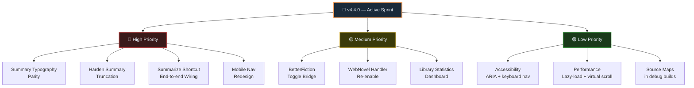

# Development Roadmap

> **Last Updated:** 2025-07-01
> **Current Version:** 4.4.0

## Table of Contents

- [Development Roadmap](#development-roadmap)
	- [Table of Contents](#table-of-contents)
	- [🗺️ Sprint Overview (v4.4.0)](#️-sprint-overview-v440)
	- [✅ Completed Features](#-completed-features)
    - [Version 4.4.0 (Current)](#version-440-current)
    - [Version 4.3.0](#version-430)
		- [Version 4.2.0](#version-420)
		- [Version 4.1.0](#version-410)
		- [Version 4.0.0](#version-400)
		- [Earlier Versions (archived)](#earlier-versions-archived)
	- [🚀 Current Sprint (v4.4.0)](#-current-sprint-v440)
		- [High Priority](#high-priority)
		- [Medium Priority](#medium-priority)
		- [Low Priority](#low-priority)
	- [🔮 Future Versions](#-future-versions)
		- [Version 4.4.0 - UX Polish \& Mobile](#version-440---ux-polish--mobile)
		- [Version 4.5.0 - Advanced AI Controls](#version-450---advanced-ai-controls)
		- [Version 5.0.0 - Platform Expansion](#version-500---platform-expansion)
	- [🐛 Known Issues](#-known-issues)
		- [Critical](#critical)
		- [High Priority](#high-priority-1)
		- [Medium Priority](#medium-priority-1)
		- [Low Priority](#low-priority-1)
	- [🔧 Technical Debt](#-technical-debt)
	- [💡 Feature Requests](#-feature-requests)
	- [🗓️ Release Schedule](#️-release-schedule)
		- [Release Criteria](#release-criteria)
	- [🤝 Contributing](#-contributing)
	- [📞 Resources](#-resources)

---

## 🗺️ Sprint Overview (v4.4.0)

  **Diagram elements:**

  - `Sprint` parent node for active release track
  - `High` blocking items required before release cut
  - `Medium` important items that should land in sprint when feasible
  - `Low` quality follow-ups that can roll over if needed
  - `H1` Summary typography parity
  - `H2` Truncation hardening
  - `H3` Shortcut pipeline wiring
  - `H4` Mobile navigation redesign
  - `M1` BetterFiction settings bridge
  - `M2` WebNovel handler re-enable
  - `M3` Library stats dashboard
  - `L1` Accessibility polish
  - `L2` Library performance optimization
  - `L3` Debug source maps

---

## ✅ Completed Features

### Version 4.4.0 (Current)

- [x] **Reading Lists as Badge Layer** — `rereading` moved out of primary statuses and into list badges
- [x] **Predefined Lists in RG Controls** — `🔁 Rereading` and `⭐ Favourites` quick toggles on chapter controls
- [x] **Library Card Dropdown Lists** — Novel-card status dropdown now includes reading-list toggle actions (including `rereading`)
- [x] **Narrow-Mobile Control Compaction** — Library view/filter chips no longer force full-width buttons on small phones
- [x] **Adaptive URL Import Pipeline** — URL import now canonicalizes via handler templates, auto-skips existing novels, and deduplicates pasted links per batch
- [x] **Shareable Library Modal Links** — Main + per-site shelf pages now support `?novel=<id>&openModal=1` deep links and preserve modal URL state for sharing
- [x] **Missing Deep-Link Recovery** — If a shared novel id is not in local storage, prompt-assisted 7s auto-recovery opens source URL and auto-adds the novel
- [x] **Legacy Status Migration** — old `re-reading` status entries normalize to `reading` + `rereading` list
- [x] **Install Guide + Landing Polish** — added cross-browser install guide page, standardized footer/nav install links, and updated published Edge install path

### Version 4.3.0

- [x] **Incognito Mode** — Auto-expiry, no-trace reading sessions
- [x] **Collapsible Sections** — Fight scenes, R18 content, author notes
- [x] **Hide Gemini UI for Read Aloud** — Clean screen reader / TTS support
- [x] **Summary Quality Helpers** — `isLowQualityLongSummary`, `getSummaryOutputBudget`
- [x] **Backup Model Selector** — Choose default model for backups per-novel
- [x] **FanFiction Redirect Fix** — Proper `domainPreference` persistence (no more `?rgffswitch` token hack)
- [x] **Metadata Hardening** — AO3, Ranobes, ScribbleHub extraction edge-cases fixed

### Version 4.2.0

- [x] **Custom Content Box Types** — Live preview when editing
- [x] **Library Hero Eyebrow** — Improved novel card header layout
- [x] **Character/Relationship Separation** — Distinct sections in library cards
- [x] **Dynamic Reading-Status Buttons** — Status-aware CTA buttons
- [x] **FanFiction DB Repair Pass** — `addRelationshipGroup` comma-split fix
- [x] **Completion Status** — Derived automatically from `publicationStatus`

### Version 4.1.0

- [x] **Enhanced Theme System** — 5 new themes, auto schedule by time-of-day / sunrise-sunset
- [x] **Reading Progress Bar** — Ranobes + ScribbleHub chapter progress
- [x] **Chunking UI** — Pause, skip chunk, per-chunk enhance button
- [x] **Export Template** — Word count column, EPUB as default format
- [x] **Site Prompt Refinements** — AO3, Ranobes, ScribbleHub per-site prompt tuning

### Version 4.0.0

- [x] Cross-browser build (Firefox + Chromium + Edge)
- [x] Manifest V3 with service-worker background script
- [x] Google Drive OAuth PKCE backup
- [x] Rolling backup retention (3 backups)
- [x] Canvas particle animations for popup
- [x] FichHub integration for novel search
- [x] Dynamic domain generation in build pipeline
- [x] Modular website handler auto-registry

### Earlier Versions (archived)

See [archived TODO (v3)](../archive/TODO_v3.0.0.md) for completed v1–v3 feature history.

---

## 🚀 Current Sprint (v4.4.0)

### High Priority

- [x] **Reading-List Model Refactor**
  - [x] Move `re-reading` out of primary reading statuses
  - [x] Add predefined list badges: `🔁 Rereading`, `⭐ Favourites`
  - [x] Add backward-compat migration for legacy `re-reading` status

- [ ] **Summary Typography Parity**
  - [ ] Summary popup inherits page font-family
  - [ ] Summary font-size / line-height consistent across all sites
  - [ ] Heading sizes match chapter body

- [ ] **Harden Summary Truncation**
  - [ ] Verify `isLowQualityLongSummary()` is called in the summarize flow
  - [ ] Verify `getSummaryOutputBudget()` caps tokens correctly
  - [ ] Add fallback message when summary is pruned

- [ ] **Summarize Shortcut Wiring**
  - [ ] Confirm `summarizeWithGemini` command listener exists in `background.js`
  - [ ] Confirm `content.js` message handler routes the action correctly
  - [ ] Keyboard shortcut fires the correct pipeline end-to-end

- [ ] **Redesign Mobile Nav UX**
  - [ ] Bottom navigation bar for mobile library
  - [ ] Touch-friendly tap targets (≥ 48px)
  - [ ] Swipe-to-dismiss for modals

### Medium Priority

- [ ] **BetterFiction Toggle Bridge**
  - [ ] Verify `betterFictionSyncEnabled` setting is wired in `SETTINGS_DEFINITION`
  - [ ] Confirm `extractBetterFictionStatus()` reads DOM and sets `document.body.dataset.rgBetterfictionSync`
  - [ ] End-to-end test of BetterFiction page toggle → settings sync

- [ ] **WebNovel Handler**
  - [ ] Re-enable WebNovel (currently disabled)
  - [ ] Fix infinite-scroll button injection
  - [ ] Verify chapter extraction on paginated chapters

- [ ] **Library Enhancements**
  - [ ] Library statistics dashboard (chapters read, word count)
  - [ ] Novel tags/collections system
  - [ ] Cover image upload option

### Low Priority

- [ ] **Accessibility**
  - [ ] ARIA labels for all interactive controls
  - [ ] Screen reader announcement for enhance progress
  - [ ] Keyboard navigation for library grid

- [ ] **Performance**
  - [ ] Lazy-load novel cards in library
  - [ ] Virtual scrolling for large libraries (> 500 novels)
  - [ ] Source maps in debug builds

- [ ] **Landing Docs Parity Automation**
  - [ ] Add a lightweight check to detect version drift between `package.json` and landing footer labels
  - [ ] Validate `landing/*.html` structure in CI to catch malformed pages early
  - [ ] Require at least one canonical docs link per landing page section during docs reviews

---

## 🔮 Future Versions

### Version 4.4.0 - UX Polish & Mobile

**Focus:** Summary quality, mobile nav, accessibility

- [ ] Summary typography parity (all sites)
- [ ] Harden truncation flow
- [ ] Mobile bottom nav bar
- [ ] Summarize shortcut end-to-end
- [ ] BetterFiction toggle bridge

### Version 4.5.0 - Advanced AI Controls

**Focus:** AI model flexibility and prompt quality

- [ ] Multiple enhancement styles (formal, casual, poetic)
- [ ] Per-site prompt presets
- [ ] Enhancement comparison (split-screen)
- [ ] Character glossary generation per novel
- [ ] Terminology dictionary integration

### Version 5.0.0 - Platform Expansion

**Focus:** React migration, plugin system, cross-device sync

- [ ] Migrate popup and library to React
- [ ] Firefox Sync integration for library
- [ ] Plugin system for custom handlers
- [ ] REST API for third-party integrations
- [ ] Dropbox / OneDrive backup adapters

---

## 🐛 Known Issues

### Critical

- None currently

### High Priority

- [ ] WebNovel handler disabled — re-enable after infinite-scroll fix
- [ ] Long chapters (> 100 k chars) may time out during chunking on slow connections

### Medium Priority

- [ ] FanFiction mobile: Cover images sometimes fail to load due to CORS
- [ ] AO3: Custom tags beyond the first 20 are not extracted
- [ ] Cache entries are never automatically evicted; manual clear required

### Low Priority

- [ ] Sites with strict CSP partially block injected button styles
- [ ] Library grid card height inconsistent with very long tag lists

---

## 🔧 Technical Debt

- [ ] Background service worker (`background.js`) is very large — split into `api.js`, `chunking.js`, `drive.js`, `storage.js`
- [ ] Add unit tests for handlers (mock DOM), storage manager, novel library
- [ ] TypeScript migration — start with utility modules; add JSDoc types in the interim
- [ ] Build system: add source maps for debug builds; minify production bundles

---

## 💡 Feature Requests

- [ ] Offline reading — store enhanced chapters in IndexedDB
- [ ] EPUB/PDF export from library
- [ ] Text-to-speech integration with Incognito Mode
- [ ] Shared community prompt library
- [ ] AI-powered chapter predictions (experimental)
- [ ] Wattpad handler
- [ ] Royal Road handler

---

## 🗓️ Release Schedule

| Version | Target  | Focus                          |
| ------- | ------- | ------------------------------ |
| v4.4.0  | Q3 2025 | UX Polish & Mobile             |
| v4.5.0  | Q4 2025 | Advanced AI Controls           |
| v5.0.0  | 2026    | React migration, plugin system |

### Release Criteria

Each release must:
- [ ] Fix all high-priority bugs in scope
- [ ] Update CHANGELOG.md and release notes
- [ ] Pass build (Firefox + Chromium)
- [ ] Be tested on all supported sites

---

## 🤝 Contributing

See [CONTRIBUTING.md](../../CONTRIBUTING.md) for contribution guidelines.

Priority areas for contributions:
1. **New website handlers** — Always welcome! See [ADDING_NEW_WEBSITES.md](../guides/ADDING_NEW_WEBSITES.md)
2. **Bug fixes** — Check issues labeled `good first issue`
3. **Documentation** — Help make docs clearer and more current
4. **Feature implementations** — Discuss in Issues first

---

## 📞 Resources

- **GitHub Repository:** [Life-Experimentalist/RanobeGemini](https://github.com/Life-Experimentalist/RanobeGemini)
- **Issue Tracker:** [GitHub Issues](https://github.com/Life-Experimentalist/RanobeGemini/issues)
- **Changelog:** [docs/release/CHANGELOG.md](../release/CHANGELOG.md)
- **Architecture:** [docs/architecture/ARCHITECTURE.md](../architecture/ARCHITECTURE.md)

---

**Navigation:** [Back to Development Docs](./README.md) | [Main Docs](../README.md) | [Architecture](../architecture/ARCHITECTURE.md)
