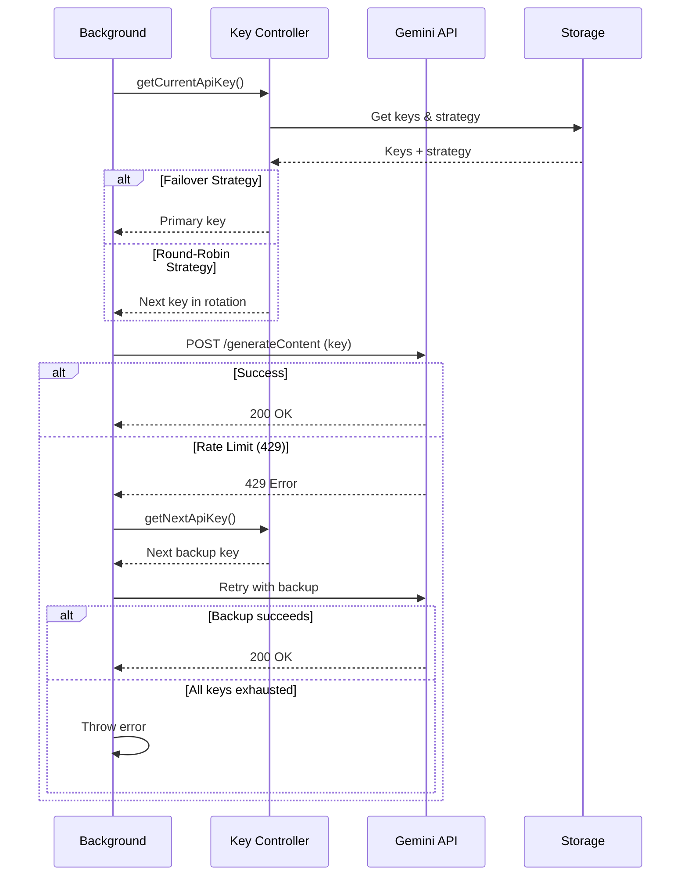
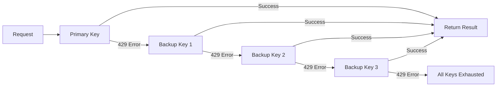
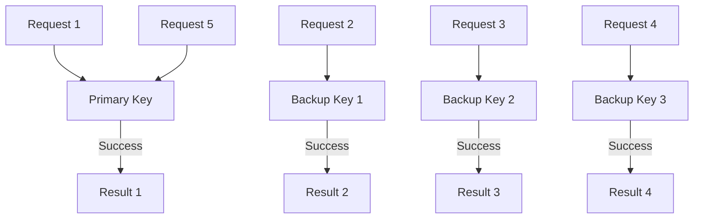

# Backup API Keys & Rotation System

> **Index:**

- [Backup API Keys \& Rotation System](#backup-api-keys--rotation-system)
	- [Table of Contents](#table-of-contents)
	- [Overview](#overview)
		- [Key Benefits](#key-benefits)
	- [How It Works](#how-it-works)
		- [Key Components](#key-components)
	- [Configuration](#configuration)
		- [Adding Backup Keys](#adding-backup-keys)
		- [Removing Backup Keys](#removing-backup-keys)
		- [Setting Rotation Strategy](#setting-rotation-strategy)
	- [Rotation Strategies](#rotation-strategies)
		- [1. Failover Strategy (Default)](#1-failover-strategy-default)
		- [2. Round-Robin Strategy](#2-round-robin-strategy)
	- [Usage Guide](#usage-guide)
		- [Basic Setup (Failover)](#basic-setup-failover)
		- [Advanced Setup (Round-Robin)](#advanced-setup-round-robin)
		- [Handling Rate Limits](#handling-rate-limits)
		- [Key Rotation Behavior](#key-rotation-behavior)
	- [Technical Details](#technical-details)
		- [Storage Schema](#storage-schema)
		- [Key Selection Algorithm](#key-selection-algorithm)
		- [Rate Limit Detection](#rate-limit-detection)
		- [Error Handling](#error-handling)
		- [Performance Impact](#performance-impact)
	- [Best Practices](#best-practices)
		- [Key Management](#key-management)
		- [Strategy Selection](#strategy-selection)
		- [Quota Management](#quota-management)
		- [Troubleshooting](#troubleshooting)


**Feature Version:** 2.8.0
**Last Updated:** 2025-11-28
**Status:** ✅ Active

---

## Table of Contents

1. [Overview](#overview)
2. [How It Works](#how-it-works)
3. [Configuration](#configuration)
4. [Rotation Strategies](#rotation-strategies)
5. [Usage Guide](#usage-guide)
6. [Technical Details](#technical-details)

---

## Overview

The Backup API Keys system provides automatic failover and load balancing across multiple Gemini API keys. Introduced in v2.8.0, it ensures uninterrupted service when rate limits are hit or keys fail.

### Key Benefits

- 🔄 **Automatic Failover**: Switches keys when rate limits hit
- ⚖️ **Load Balancing**: Distribute requests across keys (round-robin)
- 🛡️ **Service Continuity**: Maintains operation during API issues
- 📊 **Key Management**: Easy add/remove backup keys
- 🎯 **Strategy Selection**: Choose failover or round-robin

---

## How It Works



### Key Components

| Component               | Purpose         | Behavior                              |
| ----------------------- | --------------- | ------------------------------------- |
| **Primary Key**         | Main API key    | First key used in both strategies     |
| **Backup Keys**         | Failover array  | Additional keys (up to 5 recommended) |
| **Key Controller**      | Selection logic | Chooses which key to use              |
| **Rotation Strategy**   | Selection mode  | Failover or round-robin               |
| **Rate Limit Detector** | Error handler   | Identifies 429 responses              |
| **Retry Logic**         | Resilience      | 3 attempts per key before switching   |

---

## Configuration

### Adding Backup Keys

**Via Popup**:
1. Click extension icon
2. Go to **Settings** tab
3. Scroll to **"Backup API Keys"** section
4. Enter a backup key
5. Click **"Add Backup Key"**
6. Repeat for additional keys (up to 5 recommended)

**Via Storage** (Advanced):
```javascript
await browser.storage.local.set({
  backupApiKeys: [
    "AIzaSyBackupKey1...",
    "AIzaSyBackupKey2...",
    "AIzaSyBackupKey3..."
  ]
});
```

### Removing Backup Keys

**Via Popup**:
1. Go to Settings → Backup API Keys
2. Find key in list
3. Click **"Remove"** button next to key
4. Key removed immediately

### Setting Rotation Strategy

**Via Popup**:
1. Go to Settings → Backup API Keys
2. Find **"Key Rotation Strategy"** dropdown
3. Select strategy:
   - **Failover** (default): Sequential fallback
   - **Round-Robin**: Balanced distribution
4. Strategy applies immediately

---

## Rotation Strategies

### 1. Failover Strategy (Default)

**Behavior**: Uses primary key until it fails, then tries backup keys sequentially.



**Use Cases**:
- **Primary key has high quota**: Maximize usage of best key
- **Backup keys are limited**: Save backups for emergencies
- **Cost optimization**: Primary key cheaper than backups

**Pros**:
- Simple and predictable
- Maximizes primary key usage
- Easy to understand behavior

**Cons**:
- Primary key may hit limits quickly
- Uneven key usage
- Backups only used when primary fails

### 2. Round-Robin Strategy

**Behavior**: Rotates through all keys evenly, distributing load.



**Use Cases**:
- **Multiple equal keys**: All keys have same quota
- **High request volume**: Distribute load across all keys
- **Rate limit avoidance**: Prevent any single key from hitting limits

**Pros**:
- Even key usage
- Better for high volume
- Less likely to hit rate limits

**Cons**:
- All keys used equally (may not be desired)
- More complex tracking
- Requires multiple good keys

---

## Usage Guide

### Basic Setup (Failover)

**Recommended for most users:**

1. **Get API Keys**:
   - Visit [Google AI Studio](https://aistudio.google.com/app/apikey)
   - Generate 2-3 API keys
   - Save them securely

2. **Configure Extension**:
   - Open popup → Settings
   - Enter first key as "API Key" (primary)
   - Add 1-2 additional keys as backup keys
   - Leave strategy as "Failover" (default)

3. **Test**:
   - Visit a supported website
   - Enhance a chapter
   - If successful, setup complete!

### Advanced Setup (Round-Robin)

**For high-volume users:**

1. **Get Multiple Keys**:
   - Generate 3-5 API keys
   - All should have similar quotas
   - Save them securely

2. **Configure Extension**:
   - Open popup → Settings
   - Enter first key as primary
   - Add 2-4 backup keys
   - **Change strategy to "Round-Robin"**

3. **Monitor Usage**:
   - Keys used evenly
   - Check Google AI Studio for usage stats
   - Add more keys if all hitting limits

### Handling Rate Limits

When you see: *"All API keys exhausted. Please try again later."*

**Immediate Actions**:
1. Wait 15-30 minutes for quota reset
2. Check Google AI Studio for quota status
3. Consider adding more backup keys

**Prevention**:
1. Use round-robin for high volume
2. Add more backup keys (3-5 recommended)
3. Reduce enhancement frequency temporarily

### Key Rotation Behavior

**Failover Example**:
```
Request 1: Primary → Success
Request 2: Primary → 429 Error → Backup 1 → Success
Request 3: Primary → 429 Error → Backup 1 → Success
Request 4: Primary → 429 Error → Backup 1 → 429 → Backup 2 → Success
```

**Round-Robin Example**:
```
Request 1: Primary → Success
Request 2: Backup 1 → Success
Request 3: Backup 2 → Success
Request 4: Primary → Success
Request 5: Backup 1 → Success
```

---

## Technical Details

### Storage Schema

```javascript
{
  "apiKey": "AIzaSyPrimaryKey...",           // Primary key
  "backupApiKeys": [                          // Backup keys array
    "AIzaSyBackupKey1...",
    "AIzaSyBackupKey2...",
    "AIzaSyBackupKey3..."
  ],
  "apiKeyRotation": "failover",               // Strategy
  "currentApiKeyIndex": 0                      // Round-robin tracker
}
```

### Key Selection Algorithm

**Failover**:
```javascript
function getCurrentApiKey() {
  return apiKey; // Always return primary
}

function getNextApiKey(currentIndex) {
  if (currentIndex === 0) return backupApiKeys[0];
  if (currentIndex < backupApiKeys.length) {
    return backupApiKeys[currentIndex];
  }
  throw new Error("All keys exhausted");
}
```

**Round-Robin**:
```javascript
function getCurrentApiKey() {
  const allKeys = [apiKey, ...backupApiKeys];
  const key = allKeys[currentApiKeyIndex];
  currentApiKeyIndex = (currentApiKeyIndex + 1) % allKeys.length;
  return key;
}
```

### Rate Limit Detection

```javascript
async function makeApiCallWithRotation(content, prompt) {
  let attempts = 0;
  let keyIndex = 0;

  while (attempts < maxKeysToTry) {
    try {
      const key = getKeyByIndex(keyIndex);
      const response = await callGeminiAPI(key, content, prompt);
      return response; // Success
    } catch (error) {
      if (error.status === 429) {
        // Rate limit - try next key
        keyIndex++;
        attempts++;
        continue;
      }
      throw error; // Other error - don't retry
    }
  }

  throw new Error("All API keys exhausted");
}
```

### Error Handling

| Error Type        | Status         | Behavior                     |
| ----------------- | -------------- | ---------------------------- |
| **Rate Limit**    | 429            | Switch to next key, retry    |
| **Invalid Key**   | 401            | Skip key, try next           |
| **Network Error** | -              | Retry same key up to 3 times |
| **Other 4xx**     | 400, 403, etc. | Fail immediately             |
| **Server Error**  | 500, 503       | Retry same key with backoff  |

### Performance Impact

- **Key Selection**: < 1ms per request
- **Storage Access**: Cached in memory after first load
- **Retry Overhead**: 1-3 seconds per failed key
- **Total Delay**: Up to 15s if all keys fail (5 keys × 3s each)

---

## Best Practices

### Key Management

1. **Generate from Same Account**: Use Google AI Studio with one account
2. **Label Keys**: Add comments in AI Studio (e.g., "RanobeGemini Primary")
3. **Rotate Periodically**: Generate new keys every few months
4. **Secure Storage**: Never share keys publicly

### Strategy Selection

**Choose Failover if**:
- ✅ Primary key has higher quota
- ✅ Backup keys are limited
- ✅ Low to medium request volume
- ✅ Want simple, predictable behavior

**Choose Round-Robin if**:
- ✅ All keys have equal quotas
- ✅ High request volume
- ✅ Want to maximize throughput
- ✅ Frequently hit rate limits

### Quota Management

1. **Monitor Usage**: Check Google AI Studio regularly
2. **Set Alerts**: (If available) Set up quota alerts
3. **Plan Capacity**: 3-5 keys recommended for heavy use
4. **Stagger Requests**: Don't enhance rapidly back-to-back

### Troubleshooting

**All Keys Exhausted**:
- Wait 15-30 minutes for quota reset
- Check AI Studio for quota status
- Add more backup keys
- Switch to round-robin if using failover

**One Key Always Fails**:
- Key may be revoked or invalid
- Remove and replace with new key
- Check AI Studio for key status

**Slow Performance**:
- May be trying multiple keys before success
- Check which keys are failing
- Remove non-working keys
- Ensure keys have quota remaining

---

**Navigation:** [Back to Features](./README.md) | [Main Docs](../README.md) | [Architecture](../architecture/ARCHITECTURE.md)