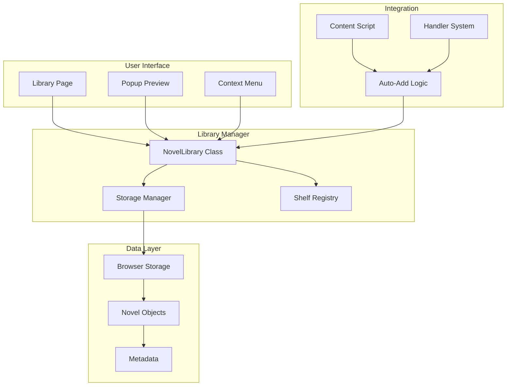
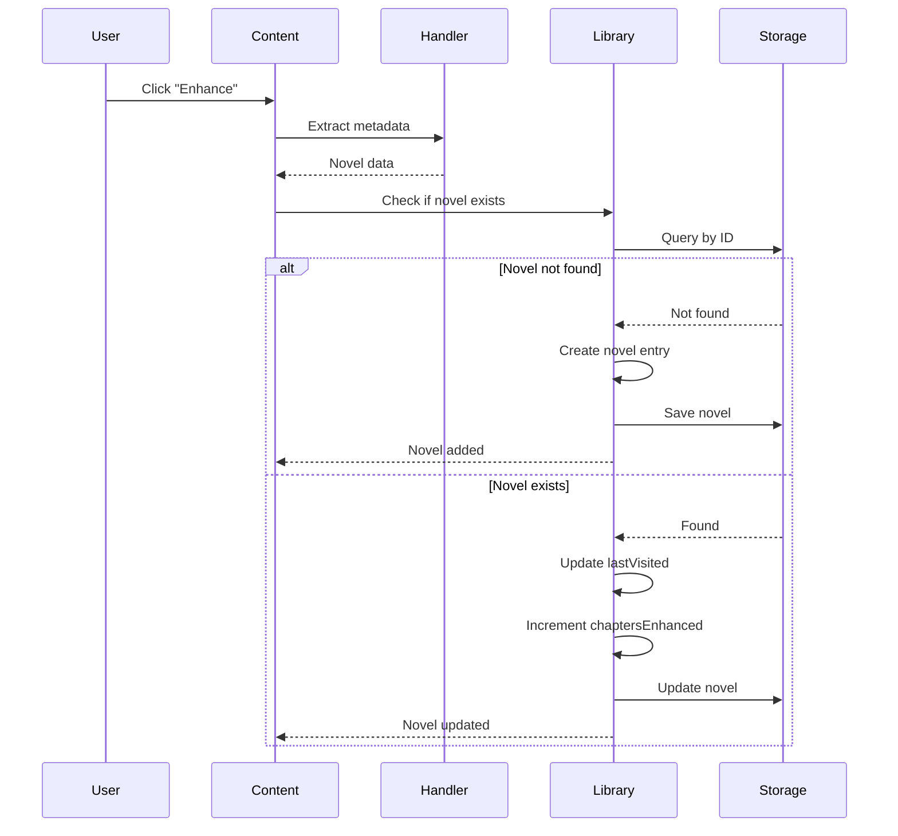
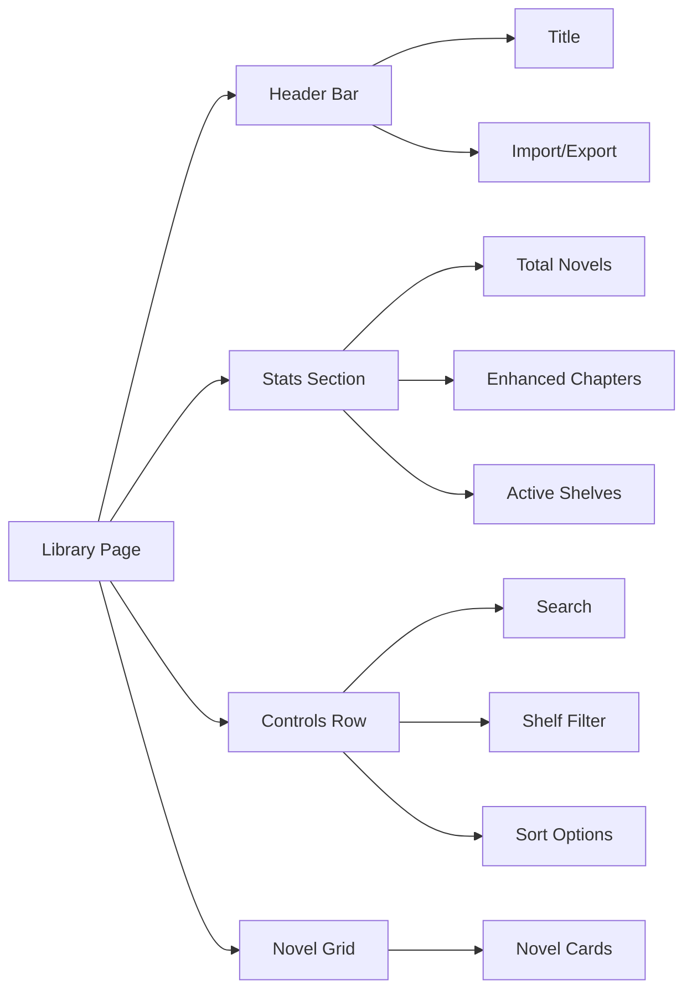
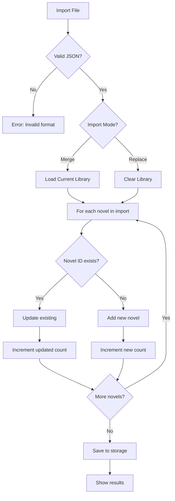

# Novel Library System

> **Index:**

- [Novel Library System](#novel-library-system)
	- [Table of Contents](#table-of-contents)
	- [Overview](#overview)
		- [Key Benefits](#key-benefits)
	- [Architecture](#architecture)
		- [Architecture Components](#architecture-components)
	- [Features](#features)
		- [1. Automatic Novel Detection](#1-automatic-novel-detection)
		- [2. Shelf Organization](#2-shelf-organization)
		- [3. Full Library Page](#3-full-library-page)
			- [Features:](#features-1)
		- [4. Novel Metadata](#4-novel-metadata)
		- [5. Novel Management](#5-novel-management)
		- [6. Import/Export](#6-importexport)
			- [Export](#export)
			- [Import](#import)
		- [7. Custom Prompts](#7-custom-prompts)
	- [Usage Guide](#usage-guide)
		- [Adding Novels to Library](#adding-novels-to-library)
		- [Viewing Your Library](#viewing-your-library)
		- [Searching Novels](#searching-novels)
		- [Filtering by Shelf](#filtering-by-shelf)
		- [Sorting Novels](#sorting-novels)
		- [Editing Novel Details](#editing-novel-details)
		- [Setting Custom Prompts](#setting-custom-prompts)
		- [Exporting Library](#exporting-library)
		- [Importing Library](#importing-library)
		- [Deleting Novels](#deleting-novels)
	- [Technical Details](#technical-details)
		- [Storage Structure](#storage-structure)
		- [Novel ID Pattern](#novel-id-pattern)
		- [Shelf Metadata](#shelf-metadata)
		- [Auto-Add Trigger](#auto-add-trigger)
		- [Data Validation](#data-validation)
	- [API Reference](#api-reference)
		- [NovelLibrary Class](#novellibrary-class)
			- [Methods](#methods)
				- [`getInstance()`](#getinstance)
				- [`addNovel(novelData)`](#addnovelnoveldata)
				- [`updateNovel(novelId, updates)`](#updatenovelnovelid-updates)
				- [`deleteNovel(novelId)`](#deletenovelnovelid)
				- [`getNovel(novelId)`](#getnovelnovelid)
				- [`getAllNovels()`](#getallnovels)
				- [`searchNovels(query)`](#searchnovelsquery)
				- [`exportLibrary()`](#exportlibrary)
				- [`importLibrary(jsonData, mode)`](#importlibraryjsondata-mode)
	- [Best Practices](#best-practices)
		- [Organization](#organization)
		- [Performance](#performance)
		- [Data Management](#data-management)


**Feature Version:** 3.0.0
**Last Updated:** 2025-11-28
**Status:** ✅ Active

---

## Table of Contents

1. [Overview](#overview)
2. [Architecture](#architecture)
3. [Features](#features)
4. [Usage Guide](#usage-guide)
5. [Technical Details](#technical-details)
6. [API Reference](#api-reference)

---

## Overview

The Novel Library System is a comprehensive solution for organizing, tracking, and managing your web novel reading across all supported websites. Introduced in v3.0.0, it provides automatic novel detection, metadata management, and reading progress tracking.

### Key Benefits

- 📚 **Organized Collection**: Automatically organize novels by website
- 📖 **Progress Tracking**: Track chapters enhanced and reading progress
- ✏️ **Metadata Management**: Edit titles, covers, descriptions, and more
- 🔍 **Search & Filter**: Quickly find novels in your collection
- 📤 **Backup & Restore**: Export/import your entire library
- 🎯 **Custom Prompts**: Set per-novel enhancement instructions

---

## Architecture



### Architecture Components

| Component              | Purpose                  | Technology                    |
| ---------------------- | ------------------------ | ----------------------------- |
| **Library Page**       | Full library interface   | HTML/CSS/JS                   |
| **Popup Preview**      | Quick access in popup    | Embedded in popup.html        |
| **Context Menu**       | Right-click shortcuts    | Browser context menu API      |
| **NovelLibrary Class** | Core library manager     | JavaScript singleton          |
| **Storage Manager**    | Storage abstraction      | browser.storage.local wrapper |
| **Shelf Registry**     | Dynamic shelf system     | Built from handler metadata   |
| **Browser Storage**    | Persistent data layer    | browser.storage.local         |
| **Novel Objects**      | Individual novel data    | JSON objects                  |
| **Metadata**           | Rich novel information   | Structured data               |
| **Handler System**     | Site-specific extraction | Handler classes               |
| **Auto-Add Logic**     | Automatic detection      | Content script integration    |

---

## Features

### 1. Automatic Novel Detection

When you enhance a chapter for the first time, the extension automatically:

1. **Detects the website** using the handler system
2. **Extracts novel ID** from the URL using shelf patterns
3. **Gathers metadata** (title, author, cover, description)
4. **Creates novel entry** in the appropriate shelf
5. **Updates progress** on subsequent enhancements



### 2. Shelf Organization

Novels are organized into shelves based on their source website:

| Shelf          | Websites                             | Icon | Color   |
| -------------- | ------------------------------------ | ---- | ------- |
| **FanFiction** | www.fanfiction.net, m.fanfiction.net | 📖    | #6c5ce7 |
| **Ranobes**    | ranobes.net + 10 variants            | 📚    | #00b894 |
| **AO3**        | archiveofourown.org, ao3.org         | 📕    | #990000 |
| **WebNovel**   | webnovel.com                         | 📘    | #f39c12 |

**Mobile & Desktop Unity**: Mobile and desktop versions of the same site share novels (e.g., www.fanfiction.net and m.fanfiction.net both use the FanFiction shelf).

### 3. Full Library Page

Access via: Popup → Novels tab → "Open Full Library"



#### Features:
- **Search**: Find novels by title, author, or description
- **Filter by Shelf**: Show only novels from specific websites
- **Sort Options**:
  - Most Recent (last visited)
  - Date Added (newest first)
  - Enhanced Chapters (most enhanced)
- **Grid Layout**: Responsive card-based design
- **Novel Cards**: Display cover, title, author, progress

### 4. Novel Metadata

Each novel stores comprehensive metadata:

```javascript
{
  "id": "fanfiction_12025721",           // Unique identifier
  "shelfId": "fanfiction",                // Shelf/website
  "novelId": "12025721",                  // Site-specific ID
  "title": "Story Title",                 // Novel title
  "author": "Author Name",                // Author name
  "url": "https://...",                   // Primary URL
  "description": "Story summary...",      // Synopsis
  "coverUrl": "https://.../cover.jpg",    // Cover image
  "status": "reading",                    // Reading status
  "genres": ["Romance", "Adventure"],     // Genres/tags
  "rating": "M",                          // Content rating
  "addedDate": "2025-11-28T10:30:00Z",   // When added
  "lastVisited": "2025-11-28T12:45:00Z", // Last enhancement
  "chaptersEnhanced": 5,                  // Enhancement count
  "totalChapters": 20,                    // Total chapters (if known)
  "customPrompt": "Custom instructions",  // Per-novel prompt
  "notes": "Personal reading notes"       // User notes
}
```

### 5. Novel Management

**Edit Novel Dialog**: Click any novel card to open the edit modal.

**Editable Fields**:
- Title
- Author
- Cover URL
- Description
- Status (Reading, Completed, On-Hold, Plan to Read, Dropped)
- Genres/Tags (comma-separated)
- Custom Enhancement Prompt
- Personal Notes

**Actions**:
- Save changes
- Delete novel (with confirmation)
- Cancel (discard changes)

### 6. Import/Export

#### Export
- **Format**: JSON with timestamp
- **Filename**: `ranobegemini-library-YYYY-MM-DD-HHmmss.json`
- **Contents**: Complete library data, settings excluded
- **Use Cases**: Backup, transfer between devices, sharing

#### Import
- **Modes**:
  - **Merge**: Add new novels, update existing (by ID)
  - **Replace**: Clear library, then import all novels
- **Conflict Resolution**: Merge mode updates existing novels
- **Results**: Shows count of new, updated, and error novels
- **Validation**: Checks JSON structure before import



### 7. Custom Prompts

Set enhancement instructions specific to each novel:

**Use Cases**:
- Genre-specific instructions (e.g., "Maintain horror atmosphere")
- Character consistency (e.g., "Character X speaks formally")
- Writing style preferences (e.g., "Keep dialogue natural")
- Content preferences (e.g., "Minimize violence descriptions")

**Priority**: Custom prompts are combined with:
1. Permanent prompt (always applied)
2. Default/summary prompt (based on action)
3. Site-specific prompt (from handler)
4. **Novel custom prompt** (highest priority for content-specific rules)

---

## Usage Guide

### Adding Novels to Library

**Automatic Method** (Recommended):
1. Visit any supported website
2. Navigate to a chapter
3. Click "Enhance" or "Long Summary"
4. Novel automatically added to library

**Manual Method**:
Currently not supported - novels must be added through enhancement.

### Viewing Your Library

**Quick Preview** (Popup):
1. Click extension icon
2. Go to "Novels" tab
3. View 5 most recent novels
4. See library stats

**Full Library**:
1. Click extension icon
2. Go to "Novels" tab
3. Click "Open Full Library"
4. Full-featured library page opens

### Searching Novels

1. Open full library page
2. Type in search box
3. Searches: title, author, description
4. Results update in real-time

### Filtering by Shelf

1. Open full library page
2. Use shelf dropdown
3. Select specific shelf or "All Shelves"
4. Grid updates immediately

### Sorting Novels

**Available Sort Options**:
- **Most Recent**: Last visited novels first (default)
- **Date Added**: Newest additions first
- **Enhanced Chapters**: Most enhanced novels first

### Editing Novel Details

1. Open full library page
2. Click any novel card
3. Edit modal opens
4. Modify any field
5. Click "Save" or press Escape to cancel

### Setting Custom Prompts

1. Edit novel (see above)
2. Scroll to "Custom Prompt" field
3. Enter your instructions
4. Click "Save"
5. Future enhancements use this prompt

### Exporting Library

1. Open full library page
2. Click "Export Library"
3. JSON file downloads automatically
4. Save securely for backup

### Importing Library

1. Open full library page
2. Click "Import Library"
3. Select JSON file
4. Choose mode:
   - **Merge**: Keep existing, add new, update duplicates
   - **Replace**: Clear all, import fresh
5. Click "Import"
6. Review results

### Deleting Novels

**Single Novel**:
1. Edit novel
2. Click "Delete Novel" (bottom of modal)
3. Confirm deletion
4. Novel removed from library

**Bulk Delete**:
Currently not supported - delete novels individually.

---

## Technical Details

### Storage Structure

```javascript
// browser.storage.local
{
  "rg_novel_library": {
    "novels": {
      "fanfiction_12025721": { /* novel object */ },
      "ranobes_12345": { /* novel object */ },
      "ao3_67890": { /* novel object */ }
    }
  }
}
```

### Novel ID Pattern

Format: `[shelfId]_[novelId]`

**Examples**:
- FanFiction: `fanfiction_12025721` (from URL: /s/12025721/1/)
- Ranobes: `ranobes_lush-life` (from URL: /novels/lush-life/chapters/)
- AO3: `ao3_12345678` (from URL: /works/12345678/)
- WebNovel: `webnovel_story-title_12345` (from URL: /book/story-title_12345)

### Shelf Metadata

Defined in each handler's `SHELF_METADATA` static property:

```javascript
static SHELF_METADATA = {
  id: "fanfiction",
  name: "FanFiction",
  icon: "📖",
  color: "#6c5ce7",
  novelIdPattern: /fanfiction\.net\/s\/(\d+)/,
  primaryDomain: "www.fanfiction.net"
};
```

### Auto-Add Trigger

Located in `content.js`, triggers after successful enhancement:

```javascript
// After enhancement completes
const novelData = await currentHandler.extractNovelMetadata();
await addOrUpdateNovelInLibrary({
  shelfId: currentHandler.constructor.SHELF_METADATA.id,
  novelId: extractedId,
  ...novelData,
  url: window.location.href
});
```

### Data Validation

**On Import**:
- Validates JSON structure
- Checks required fields (id, shelfId, novelId, title)
- Sanitizes URLs
- Validates dates
- Filters invalid genres

**On Storage**:
- Checks storage quota
- Handles quota exceeded errors
- Validates before save

---

## API Reference

### NovelLibrary Class

**Singleton class managing all library operations.**

#### Methods

##### `getInstance()`
Returns the singleton instance.

```javascript
const library = NovelLibrary.getInstance();
```

##### `addNovel(novelData)`
Adds a novel to the library.

**Parameters**:
- `novelData` (Object): Novel metadata

**Returns**: Promise<void>

**Example**:
```javascript
await library.addNovel({
  id: "fanfiction_12025721",
  shelfId: "fanfiction",
  novelId: "12025721",
  title: "Story Title",
  author: "Author Name",
  url: "https://..."
});
```

##### `updateNovel(novelId, updates)`
Updates an existing novel.

**Parameters**:
- `novelId` (string): Novel ID
- `updates` (Object): Fields to update

**Returns**: Promise<void>

**Example**:
```javascript
await library.updateNovel("fanfiction_12025721", {
  chaptersEnhanced: 10,
  lastVisited: new Date().toISOString()
});
```

##### `deleteNovel(novelId)`
Deletes a novel from the library.

**Parameters**:
- `novelId` (string): Novel ID

**Returns**: Promise<void>

##### `getNovel(novelId)`
Retrieves a specific novel.

**Parameters**:
- `novelId` (string): Novel ID

**Returns**: Promise<Object|null>

##### `getAllNovels()`
Retrieves all novels.

**Returns**: Promise<Array<Object>>

##### `searchNovels(query)`
Searches novels by title, author, or description.

**Parameters**:
- `query` (string): Search query

**Returns**: Promise<Array<Object>>

##### `exportLibrary()`
Exports library as JSON string.

**Returns**: Promise<string>

##### `importLibrary(jsonData, mode)`
Imports library from JSON.

**Parameters**:
- `jsonData` (string): JSON library data
- `mode` (string): "merge" or "replace"

**Returns**: Promise<{new: number, updated: number, errors: Array}>

---

## Best Practices

### Organization

1. **Use Custom Prompts**: Set genre-specific instructions per novel
2. **Update Metadata**: Keep titles and authors accurate
3. **Add Notes**: Track plot points, character names, etc.
4. **Regular Backups**: Export library monthly

### Performance

1. **Large Libraries**: Search/filter instead of scrolling
2. **Cover Images**: Use valid URLs for faster loading
3. **Export Size**: Libraries >1000 novels may take time to export

### Data Management

1. **Backup Before Import**: Always export before importing
2. **Merge vs Replace**: Use merge to preserve data
3. **Clean Up**: Delete dropped novels periodically

---

**Navigation:** [Back to Features](./README.md) | [Main Docs](../README.md) | [Architecture](../architecture/ARCHITECTURE.md)