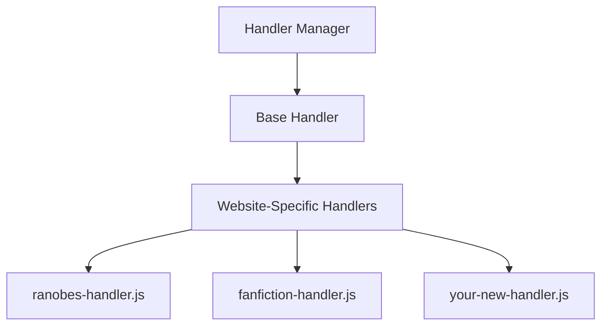
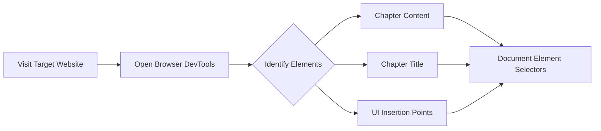
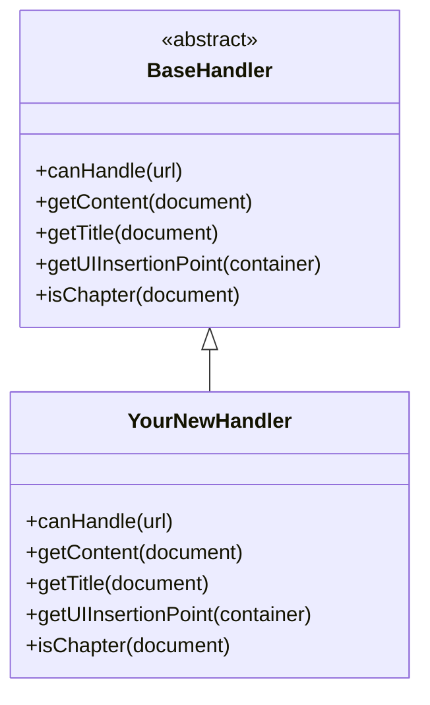
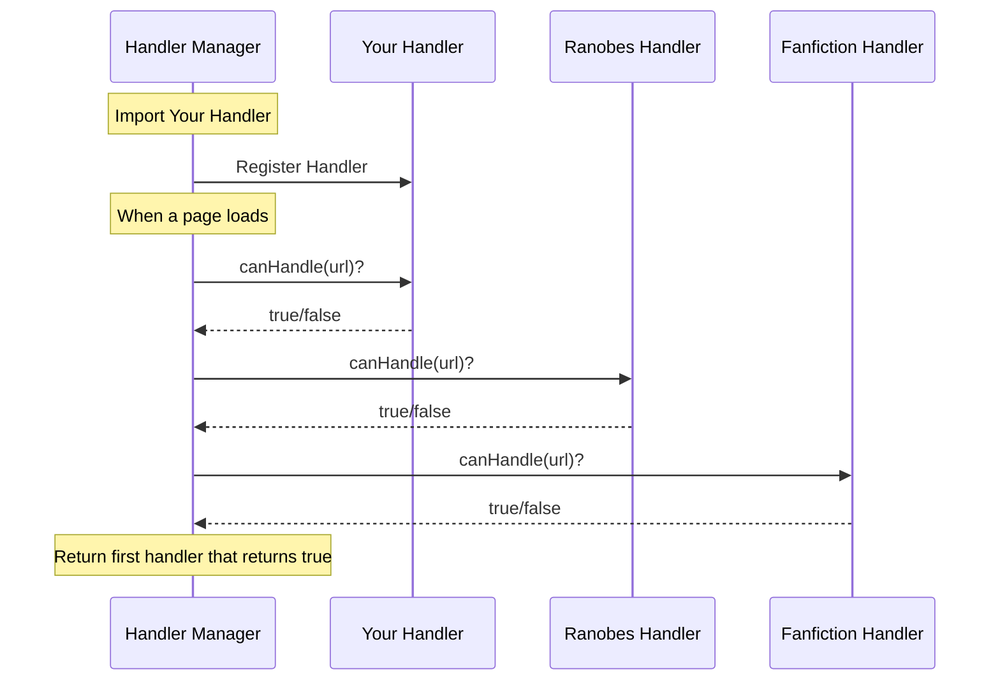
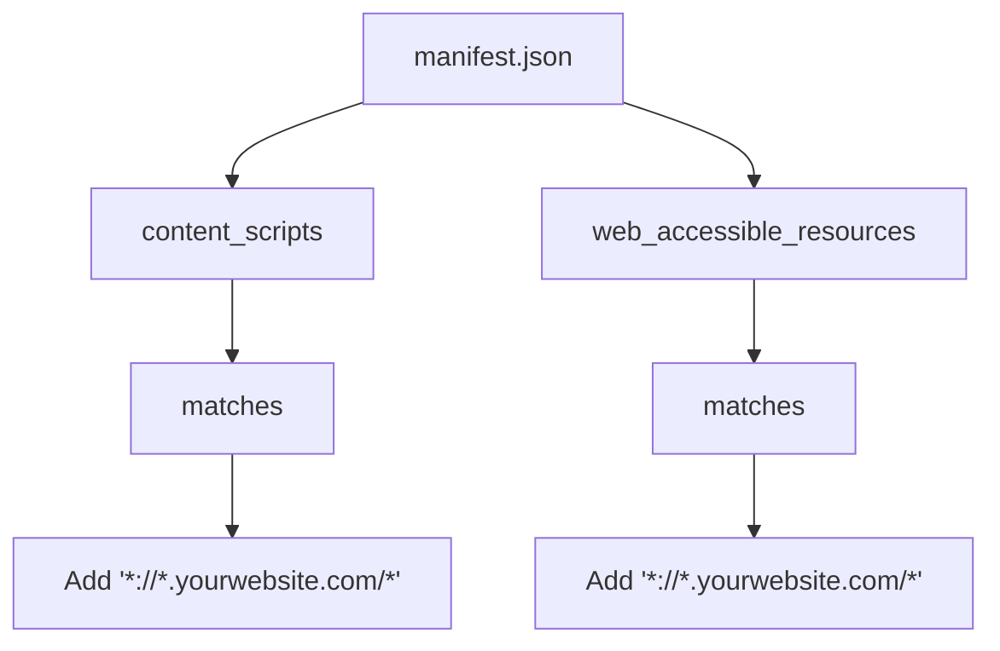
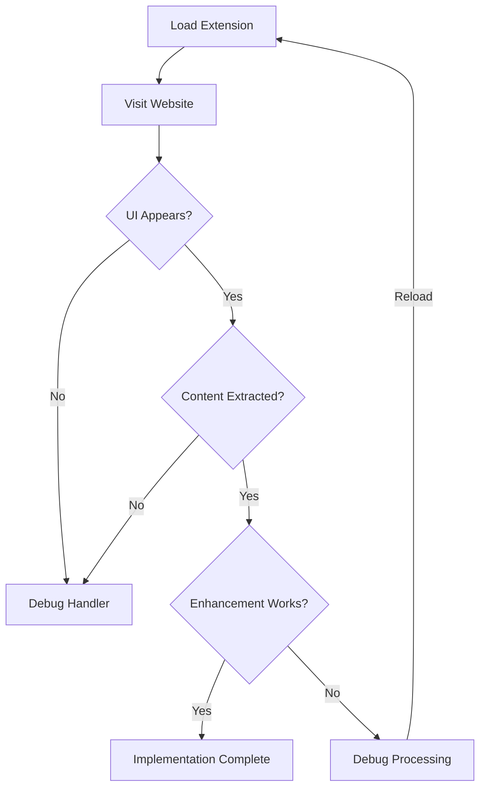

# Adding Support for New Websites

This guide explains how to add support for new novel websites to the Ranobe Gemini Firefox extension.

## Overview

Ranobe Gemini uses a modular website handler system that allows it to support different websites through specialized handler classes. Each handler knows how to extract content from a specific website's DOM structure.



### Handler System Architecture

| Component                 | Type                    | Purpose                                              | Location                                       |
| ------------------------- | ----------------------- | ---------------------------------------------------- | ---------------------------------------------- |
| **Handler Manager**       | Factory                 | Selects the appropriate handler based on current URL | `utils/website-handlers/handler-manager.js`    |
| **Base Handler**          | Abstract Class          | Defines common interface all handlers must implement | `utils/website-handlers/base-handler.js`       |
| **ranobes-handler.js**    | Concrete Handler        | Handles ranobes.net and variants (10 domains)        | `utils/website-handlers/ranobes-handler.js`    |
| **fanfiction-handler.js** | Concrete Handler        | Handles fanfiction.net (www, m, bare domain)         | `utils/website-handlers/fanfiction-handler.js` |
| **ao3-handler.js**        | Concrete Handler        | Handles archiveofourown.org and ao3.org              | `utils/website-handlers/ao3-handler.js`        |
| **webnovel-handler.js**   | Concrete Handler        | Handles webnovel.com with infinite scroll            | `utils/website-handlers/webnovel-handler.js`   |
| **your-new-handler.js**   | New Handler (Your Code) | Your implementation for a new website                | Create in same directory                       |

## Step-by-Step Process

### 1. Identify the Website's DOM Structure



### DOM Structure Analysis Steps

| Step             | Action                         | Tool                         | What to Find                                                                       |
| ---------------- | ------------------------------ | ---------------------------- | ---------------------------------------------------------------------------------- |
| **A. Visit**     | Navigate to a chapter page     | Browser                      | Open a typical chapter page on the target website                                  |
| **B. DevTools**  | Open browser inspector         | F12 or Right-click → Inspect | Opens the DOM inspection panel                                                     |
| **C. Identify**  | Locate key elements            | Element picker tool          | Click elements to see their selectors in DevTools                                  |
| **D. Content**   | Find chapter text container    | Inspector                    | Usually a `<div>` with class like `.chapter-content`, `.story-text`, or `#content` |
| **E. Title**     | Find chapter/work title        | Inspector                    | Often in `<h1>`, `<h2>`, or special title div                                      |
| **F. Insertion** | Find button placement location | Inspector                    | Look for navigation bars, chapter headers, or content wrappers                     |
| **G. Document**  | Record all CSS selectors       | Notepad/text editor          | Write down: `.chapter-content`, `#title-element`, etc.                             |

**Example Selectors:**
- Content: `.chapter-content`, `#storytext`, `.userstuff`, `.cha-words`
- Title: `.chapter-title`, `#profile_top b`, `.work-title`, `.cha-tit`
- Insertion: `.chapter-nav`, `.entry-header`, `.chapter-inner`

First, you need to understand how the target website structures its content:

1. Visit a chapter page on your target website
2. Open your browser's DevTools (F12 or right-click > Inspect)
3. Identify the DOM elements that contain:
   - The chapter content (main text)
   - The chapter title
   - Good places to insert the extension's UI elements
4. Note the CSS selectors or DOM traversal needed to reliably locate these elements

### 2. Create a New Handler File

Create a new file in `utils/website-handlers/` named after the website (e.g., `royalroad-handler.js`).

### 3. Implement the Handler Class



### Handler Class Structure

| Method                             | Return Type        | Purpose                                                         | Implementation Complexity                   |
| ---------------------------------- | ------------------ | --------------------------------------------------------------- | ------------------------------------------- |
| **canHandle(url)**                 | `boolean`          | Determines if this handler should process the current page      | ⭐ Easy - Simple URL/hostname check          |
| **getContent(document)**           | `string` or `null` | Extracts the chapter text content from the page                 | ⭐⭐ Medium - Requires DOM selector knowledge |
| **getTitle(document)**             | `string`           | Extracts the chapter or work title                              | ⭐ Easy - Usually a single selector          |
| **getUIInsertionPoint(container)** | `object`           | Determines where to place Enhance/Summarize buttons             | ⭐⭐ Medium - May need experimentation        |
| **isChapter(document)**            | `boolean`          | Checks if current page is actually a chapter (vs index/profile) | ⭐ Easy - Check for content presence         |

**BaseHandler Inheritance:**
- All website handlers must extend `BaseHandler`
- Provides default implementations for some methods
- Enforces consistent interface across all handlers
- Enables the Handler Manager to work with any handler uniformly

Here's a template for your new handler:

```javascript
// Import the base handler
import BaseHandler from './base-handler.js';

class YourWebsiteHandler extends BaseHandler {
    // Determine if this handler can process the current URL
    canHandle(url) {
        return url.includes('yourwebsite.com');
    }

    // Check if the current page is a chapter page
    isChapter(document) {
        // Return true if this page contains a chapter
        // Example: return document.querySelector('.chapter-content') !== null;
    }

    // Extract the chapter content
    getContent(document) {
        const contentElement = document.querySelector('selector-for-content');
        if (!contentElement) return null;

        // Return the text content or innerHTML as appropriate
        return contentElement.textContent;
    }

    // Extract the chapter title
    getTitle(document) {
        const titleElement = document.querySelector('selector-for-title');
        if (!titleElement) return 'Unknown Chapter';

        return titleElement.textContent.trim();
    }

    // Determine where to insert the extension's UI
    getUIInsertionPoint(container) {
        const insertionPoint = document.querySelector('selector-for-insertion');

        return {
            element: insertionPoint || container,
            position: 'before' // or 'after', 'prepend', 'append'
        };
    }
}

export default YourWebsiteHandler;
```

### 4. Register Your Handler



### Handler Selection Process

| Step | Actor              | Action                                                       | Decision Point                                             |
| ---- | ------------------ | ------------------------------------------------------------ | ---------------------------------------------------------- |
| 1    | Handler Manager    | Receives page load event                                     | Extension detects navigation to new page                   |
| 2    | Handler Manager    | Imports all registered handlers                              | Loads YourHandler, RanobesHandler, FanfictionHandler, etc. |
| 3    | Handler Manager    | Calls `canHandle(url)` on each                               | Passes current page URL to each handler                    |
| 4    | Your Handler       | Checks if URL matches (e.g., `url.includes('yoursite.com')`) | Returns `true` if match, `false` otherwise                 |
| 5    | Ranobes Handler    | Checks if URL matches ranobes domains                        | Returns `true` if match, `false` otherwise                 |
| 6    | Fanfiction Handler | Checks if URL matches fanfiction.net                         | Returns `true` if match, `false` otherwise                 |
| 7    | Handler Manager    | Selects first handler that returned `true`                   | Uses this handler for all content operations               |
| 8    | Handler Manager    | Returns selected handler to content script                   | Content script uses this handler to extract content        |

> **Important:** Handler order matters! The first handler to return `true` from `canHandle()` is used. Place more specific handlers before generic ones.

Open `utils/website-handlers/handler-manager.js` and register your new handler:

```javascript
import YourWebsiteHandler from './your-website-handler.js';

// In the registerHandlers method
registerHandlers() {
    // ...existing handlers...
    this.registerHandler(new YourWebsiteHandler());
}
```

### 5. Update the Manifest File



### Manifest Configuration Elements

| Element                      | Path                                         | Purpose                                   | Example Value                           |
| ---------------------------- | -------------------------------------------- | ----------------------------------------- | --------------------------------------- |
| **manifest.json**            | Root file                                    | Extension configuration file              | Defines permissions, scripts, resources |
| **content_scripts**          | `manifest.json` → `content_scripts`          | Array of scripts to inject into web pages | Contains matches, js, css, run_at       |
| **matches**                  | `content_scripts[0]` → `matches`             | URL patterns where content script runs    | `["*://*.yoursite.com/*"]`              |
| **yourwebsite.com**          | Added to matches array                       | Your new website's domain pattern         | Use wildcard: `*://*.domain.com/*`      |
| **web_accessible_resources** | `manifest.json` → `web_accessible_resources` | Resources that web pages can access       | Icons, utility scripts, handlers        |
| **resources**                | `web_accessible_resources[0]` → `resources`  | Files available to content scripts        | `["icons/*.png", "utils/*.js"]`         |
| **matches (WAR)**            | `web_accessible_resources[0]` → `matches`    | Which sites can access the resources      | Same patterns as content_scripts        |

**Automated Approach:**
Instead of manually editing `manifest.json`, use:
```powershell
npm run update-domains
```
This script automatically extracts domains from all handlers and updates the manifest.

Update the `manifest.json` file to include your new website in the content script matching patterns:

```json
"content_scripts": [
    {
        "matches": [
            "*://*.ranobes.top/*",
            "*://*.fanfiction.net/*",
            "*://*.yourwebsite.com/*"  // Add your website's pattern
        ],
        "js": ["content/content.js"],
        "css": ["content/content.css"],
        "run_at": "document_idle"
    }
],
"web_accessible_resources": [
    {
        "resources": [
            "icons/*.png",
            "utils/*.js",
            "utils/website-handlers/*.js"
        ],
        "matches": [
            "*://*.ranobes.top/*",
            "*://*.fanfiction.net/*",
            "*://*.newsite.com/*" // Add new site match pattern
        ]
    }
]
```

### 6. Test Your Implementation



### Testing Checklist

| Test Stage             | Check                           | Pass Criteria                                        | Debug If Fails                                                    |
| ---------------------- | ------------------------------- | ---------------------------------------------------- | ----------------------------------------------------------------- |
| **UI Appears?**        | Buttons visible on page         | "Enhance with Gemini" and "Summarize" buttons appear | Check `canHandle()` returns true, verify content script injection |
| **Content Extracted?** | Click buttons, check console    | Console shows extracted content (no "null" or empty) | Debug `getContent()` selector, check DOM structure                |
| **Enhancement Works?** | Enhanced text replaces original | Page content updates with enhanced version           | Check API key, verify Gemini API response, check network tab      |
| **Restore Works?**     | "Restore Original" button       | Original content restored after enhancement          | Verify original content was saved before replacement              |
| **Multiple Chapters**  | Test on 3+ different chapters   | Works consistently across chapters                   | Check if selectors are too specific, need more generic patterns   |
| **Mobile/Desktop**     | Test both versions              | Works on www. & m. subdomain like in fanfiction.net  | Verify SUPPORTED_DOMAINS includes both                            |
| **Summary Display**    | Click "Summarize" buttons       | Summary appears correctly formatted                  | Check summary container injection                                 |
| **Debug Mode**         | Enable in popup settings        | No console errors                                    | Fix JavaScript errors, check API limits                           |

1. Load your modified extension in Firefox (about:debugging)
2. Visit a chapter page on your target website
3. Check if:
   - The extension UI appears
   - It correctly extracts the chapter content
   - Enhancement and summarization work as expected
4. Fix any issues in your handler implementation

### 7. Add SHELF_METADATA for Novel Library

To enable the Novel Library feature for your website, add a static `SHELF_METADATA` property to your handler class. This metadata is used to create shelves in the library UI and enable site-specific filtering.

```javascript
class YourWebsiteHandler extends BaseHandler {
    // Static metadata for the Novel Library shelf system
    static SHELF_METADATA = {
        id: 'yoursite',           // Unique identifier (lowercase, no spaces)
        name: 'Your Site Name',   // Display name for the shelf
        icon: '📖',               // Can be emoji OR URL (see icon options below)
        description: 'Novels from yoursite.com'
    };

    static SUPPORTED_DOMAINS = ['yoursite.com', 'www.yoursite.com'];

    // ... rest of handler implementation
}
```

**Icon Options:**

| Format                   | Example                                 | Use Case                                    |
| ------------------------ | --------------------------------------- | ------------------------------------------- |
| **Emoji**                | `'📖'`                                   | Simple, universal, no external dependencies |
| **URL**                  | `'https://yoursite.com/favicon.ico'`    | Site's actual favicon/logo                  |
| **Object with fallback** | `{ url: 'https://...', fallback: '📖' }` | Best practice: URL with emoji backup        |

```javascript
// Option 1: Simple emoji
static SHELF_METADATA = {
    icon: '📖',  // Works everywhere
};

// Option 2: URL (favicon/logo)
static SHELF_METADATA = {
    icon: 'https://yoursite.com/favicon.ico',
};

// Option 3: URL with emoji fallback (recommended)
static SHELF_METADATA = {
    icon: {
        url: 'https://yoursite.com/favicon.ico',
        fallback: '📖'
    },
};
```

### 8. Create a Library Page for Your Website (Optional)

To add a dedicated "View All" page for novels from your website in the Novel Library:

**Step 1:** Create a folder at `src/library/websites/yoursite/`

**Step 2:** Create `index.html` in that folder:

```html
<!DOCTYPE html>
<html lang="en">
<head>
    <meta charset="UTF-8">
    <meta name="viewport" content="width=device-width, initial-scale=1.0">
    <title>Your Site Name - Novel Library</title>
    <link rel="stylesheet" href="../shelf-page.css">
</head>
<body>
    <header>
        <a href="../../library.html" class="back-link">← Back to Library</a>
        <h1><span class="shelf-icon">📖</span> Your Site Name Novels</h1>
    </header>
    <main id="shelf-container">
        <p class="loading">Loading novels...</p>
    </main>
    <script src="../../lib/browser-polyfill.min.js"></script>
    <script src="../shelf-page.js"></script>
    <script>
        // Initialize with your shelf ID (must match SHELF_METADATA.id)
        document.addEventListener('DOMContentLoaded', () => {
            initShelfPage('yoursite');
        });
    </script>
</body>
</html>
```

**Step 3:** Update the shelf's View All link in `library.js` to point to your page.

The shared `shelf-page.js` handles all the logic automatically - it reads the shelf ID, fetches novels, and renders them using the same card format as the main library.

### 9. Implement Novel Metadata Extraction (For Auto-Update)

For the Novel Library to auto-update novel details when users visit novel pages, implement these methods in your handler:

```javascript
class YourWebsiteHandler extends BaseHandler {
    // Check if current page is a novel info page (not chapter)
    isNovelPage(document) {
        // Return true if this is the novel's main page (description, info)
        return document.querySelector('.novel-info-container') !== null;
    }

    // Extract comprehensive novel metadata
    extractNovelMetadata(document, url) {
        return {
            // Required fields
            id: this.generateNovelId(url),  // Unique ID
            title: document.querySelector('.novel-title')?.textContent?.trim(),
            sourceUrl: url,
            sourceSite: 'yoursite',  // Must match SHELF_METADATA.id

            // Optional but recommended
            author: document.querySelector('.author-name')?.textContent?.trim(),
            coverUrl: document.querySelector('.novel-cover img')?.src,
            description: document.querySelector('.novel-description')?.textContent?.trim(),
            genres: Array.from(document.querySelectorAll('.genre-tag'))
                        .map(el => el.textContent.trim()),
            status: document.querySelector('.novel-status')?.textContent?.trim(),
            totalChapters: parseInt(document.querySelector('.chapter-count')?.textContent) || null,

            // Timestamps
            lastUpdated: Date.now(),
            dateAdded: Date.now()
        };
    }

    // Generate a consistent unique ID for the novel
    generateNovelId(url) {
        // Extract unique identifier from URL
        const match = url.match(/\/novel\/(\d+)/);
        return match ? `yoursite-${match[1]}` : `yoursite-${btoa(url).substring(0, 12)}`;
    }
}
```

**Auto-Update Behavior:**
When a user visits a novel page on your supported website, the extension automatically:
1. Checks if the novel exists in the library
2. Updates non-edited fields (fields the user hasn't manually changed)
3. Preserves any user edits to title, description, etc.

### 10. Submit Your Contribution

When your implementation is working correctly, submit a pull request with your changes.

## Complete Integration Checklist

| Step | File(s) to Modify                          | Required?  | Description                                               |
| ---- | ------------------------------------------ | ---------- | --------------------------------------------------------- |
| 1    | `your-handler.js`                          | ✅ Yes      | Create handler class with `canHandle`, `getContent`, etc. |
| 2    | `your-handler.js`                          | ✅ Yes      | Add `SHELF_METADATA` static property                      |
| 3    | `your-handler.js`                          | ✅ Yes      | Add `SUPPORTED_DOMAINS` static array                      |
| 4    | `handler-manager.js`                       | ✅ Yes      | Import and register your handler                          |
| 5    | Run `npm run update-domains`               | ✅ Yes      | Auto-updates manifest.json                                |
| 6    | `src/library/websites/yoursite/index.html` | ⭐ Optional | Site-specific library page                                |
| 7    | `your-handler.js`                          | ⭐ Optional | Add `isNovelPage()` and `extractNovelMetadata()`          |

## Common Challenges and Solutions

### Challenge: Complex Content Structure

Some websites have complex content structures with advertisements, annotations, or multi-part content.

**Solution**: You may need to combine multiple DOM elements or remove unwanted elements:

```javascript
getContent(document) {
    const contentBlocks = document.querySelectorAll('.chapter-paragraph');
    if (!contentBlocks.length) return null;

    let content = '';
    contentBlocks.forEach(block => {
        // Filter out advertisements or special blocks
        if (!block.classList.contains('ad-block')) {
            content += block.textContent + '\n\n';
        }
    });

    return content;
}
```

### Challenge: Dynamic Content Loading

Some websites load chapter content dynamically after the page loads.

**Solution**: Implement a wait and retry mechanism:

```javascript
async getContent(document) {
    let attempts = 0;
    const maxAttempts = 5;

    while (attempts < maxAttempts) {
        const content = document.querySelector('.chapter-content');
        if (content && content.textContent.length > 0) {
            return content.textContent;
        }

        // Wait and try again
        await new Promise(resolve => setTimeout(resolve, 1000));
        attempts++;
    }

    return null; // Content not found after all attempts
}
```

### Challenge: Protected Content

Some websites have measures to prevent content extraction.

**Solution**: Focus on visible text rather than trying to bypass protections:

```javascript
getContent(document) {
    // Get visible text only - works with most protection systems
    // that hide text using CSS or obscure HTML structure
    const visibleText = Array.from(document.querySelectorAll('p, div'))
        .filter(el => {
            const style = window.getComputedStyle(el);
            return style.display !== 'none' &&
                   style.visibility !== 'hidden' &&
                   el.textContent.trim().length > 0;
        })
        .map(el => el.textContent.trim())
        .join('\n\n');

    return visibleText.length > 100 ? visibleText : null;
}
```

## Guidelines for Good Handlers

1. **Robustness**: Your handler should work across different chapter formats on the same site
2. **Performance**: Minimize DOM queries and processing
3. **Maintainability**: Add comments explaining any complex logic
4. **Respect**: Don't bypass paywalls or access protected content
5. **Testing**: Test your handler on various chapters and book types
