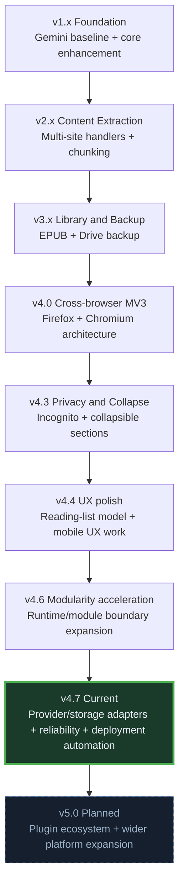

## Roadmap

> Last updated: 2026-04-19 — Current version: **4.7.0**

---

### Version Timeline

Diagram elements:

- v1: Foundation baseline for Gemini enhancement.
- v2: Content extraction/chunking maturation.
- v3: Library/export/backup feature set.
- v4.0: Cross-browser MV3 runtime baseline.
- v4.3: Privacy/collapsible feature milestone.
- v4.4: UX-focused release branch.
- v4.6: Stronger runtime modularization phase.
- v4.7: Current architecture and reliability baseline.
- v5.0: Planned plugin/platform expansion.

---

### Current Source of Truth

- Detailed execution plan and unit tracking: [TECHNICAL_ROADMAP.md](./TECHNICAL_ROADMAP.md)
- This file is a concise status view for contributors.

---

### Completed Through v4.7.x

1. Chunking runtime with per-chunk controls, cache, and summary groups.
2. Handler ecosystem formalization and deterministic build-time registration validation.
3. AI provider adapter pattern in place (Gemini + OpenAI-compatible + Ollama baseline adapters).
4. Storage adapter boundary in place with active sync provider wiring.
5. Build-time secret validation and documented env mapping.
6. OAuth reliability hardening across desktop/mobile callback paths.
7. Landing to extension awareness contract (`EXTERNAL_PING`) and compatibility integration.
8. Cross-surface compatibility artifacts and parity check scaffolding.
9. Deployment automation track marked completed (store workflow gating/reporting path).

---

### Active Now (High Priority)

1. **Phase 8 completion follow-through**:
- Manual restore-path parity execution/checklist completion in real browser runtimes.

2. **Runtime hotspot watch**:
- `src/content/content.js` remains a watchlisted hotspot, but Phase 1 is closed and the remaining work is follow-on maintenance rather than the primary blocker.

---

### Planned Next

1. Continue contributor-focused modular contracts and docs where implementation changes require updates.
2. Prepare v5.0 plugin-friendly expansion path without regressing local-first behavior.
3. Refresh graphify-out/GRAPH_REPORT.md when large structural refactors change module boundaries.

---

### Ongoing Themes

1. Performance and memory optimizations in runtime hotspots.
2. New supported websites via additional handlers.
3. Improved testing coverage (unit and integration).
4. Documentation quality and contributor onboarding clarity.
5. User feedback collection and UX iteration.

---

Navigation: [Main Docs](../README.md) | [Technical Roadmap](./TECHNICAL_ROADMAP.md) | [Development TODO](../development/TODO.md)
