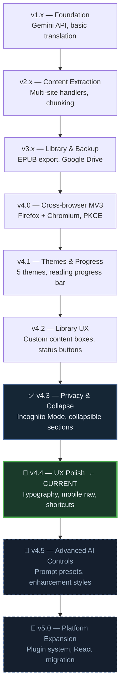

## Roadmap

> Last updated: 2025-07-01 — Current version: **4.4.0**

---

### 🗺️ Version Timeline

**Diagram elements:**

- `v1` Foundation baseline (Gemini + initial enhancement workflow)
- `v2` Content extraction and chunking stabilization
- `v3` Library/export/backup maturation
- `v4.0` MV3 cross-browser architecture
- `v4.1` Theme and reading-progress UX improvements
- `v4.2` Library UX and metadata quality improvements
- `v4.3` Privacy/collapsible milestone currently released
- `v4.4` Active sprint for UX polish and reading-list model cleanup
- `v4.5` Planned advanced AI controls
- `v5.0` Planned platform expansion and plugin foundation

---

### ✅ Completed

1. **Chunking system** — chapters auto-split by configurable `Chunk_Size`; each chunk has its own regenerate, cache, show-original, and per-chunk enhance buttons. Summary buttons repeat every `Chunk_Summary_Count` chunks.

2. **Modularity**
   - Website handlers: `src/utils/website-handlers/`  (`*-handler.js`, auto-registered)
   - Library website pages: `src/library/websites/`
   - AI model adapters placeholder: `src/utils/model-handlers/` (future)
   - Build pipeline auto-generates `handler-registry.js` and manifest domain lists

3. **Library & export** — EPUB export with per-novel metadata; word-count column in export template; novel completion status; character / relationship section separation.

4. **Backup system** — Google Drive OAuth PKCE; rolling 3-backup retention; backup model selector; continuous backup scheduling.

5. **Cross-browser (MV3)** — Firefox + Chromium (Edge) via unified service-worker background. Dynamic build separates manifests.

6. **Theme system** — 5 new themes (v4.1.0); auto schedule by time-of-day and sunrise / sunset.

7. **Incognito Mode** (v4.3.0) — auto-expiry no-trace reading sessions.

8. **Collapsible sections** (v4.3.0) — fight scenes, R18, author notes.

9. **Canvas animations** — particle / ember system on popup load.

10. **FichHub integration** — novel search and metadata import.

---

### 🚀 Active (v4.4.0)

- Fix summary typography parity (inherit page font across all sites)
- Harden summary truncation flow (`isLowQualityLongSummary` + `getSummaryOutputBudget`)
- Fix summarize keyboard shortcut wiring end-to-end
- Redesign mobile nav UX (bottom bar, larger tap targets)
- BetterFiction toggle bridge end-to-end verification
- Reading-list model (`rereading` as list/state badge, not primary status)

---

### 🔮 Future

1. **React migration** — Popup and library converted to React for better reuse.
2. **v5.0.0 Plugin system** — Custom handler plugins; REST API for third-party integrations.
3. **Cross-device sync** — Firefox Sync integration; conflict resolution.
4. **More reading services** — FBReader sync, Dropbox / OneDrive backup adapters.
5. **New handlers** — Wattpad, Royal Road.
6. **Notification centre** — Grouped notifications page in library + popup.
7. **AI preset library** — Genre-based enhancement style presets.
8. **Accessibility pass** — Full keyboard navigation; ARIA labels; screen-reader support.

---

**Navigation:** [Main Docs](../README.md) | [TODO.md](../development/TODO.md) | [CHANGELOG](../release/CHANGELOG.md)

10. Improve the performance of the extension by optimizing the code and reducing the memory usage (ongoing)

11. Add more websites to the supported list by creating new handlers (ongoing)

12. Improve the testing coverage of the extension by adding more unit and integration tests (ongoing)

13. Improve the documentation of the extension by adding more examples and tutorials (ongoing)

14. Gather user feedback and suggestions to improve the extension (ongoing)
