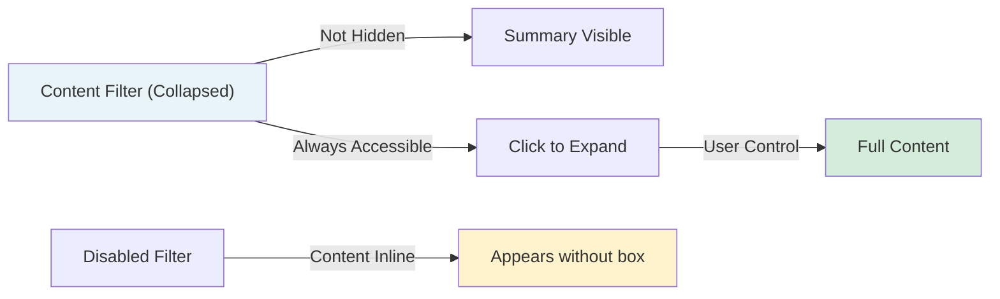

# The Journey to Ranobe Gemini v4.4.0 — Visual Architecture

> _How a reading experience evolved from one-direction text to intelligent, user-controlled content presentation._

---

## Key Concept: Collapse vs. Hide

**Collapsing ≠ Hiding**



- **Collapsed**: Summary visible, full content hidden behind toggle (always recoverable)
- **Expanded**: Full content visible, summary hidden
- **Disabled**: Content appears normally in page flow, no collapsible wrapper
- **Hidden vs Collapsible**: We COLLAPSE (user controls visibility), never permanently hide

---

## Act 1: The Foundation (v1.0 - v2.0)

```
┌─────────────────────────────────────┐
│     Ranobe Gemini v1.0 Genesis      │
├─────────────────────────────────────┤
│ Simple workflow:                    │
│ 1. User reads chapter on web        │
│ 2. Click "✨ Enhance with Gemini"   │
│ 3. Get back formatted HTML          │
│ 4. Inject into page                 │
│ 5. Read enhanced version            │
└─────────────────────────────────────┘
           ↓↓↓
    Problem Emerges:
    ❌ Fight scenes: 20 lines, breaks reading
    ❌ Adult content: Inappropriate context
    ❌ Author notes: Tangential interruptions
```

---

## Act 2: First Solution (v3.0)

```
┌──────────────────────────────────┐
│ v3.0: Basic Content Filtering    │
├──────────────────────────────────┤
│ Simple hide/show toggle          │
│ Frontend-only parsing            │
│ No Gemini awareness              │
└──────────────────────────────────┘
           ↓
    Limitations Found:
    ⚠️ Users still see structure
    ⚠️ No summaries provided
    ⚠️ Manual page-by-page control
    ⚠️ Accessibility issues (TTS)
```

---

## Act 3: The Intelligent System (v4.4.0+)

### Layer 1: Gemini-Aware Markup

```
┌──────────────────────────┐
│  Gemini Instruction Set  │
├──────────────────────────┤
│                          │
│  For comprehension:      │
│  [Wrap fight scenes in   │
│  <div class="...">]      │
│                          │
│  For privacy:            │
│  [Mark R18 content]      │
│                          │
│  For pacing:             │
│  [Flag long author notes]│
│                          │
└──────────────────────────┘
         ↓
      HTML Output:
┌────────────────────────────────────┐
│<div class="rg-collapsible-section" │
│     data-type="fight"              │
│     data-summary="Kael wins">      │
│  [Full fight details]              │
│</div>                              │
└────────────────────────────────────┘
```

### Layer 2: Storage & Configuration

```
┌─────────────────────────────────────────┐
│   browser.storage.local                 │
├─────────────────────────────────────────┤
│ contentFilterSettings: {                │
│   fight: {                              │
│     enabled: true,                      │
│     defaultCollapsed: true              │
│   },                                    │
│   r18: {                                │
│     enabled: true,                      │
│     defaultCollapsed: true              │
│   },                                    │
│   authorNote: {                         │
│     enabled: true,                      │
│     defaultCollapsed: false             │
│   },                                    │
│   custom: [...]                         │
│ }                                       │
└─────────────────────────────────────────┘
```

### Layer 3: Processing Pipeline

```
        Gemini Response
        ↓(with collapsible markers)
            ┌───────────────────┐
            │ content.js        │
            │ (injected script) │
            └───────────────────┘
                    ↓
        ┌──────────────────────────┐
        │ renderCollapsibleSections│
        │   (main processor)       │
        └──────────────────────────┘
           ↓           ↓           ↓
    ┌──────────┐ ┌──────────┐ ┌──────────┐
    │ Fight    │ │  R18     │ │ Author   │
    │ Scenes   │ │ Content  │ │ Notes    │
    └──────────┘ └──────────┘ └──────────┘
           ↓           ↓           ↓
        buildCollapsibleWrapper() × N
           ↓           ↓           ↓
    ┌──────────────────────────────────┐
    │ Interactive Wrappers w/ Headers  │
    │ + Summaries + Toggle buttons     │
    └──────────────────────────────────┘
           ↓
    Rendered in Chapter View
```

### Layer 4: User Interface Control

```
┌─────────────────────────────────────────┐
│   Library Settings → Content Filters 🔽 │
├─────────────────────────────────────────┤
│                                         │
│ ⚔️ Fight Scenes     [✓ ON] [Collapsed]  │
│ 🔞 Mature Content    [✓ ON] [Collapsed] │
│ 📝 Author's Notes    [✓ ON] [Expanded]  │
│                                         │
│ ✨ Custom Types:                        │
│  + Flashback        [✓ ON] [Collapsed]  │
│  + World Exposition [✗ OFF]             │
│                                         │
│ [+ Add Custom Type]                     │
│ [💾 Save]                               │
│                                         │
└─────────────────────────────────────────┘
        ↓
   browser.storage.local.set
        ↓
   Next chapter uses these settings
```

### Layer 5: Content Rendering

```
┌─────────────────────────────────┐
│   Chapter DOM After Processing  │
├─────────────────────────────────┤
│                                 │
│ <p>Chapter text...</p>          │
│                                 │
│ ╔═══════════════════════════╗   │
│ ║ ⚔️ FIGHT SCENE      [▼ Read]║  ← Collapsed
│ ╠═══════════════════════════╣   │
│ ║ Kael defeats the knight   ║   │ Summary only
│ ╚═══════════════════════════╝   │
│                                 │
│ <p>Story continues...</p>       │
│                                 │
│ ╔═══════════════════════════╗   │
│ ║ 📝 AUTHOR'S NOTE   [▲ Hide]║  ← Expanded
│ ║ Thanks to patrons!        ║   │
│ ║ New chapter next week  ║   │ Full content
                           ║   │ visible
│ ╚═══════════════════════════╝   │
│                                 │
│ <p>Final paragraph...</p>       │
│                                 │
└─────────────────────────────────┘
```

---

## The Architecture Ecosystem

### System Components Map

```
                        ┌──────────────────────┐
                        │  User's Computer     │
                        │                      │
                  ┌─────┼──────────────────────┼─────┐
                  │     │                      │     │
            ┌─────▼─┐   │    ┌────────────────┐│     │
            │Browser│   │    │  Web Page      ││     │
            │       │   │    │  (Novel Site)  ││     │
            └─────┬─┘   │    └────────────────┘│     │
                  │     │     ▲                │     │
        ┌─────────┘     │     │ inject HTML    │     │
        │               │     │                │     │
        │         ┌─────▼─────┼────────────┐   │     │
        │         │ Extension │            │   │     │
        │         │ Content   │ ─────────┐ │   │     │
        │         │ Script    │ render   │ │   │     │
        │         │           │ visible  │ │   │     │
        │         └───────────┼──────────┘ │   │     │
        │                     │            │   │     │
        │          ┌──────────▼────────┐   │   │     │
        │          │collapsible-       │   │   │     │
        │          │sections.js        │   │   │     │
        │          │                   │   │   │     │
        │          │ • Parse sections  │   │   │     │
        │          │ • Create wrappers │   │   │     │
        │          │ • Bind toggles    │   │   │     │
        │          │ • TTS support     │   │   │     │
        │          └┬──────────────────┘   │   │     │
        │           │                      │   │     │
        │         ┌─▼──────────────────┐   │   │     │
        │         │ Storage Layer      │   │   │     │
        │         │ contentFilterSet.. │   │   │     │
        │         └───────────────────┘   │   │     │
        │                                 │   │     │
        └──────────────────────────────────┘   │     │
                                               │     │
                                    ┌──────────▼──┐  │
                                    │ Settings UI │  │
                                    │ Panel       │  │
                                    └─────────────┘  │
                                               │     │
                └──────────────────────────────┴─────┘
```

---

## Feature Lifecycle: Understanding What You See

### When User Clicks "Enhance Chapter"

```
Timeline:
0s    - User clicks "✨ Enhance with Gemini"
      - Request sent to Gemini API

2-5s  - Gemini processes: "This is fight scene → wrap it"
      - Response: HTML with markers

5-6s  - Browser extension receives response
      - content.js injects HTML into page

6+    - renderCollapsibleSections() called
      - Reads contentFilterSettings from storage
      - Transforms all .rg-collapsible-section → wrappers
      - User sees interactive boxes!

✅    - Fight scenes: Collapsed (shows summary only)
      - R18 content: Collapsed (shows summary only)
      - Author notes: Expanded (shows full text)
      - Custom types: Per-user settings
```

---

## Settings UI Walkthrough

### Navigation Path: User Wants to Disable Fights

```
Library Main Page
   ↓ (Click ⚙️ Settings button)
Settings Page Opens
─────────────────────────────────────
Sidebar Navigation:
  • General 💾
  • Backups ☁️
  • Automation ⚡
  • Sites 🌐
  • Prompts ✍️
  • Statuses 📋
  • Advanced ⚙️
  • Copy Format 📋
  • Content Filters 🔽  ← Click here
  • Content Boxes 🎨
─────────────────────────────────────
   ↓
Content Filters Panel Opens
─────────────────────────────────────
   [What are Collapsible Sections?]

   Built-in Types:

   ⚔️ Fight Scenes         [Toggle]
   Default: Collapsed

   🔞 Mature Content       [Toggle]
   Default: Collapsed

   📝 Author's Notes       [Toggle]
   Default: Expanded

   ✨ Custom Types:
   [+ Add Custom Type]

   [Playground Examples]

   [💾 Save]
─────────────────────────────────────
   ↓ (Toggle off Fight Scenes)
   ↓ (Click Save)

Settings Saved to browser.storage.local
   ↓
   ✅ "✅ Content filter settings saved!"

   ↓
   Next chapter enhanced:
   → Fight scenes NOT wrapped
   → Content appears inline
```

---

## Data Flow Diagram: Single Request

```
User Action
   ↓
REQUEST PHASE:
   │
   ├─→ Settings UI loaded
   │   └─→ browser.storage.local.get("contentFilterSettings")
   │       └─→ {fight: {enabled: true, defaultCollapsed: true}, ...}
   │
   └─→ Chapter enhancement requested
       └─→ Gemini API call (with system prompt including settings)
           └─→ Gemini knows: "User has fight scenes enabled, marked collapsible"
               └─→ Response HTML with <div class="rg-collapsible-section" data-type="fight">

PROCESSING PHASE:
   │
   ├─→ content.js receives HTML
   │   └─→ createEnhancedChapter(html)
   │       └─→ document.getElementById("chapter").innerHTML = html
   │
   └─→ renderCollapsibleSections() invoked
       ├─→ Load settings from storage (again, in-page)
       ├─→ Query all .rg-collapsible-section elements
       ├─→ For each element:
       │   ├─→ Check: is type enabled?
       │   ├─→ Check: what's default collapsed state?
       │   ├─→ Load: type metadata (colors, icon, label)
       │   ├─→ Build: wrapper DOM
       │   ├─→ Attach: toggle event listener
       │   └─→ Replace: element with wrapper
       │
       └─→ Query all .rg-author-note[data-collapse=true] elements
           └─→ Process similarly

RENDERING PHASE:
   │
   └─→ Fully rendered chapter visible
       ├─→ Regular text: Normal reading flow
       ├─→ Fight Scene: Collapsed box with summary
       ├─→ R18 Content: Collapsed box with summary
       ├─→ Author Notes: Expanded with full text (default)
       │
       └─→ User can:
           ├──→ Click headers to toggle
           ├──→ Read aloud (respects state)
           └──→ Use Read With Me (follows changes)
```

---

## From Problem to Solution: The Evolution

### Problem: Fighting Overwhelm

| Before v4.4.0                            | After v4.4.0                                    |
| ---------------------------------------- | ----------------------------------------------- |
| 30-line fight scene in middle of chapter | 1-line summary visible, expand button available |
| Reader skips or scrolls frantically      | Reader controls when to dive deep               |
| Content misses: WHO won?                 | Gemini adds: "Kael defeats shadow warrior"      |

### Problem: Privacy/Comfort

| Before                          | After                                  |
| ------------------------------- | -------------------------------------- |
| Explicit scene mixed with story | Summary visible, full content hidden   |
| Public reading awkward          | Can quickly collapse, continue reading |
| TTS reads everything            | TTS respects collapsed state           |

### Problem: Pacing

| Before                              | After                                   |
| ----------------------------------- | --------------------------------------- |
| Author's rambling breaks story flow | Long notes collapsible by default       |
| User forced to read or skip         | Summary + option to read if interested  |
| No user preference system           | Settings saved, applies to all chapters |

---

## The Complete User Journey

```
┌─────────────────────────────┐
│ 1. User Opens Novel Site    │
├─────────────────────────────┤
│ Sees normal chapter         │
│ [✨ Enhance]  [← Settings]  │
└─────────────────────────────┘
       ↓
┌─────────────────────────────┐
│ 2. First Time: Settings Up  │
├─────────────────────────────┤
│ User visits:                │
│ Settings → Content Filters  │
│                             │
│ Sees default behavior:      │
│ • Fights: Collapsed         │
│ • R18: Collapsed            │
│ • Notes: Expanded           │
│                             │
│ User customizes:            │
│ • Turns OFF R18 collapsing  │
│ • Adds custom type:         │
│   "Lore Dump" → Collapsed   │
│ • Clicks Save               │
└─────────────────────────────┘
       ↓
┌─────────────────────────────┐
│ 3. User Enhances Chapter    │
├─────────────────────────────┤
│ Clicks ✨ Enhance           │
│ (Settings auto-sent)        │
│                             │
│ Gemini response:            │
│ • Marks fight → collapsible │
│ • Marks R18 → NOT wrapped   │
│ • Marks lore → collapsible  │
│ • Marks notes → expanded    │
└─────────────────────────────┘
       ↓
┌─────────────────────────────┐
│ 4. Reads Enhanced Chapter   │
├─────────────────────────────┤
│ [Normal paragraph]          │
│                             │
│ ╔ ⚔️ FIGHT [▼ Read] ╗       │
│ ║ Summary only...  ║        │
│ ╚════════════════════╝      │
│                             │
│ [Normal paragraph]          │
│                             │
│ [R18 content → Visible]     │
│                             │
│ ╔ 📚 LORE [▼ Read] ╗        │
│ ║ Summary...       ║        │
│ ╚════════════════════╝      │
│                             │
│ ╔ 📝 NOTE [▲ Hide] ╗        │
│ ║ Full author note ║        │
│ ║ is visible...    ║        │
│ ╚════════════════════╝      │
└─────────────────────────────┘
       ↓
┌─────────────────────────────┐
│ 5. User Interacts           │
├─────────────────────────────┤
│ Clicks fight header:        │
│ → Expands to show details   │
│                             │
│ Clicks lore header:         │
│ → Expands worldbuilding     │
│                             │
│ Clicks note header:         │
│ → Collapses author tangent  │
│                             │
│ Uses "Read Aloud":          │
│ → TTS respects each state   │
│ → Doesn't read hidden text  │
└─────────────────────────────┘
       ↓
┌─────────────────────────────┐
│ ✅ Customized Experience    │
│                             │
│ User gets exactly what they │
│ want: fight details optional,
│ R18 visible, lore summaries,
│ notes tucked away.          │
│                             │
│ Settings persist across     │
│ chapters & sessions!        │
└─────────────────────────────┘
```

---

## Behind the Scenes: Code Connections

### File Relationships

```
┌─────────────────────────────────────────┐
│         Gemini-Aware Backend            │  ← Sends HTML with markers
└─────────────┬───────────────────────────┘
              │ (enhanced HTML response)
              ↓
┌─────────────────────────────────────────┐
│    src/content/content.js                │  ← Injects into page
│ • Receives HTML from background         │  ← Calls renderCollapsibleSections()
└─────────────┬───────────────────────────┘
              │ (calls function)
              ↓
┌─────────────────────────────────────────┐
│   src/utils/collapsible-sections.js     │  ← Main logic
│ • Reads storage settings                │
│ • Transforms section elements           │
│ • Builds wrapper DOM                    │
│ • Binds toggle events                   │
└─────────────┬───────────────────────────┘
              │ (needs settings)
              ├────────────────┐
              ↓                ↓
    ┌──────────────────┐  ┌──────────────────────┐
    │ storage.local    │  │ Typed Settings:      │
    │ contentFilter    │  │ fight, r18, custom   │
    │ Settings         │  │                      │
    └──────────────────┘  └──────────────────────┘
              ↑                │
              │ (reads/writes) │ (configured via)
              ↓                ↓
        ┌──────────────────────────┐
        │ src/library/             │
        │ library-settings.html    │  ← Settings UI
        │ library-settings.js      │  ← Event handlers
        └──────────────────────────┘
              │ (user clicks Save)
              ↓
        ┌──────────────────────────┐
        │ Content Filters Panel    │  ← Display toggles
        ├──────────────────────────┤   ← Dropdowns
        │ Toggles:                 │   ← Custom editor
        │ • Fight scenes           │   ← Playground
        │ • R18 content            │   ← Save button
        │ • Author notes           │
        │ Custom types: [+Add]     │
        │ Playground: [Live demos] │
        │ [💾 Save]                │
        └──────────────────────────┘
```

---

## Version Timeline

```
v1.0 (2025)
  └─ Basic Gemini integration

v2.0
  └─ Content box support

v3.0
  └─ Simple content filtering

v3.5
  └─ Landing page showcase

→→→ MAJOR UPGRADE POINT ←←←

v4.4.0 ⭐ (March 2026)
  ├─ Gemini-aware collapsible markup
  ├─ Complete storage system
  ├─ Rich settings UI
  │  ├─ Toggle switches
  │  ├─ Default state control
  │  ├─ Custom type editor
  │  └─ Interactive playground
  ├─ GitHub issue/discussion templates
  ├─ Enhanced commit history
  ├─ Comprehensive documentation
  │  ├─ COLLAPSIBLE_SECTIONS.md
  │  ├─ COLLAPSIBLE_JOURNEY.md (this file)
  │  └─ API documentation
  └─ TTS/Read-aloud integration

v4.5.0 (Future)
  ├─ Animated transitions
  ├─ Per-chapter state memory
  └─ Custom CSS theming
```

---

## Why This Architecture Matters

✅ **User Control**: Settings respected across all sessions
✅ **Privacy**: Can hide mature content without seeing it
✅ **Performance**: Collapsible divs don't load outside content
✅ **Accessibility**: TTS knows collapsed state
✅ **Extensibility**: Custom types easily added
✅ **Maintainability**: Clear separation of concerns
✅ **Testing**: Each layer independently verifiable

---

## Summary: The Big Picture

```
What looks simple on the surface...

  ╔════════════════════════╗
  ║ ⚔️ FIGHT [▼ Read]     ║
  ║ Kael defeats shadow.. ║
  ╚════════════════════════╝

...is actually powered by:

  ✓ Gemini understanding context
  ✓ Web extension API communication
  ✓ Storage persistence
  ✓ DOM manipulation
  ✓ Event handling
  ✓ State management
  ✓ Accessibility features
  ✓ Responsive design
  ✓ TTS integration
  ✓ User customization
  ✓ Comprehensive testing

All working together seamlessly to give users
⭐ Control ⭐ Privacy ⭐ Comfort ⭐ Choice
```

---

**Next Steps:**
- See [COLLAPSIBLE_SECTIONS.md](../features/COLLAPSIBLE_SECTIONS.md) for reference docs
- Check [src/utils/collapsible-sections.js](../../src/utils/collapsible-sections.js) for implementation
- Visit Settings → Content Filters to test it out!

**Questions?** Open an issue on GitHub or start a discussion!
