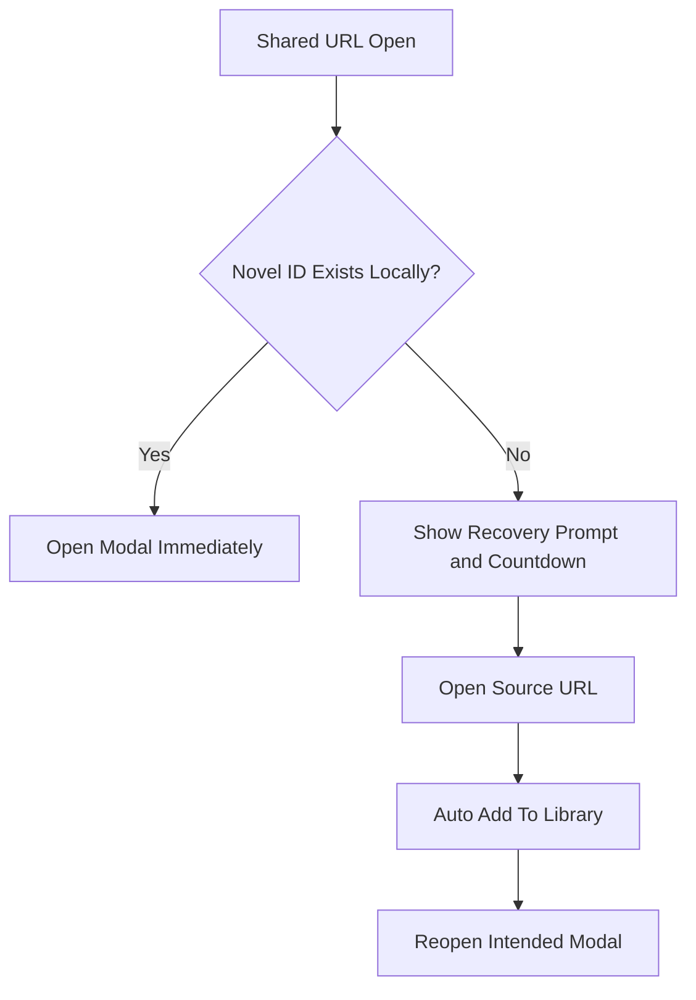
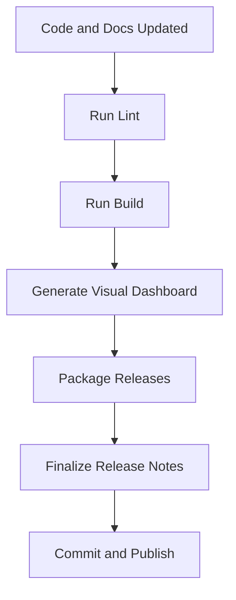

# Ranobe Gemini v4.6.0 Release Notes

Release date: March 25, 2026
Branch: main
Status: Stable

---

## Overview

v4.6.0 is a workflow-focused platform release that improves sharing, recovery, installability, and release-readiness. The headline updates are:

- shareable deep-link modal URLs that work consistently across main library and per-site shelf pages,
- missing deep-link recovery with guided prompt and timed auto-import flow,
- true web PWA foundation for installable browser app entry,
- mobile control compaction improvements to prevent forced full-width control layouts,
- automated documentation visualization and updated release/documentation surfaces.

---

## Major Features

### 1. Shareable Modal Deep Links Across Library Surfaces

What changed:

- Deep-link shape is now standardized as query params using novel plus openModal.
- Main library and per-site shelf pages preserve these params during modal open.
- Shared URLs reopen the same modal context rather than dropping users into generic shelf views.

Why this matters:

- Better collaboration and QA reproduction.
- Reliable copy-paste sharing for specific novels.
- Reduced friction when moving between devices.

### 2. Missing-ID Recovery With Prompt and Auto-Import

What changed:

- If a deep-linked novel is missing locally, recovery logic now attempts source regeneration.
- Prompt includes countdown and optional manual confirmation.
- Auto path can open source page and re-add the novel into the library, then reopen the intended modal.

Why this matters:

- Shared links remain useful even when local storage is incomplete.
- Better resilience after cleanup/import/reset workflows.
- Fewer dead-end modal-open errors.

### 3. True Web PWA Companion Foundation

What changed:

- Added web manifest, service worker, offline page, and library hub entry page.
- Added install-prompt lifecycle support in landing scripts.
- Established extension-companion routing model from web app entry to extension library workflows.

Added files:

- landing/manifest.webmanifest
- landing/sw.js
- landing/offline.html
- landing/library-hub.html

Why this matters:

- Installable app-like entry on supported browsers.
- Better offline/low-connectivity user experience for landing surfaces.
- Clearer boundary between web PWA shell and extension runtime features.

### 4. Mobile Control Compaction

What changed:

- Primary control groups no longer force full-width behavior on narrow layouts.
- Wrapping and spacing behavior is more compact while preserving tap targets.

Why this matters:

- Faster interaction on narrow phones.
- Less scrolling and reduced control crowding.
- Better parity across website handlers.

### 5. Automated Documentation Visualizers

What changed:

- Added documentation visualizer generator and npm script.
- Generated dashboard documentation for architecture and feature overview views.

Added/updated:

- dev/generate-doc-visualizers.js
- docs/overview/VISUAL_DASHBOARD.md
- package.json script: docs:visualize

---

## Flow Snapshots

Diagram elements:

- A: user opens a shared deep-link URL
- B: lookup decision on local library state
- C: normal direct modal path
- D: recovery UX path when ID is missing
- E: source-page hydration step
- F: automatic library registration step
- G: successful return to the requested modal

Diagram elements:

- H: implementation and documentation completion
- I: static analysis gate
- J: extension build gate
- K: docs visualization refresh step
- L: packaging for browser targets
- M: full and short release-note finalization
- N: ready state for commit and publish

---

## Stability Fixes and Technical Improvements

- Timer declaration-order safety in recovery prompt handling.
- Reliable listener cleanup in tab-completion wait flow.
- Service worker syntax/cache flow hardening on landing PWA surface.
- Repository-wide lint warning cleanup completed (zero warnings, zero errors).

---

## Upgrade Notes

- Extension-first users can continue without migration steps.
- Android/Windows users can now install the web companion surface where supported.
- Firefox flow remains extension-first for full runtime features.

---

## Documentation Updated

- README.md
- docs/architecture/ARCHITECTURE.md
- docs/features/NOVEL_LIBRARY.md
- docs/overview/VISUAL_DASHBOARD.md
- docs/release/CHANGELOG.md
- docs/release/RELEASE_NOTES_4.6.0.md
- landing/install-guide.html

---

## Support

- Issues: https://github.com/Life-Experimentalist/RanobeGemini/issues
- Discussions: https://github.com/Life-Experimentalist/RanobeGemini/discussions

-----

# Ranobe Gemini v4.6.0 — Quick Release Notes

Release Date: March 25, 2026 | Status: Stable

---

## What Is New

### Shareable Deep-Link Modals

Modal URLs now preserve novel and openModal state across main library and shelf pages, making direct sharing reliable.

### Missing-ID Recovery

When a shared novel ID is missing locally, recovery prompt plus timed auto-import can restore and reopen the target modal.

### True Web PWA Foundation

Added web manifest, service worker, offline page, and install flow to enable installable companion entry on supported browsers.

### Mobile Control Improvements

Primary control groups now avoid forced full-width behavior and render more cleanly on narrow devices.

### Docs Automation

Added docs visualizer generation and updated architecture/release documentation for v4.6.0.

---

## Fixes

- Timer and cleanup robustness in recovery flows.
- Stable tab listener cleanup behavior.
- Service worker parse/cache reliability updates.
- Lint clean state across source files.

---

## Learn More

Full details: docs/release/RELEASE_NOTES_4.6.0.md

Architecture docs: docs/architecture/ARCHITECTURE.md

---

Built by VKrishna04 under Life Experimentalist
Report issues: https://github.com/Life-Experimentalist/RanobeGemini/issues
