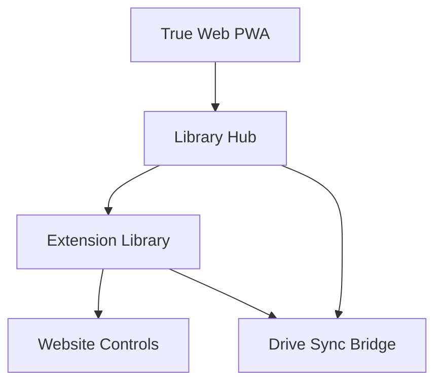

# Release Notes - v4.6.0

Release date: 2026-03-25

## Highlights

- Shareable deep-link modal URLs now work across main library and per-site shelf pages.
- Missing deep-link IDs now have guided recovery with prompt and auto-open/add flow.
- True web PWA foundation added for installable Android/Windows web app entry.
- Mobile RG controls now avoid forced full-width behavior for primary control groups.
- Automated documentation visualizers added with Mermaid-driven dashboards.

## Added

- Landing true web PWA assets:
  - `landing/manifest.webmanifest`
  - `landing/sw.js`
  - `landing/offline.html`
  - `landing/library-hub.html`
- Landing install prompt support via `beforeinstallprompt` handling in `landing/script.js`.
- Automated doc visualizer script:
  - `dev/generate-doc-visualizers.js`
  - npm script `docs:visualize`
- Auto-generated dashboard:
  - `docs/overview/VISUAL_DASHBOARD.md`

## Changed

- Modal open behavior now preserves shareable URL params in address bar.
- Shelf deep-link open handlers no longer consume and remove query params in modal-open paths.
- Missing-ID recovery now supports cross-shelf redirection to correct shelf modal pages.
- Mobile control CSS updated to keep primary RG controls compact and wrap-aware on narrow screens.
- `buildLibraryUrl` behavior is documented as cache-first when runtime URL is discovered.

## Fixed

- `showAutoImportPrompt` timer handle declaration order no longer risks reference errors.
- `waitForTabComplete` now guarantees listener and timeout cleanup across success/timeout paths.
- Landing PWA service worker parsing and caching logic validated and stabilized.

## Architecture Snapshot

Diagram elements:

- `A`: installable web app surface for supported browsers
- `B`: PWA launch surface for library workflows
- `C`: extension runtime for full novel feature set
- `D`: in-page controls (enhance/summarize)
- `E`: bridge channel for cross-surface data sync

## Upgrade Notes

- Users on extension-only workflow can continue unchanged.
- For app install on Android/Windows browsers, use the new web PWA install path from landing.
- Firefox users should continue using extension-first install flow.
