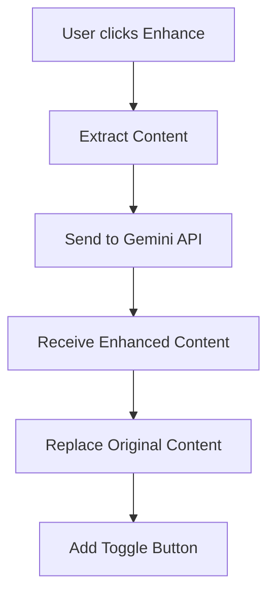
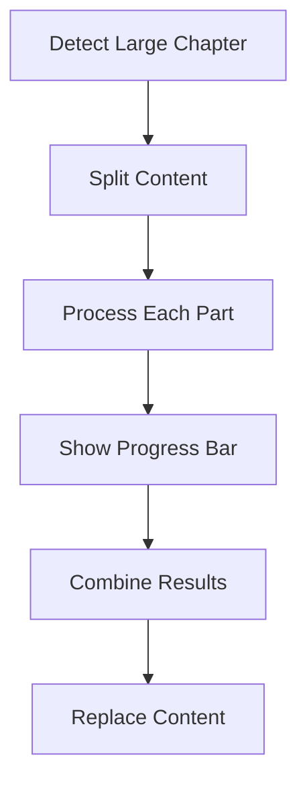
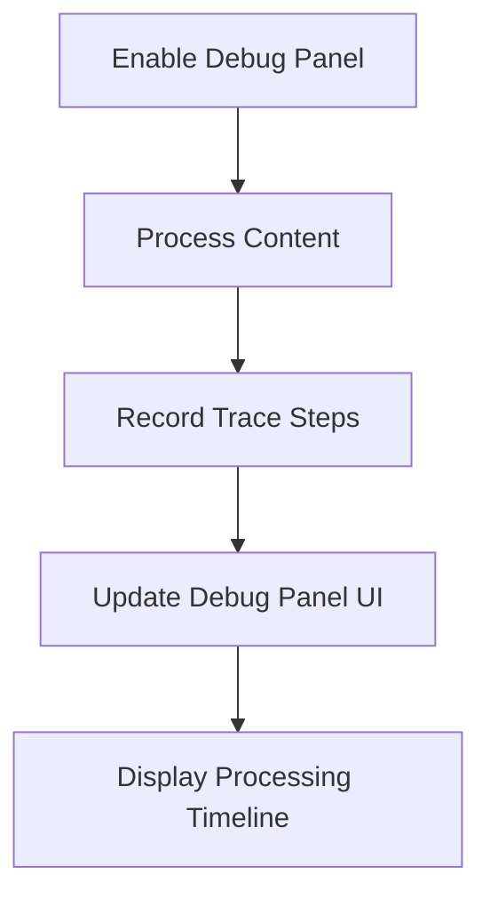

# RanobesGemini Documentation

Welcome to the RanobesGemini documentation! This guide will help you understand how to use and get the most out of the extension.

## User Guides

- [Debug Panel](debug-panel.md) - How to use the visual debug panel for advanced users
- [Large Chapter Handling](large-chapter-handling.md) - Guide to processing large chapters effectively

## Technical Documentation

- [Processing Flow](processing-flow.md) - How content is processed and enhanced
- [Debug Panel Implementation](technical/debug-panel-implementation.md) - Technical details of the debug panel
- [Content Splitting Algorithm](technical/content-splitting-algorithm.md) - Technical details of how large content is split
- [Content Splitting Visualization](technical/content-splitting-visualization.md) - Visual guide to content splitting
- [Error Handling](technical/error-handling.md) - How errors are managed and recovered from
- [Content Splitting Fix](content-splitting-fix.md) - Overview of the v2.4.0 content splitting improvements

## Other Resources

- [Changelog](../CHANGELOG.md) - History of changes and new features

## Diagrams

The documentation includes various diagrams to help visualize how the extension works:

### Basic Processing Flow

### Large Chapter Processing Flow

### Debug Panel Flow

