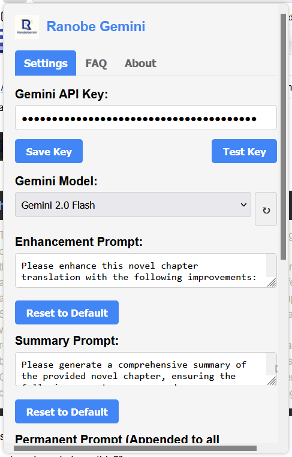

<!-- _class: lead -->
# Ranobe Gemini Extension

#### Enhancing Web Novel Translations with AI


---

# What is Ranobe Gemini?

A Firefox extension that enhances the reading experience on web novel sites using Google's Gemini AI:

- **Improves readability** of machine-translated novels
- **Fixes grammar and flow** of text
- **Summarizes chapters** to highlight key plot points
- **Works with multiple sites** with a modular architecture
- **Adapts to user preferences** with customizable settings

---

# Why Ranobe Gemini?

<div class="columns">

<div>

### Problem:
- Machine translations are often awkward and hard to read
- Grammar errors and inconsistent terminology
- Reading experience varies between different websites
- No standardized enhancement tools for web novels

</div>

<div>

### Solution:
- AI-powered text improvement right in the browser
- Consistent reading experience across websites
- One-click enhancement of entire chapters
- Chapter summarization to track complex storylines

</div>

</div>


---

# How It Works - Main UI

<div class="columns3">

<div>

### Extension seamlessly integrates into novel reading sites with simple, accessible controls
- **User-friendly interface** for easy navigation
- **Real-time enhancements** for immediate feedback

</div>

<div>

#### Extension Popup


</div>

</div>

---

# Extension User Interface

<div class="columns">

<div>

### Main Controls
- **Enhance with Gemini** - Improves text quality
- **Summarize Chapter** - Creates concise summary
- **Status Indicator** - Shows processing state
- **Restore Original** - Returns to unenhanced text

</div>

<div>

### Configuration Popup
- API key management
- Model selection
- Custom prompt configuration
- Advanced settings
- Theme preferences
- Token & context management

</div>

</div>


---

# User Experience Flow


---

# Key Features

<div class="columns">

<div>

### Content Enhancement
- Grammar correction
- Improved readability
- Flow enhancement
- Contextual understanding
</div>

<div>

### Summarization
- Concise chapter summaries
- Key plot points
- Character focus
- Thematic elements

</div>

---

# Key Features
<div class="columns">

<div>

### Technical Features
- Multiple Gemini models support
- Large chapter handling
- Responsive design
- Light/dark mode compatibility
- Modular website handlers

</div>

<div>

### User Experience
- Easy configuration
- Custom prompts
- Restore original content
- Seamless integration
- User-friendly interface

</div>
</div>

---

<h1 style="font-size: 4em;"> Use Cases: Readers & Learners </h1>

<div class="columns">

<div>

### Language Learners
- Improve understanding of complex text
- See proper grammar structures
- Compare original and enhanced versions
- Build vocabulary through contextual rewriting
- Use as editing tool for drafts
- Learn contextual word usage
</div>
<div>

### Casual Readers
- Enjoy smoother reading experience
- Skip filler content with summaries
- Maintain story coherence across breaks
- Better comprehension of plot elements

</div>

</div>

---

# Text Enhancement Before/After

<div class="columns">

<div>

### Before Enhancement
From what I understood, the Little Garden had a vast `worldview`, but `there were very few` beings `in the` double-digit ranks! The exact power level of a single-universe entity was unknown, but in this world, they were absolutely invincible!

</div>

<div>

### After Enhancement
From what I understood, the Little Garden had a vast `world building`, but beings `of` double-digit rank `were incredibly rare`! The exact power level of a single-universe entity was unknown, but in this world, they were absolutely invincible!

</div>

</div>

---

# System Architecture

<div class="mermaid">
%%{init: {"theme":"neutral", "themeVariables": {"primaryColor":"#f0e6d2", "primaryTextColor":"#333", "primaryBorderColor":"#6d5e49", "lineColor":"#6d5e49", "secondaryColor":"#ffeedd", "tertiaryColor":"#fff8ee"}}}%%
graph TD
    A[User Browser] --> B[Content Script]
    B <--> C[Website Handler]
    B <--> D[Background Script]
    D <--> E[Gemini API]
    F[Popup Interface] <--> D
    G[Storage API] <--> D

    subgraph "Content Layer"
        B
        C
    end

    subgraph "Processing Layer"
        D
        G
    end

    subgraph "External Service"
        E
    end

    subgraph "Configuration"
        F
    end

    classDef browser fill:#ffd9b3,stroke:#b38666,stroke-width:2px
    classDef content fill:#fff2dc,stroke:#d9b577,stroke-width:2px
    classDef processing fill:#d9ead3,stroke:#76a567,stroke-width:2px
    classDef external fill:#f9cb9c,stroke:#b6854d,stroke-width:2px
    classDef config fill:#d0e0e3,stroke:#6fa8dc,stroke-width:2px

    class A browser
    class B,C content
    class D,G processing
    class E external
    class F config

    linkStyle default stroke-width:2px,stroke:#6d5e49
</div>

---

# Website Handler System

<div class="mermaid">
%%{init: {"theme":"neutral", "themeVariables": {"primaryColor":"#f0e6d2", "primaryTextColor":"#333", "primaryBorderColor":"#6d5e49", "lineColor":"#6d5e49", "secondaryColor":"#ffeedd", "tertiaryColor":"#fff8ee", "noteTextColor":"#333", "noteBkgColor":"#fff2dc", "noteBorderColor":"#d9b577"}}}%%
classDiagram
    direction TB

    class BaseHandler {
        <<abstract>>
        +canHandle(url) bool
        +getContent(document) string
        +getTitle(document) string
        +getUIInsertionPoint(container) object
    }

    class HandlerManager {
        -handlers[] BaseHandler
        +registerHandler(handler) void
        +getHandler(url) BaseHandler
    }

    class RanobesHandler {
        +canHandle(url) bool
        +getContent(document) string
        +getTitle(document) string
    }

    class FanfictionHandler {
        +canHandle(url) bool
        +getContent(document) string
        +getTitle(document) string
    }

    BaseHandler <|-- RanobesHandler : extends
    BaseHandler <|-- FanfictionHandler : extends
    HandlerManager --> BaseHandler : manages

    note for BaseHandler "Defines handler interface"
    note for HandlerManager "Selects handler by URL"
</div>

---

###### Data Flow

<div class="mermaid">
%%{init: {"theme":"neutral", "themeVariables": {"primaryColor":"#f0e6d2", "primaryTextColor":"#333", "primaryBorderColor":"#6d5e49", "lineColor":"#6d5e49", "secondaryColor":"#ffeedd", "tertiaryColor":"#fff8ee", "noteTextColor":"#333", "noteBkgColor":"#fff2dc", "noteBorderColor":"#d9b577", "actorBkg":"#ffd9b3", "actorBorder":"#b38666", "activationBkgColor":"#d9ead3", "activationBorderColor":"#76a567"}}}%%
sequenceDiagram
    participant User
    participant CS as Content Script
    participant WH as Website Handler
    participant BS as Background Script
    participant API as Gemini API

    User->>CS: Click "Enhance" button
    CS->>WH: Extract content
    WH-->>CS: Return content
    CS->>BS: Send for processing
    BS->>API: Send request
    API-->>BS: Return enhanced
    BS-->>CS: Return processed
    CS->>User: Display enhanced

    Note over BS,API: Large content is split into chunks
</div>

---

# Processing Large Content

<div class="mermaid">
%%{init: {"theme":"neutral", "themeVariables": {"primaryColor":"#f0e6d2", "primaryTextColor":"#333", "primaryBorderColor":"#6d5e49", "lineColor":"#6d5e49", "secondaryColor":"#ffeedd", "tertiaryColor":"#fff8ee"}}}%%
graph TD
    A[Chapter Text] -->|Split| B[Chunk 1]
    A -->|Split| C[Chunk 2]
    A -->|Split| D[Chunk 3]

    subgraph "Processing"
    B --> E[Process 1]
    C --> F[Process 2]
    D --> G[Process 3]
    end

    E & F & G --> H[Combine Results]
    H --> I[Enhanced Chapter]

    classDef input fill:#ffd9b3,stroke:#b38666,stroke-width:2px
    classDef process fill:#d9ead3,stroke:#76a567,stroke-width:2px
    classDef output fill:#d0e0e3,stroke:#6fa8dc,stroke-width:2px

    class A input
    class B,C,D,E,F,G,H process
    class I output

    linkStyle default stroke-width:2px,stroke:#6d5e49
</div>

---

# UI Integration & Responsiveness

<div class="columns3">

<div>

### Mobile View
- Condensed spacing
- Simplified UI for small screens
- Enhanced accessibility features

### Desktop View
- Horizontal button layout
- Multi-column layout options

</div>

<div>

### Theme Integration
- Adapts to site's light/dark mode
- Compatible with Dark Reader extension
- Respects user system preferences
- Seamless content area integration

</div>

</div>

---

# Customizable Prompts

The extension allows users to customize AI prompts for different content needs:

<div class="columns">
<div>

Users can add special instructions for:
- Style preferences (formal/casual)
- Terminology consistency
- Character voice preservation
- Special literary techniques
- Contextual hints for AI
</div>

<div>

```markdown

You are a helpful assistant that enhances machine-translated fiction.
Improve this chapter by:
- Fixing grammar and spelling errors
- Improving sentence flow and readability
- Maintaining the original meaning and style
- Preserving all important plot details

Original chapter to enhance:
{{CHAPTER_CONTENT}}

```

</div>


---

# Version History Highlights

<div class="columns">

<div>

### v2.2.0
- Responsive design (mobile/desktop)
- Complete theme integration
- Improved API key handling
- Dark Reader compatibility

</div><div>

### v2.1.0
- Separate model selection for summaries
- Enhanced large chapter handling
- Better token limit management
- Improved error handling

</div>

</div>

---

# Adding Support for New Websites

<div class="mermaid">
%%{init: {"theme":"neutral", "themeVariables": {"primaryColor":"#f0e6d2", "primaryTextColor":"#333", "primaryBorderColor":"#6d5e49", "lineColor":"#6d5e49", "secondaryColor":"#ffeedd", "tertiaryColor":"#fff8ee"}}}%%
flowchart TD
    subgraph "Implementation Steps"
    A[Identify Website] --> B[Inspect DOM]
    B --> C[Create Handler]
    C --> D[Implement Methods]
    end

    subgraph "Integration"
    D --> E[Register in Manager]
    E --> F[Update manifest.json]
    end

    subgraph "Testing & Deployment"
    F --> G[Test on Website]
    G -->|Issues| D
    G -->|Works| H[Submit PR]
    end

    subgraph "Core Methods"
    D1[canHandle]
    D2[getContent]
    D3[getTitle]
    D4[getUIInsertionPoint]
    end

    D --- D1 & D2 & D3 & D4

    classDef start fill:#ffd9b3,stroke:#b38666,stroke-width:2px
    classDef process fill:#d9ead3,stroke:#76a567,stroke-width:2px
    classDef methods fill:#fff2dc,stroke:#d9b577,stroke-width:2px
    classDef end fill:#d0e0e3,stroke:#6fa8dc,stroke-width:2px

    class A start
    class B,C,D,E,F,G process
    class D1,D2,D3,D4 methods
    class H end

    linkStyle default stroke-width:2px,stroke:#6d5e49
</div>

---

# Configuration Options

<div class="columns">

<div>

#### API & Models
- Gemini API key
- Model selection for enhancement
- Model selection for summarization
- Token limits and chunking options

#### Content Processing
- Enhancement prompt customization
- Summary prompt customization
- Permanent prompt option
- Advanced timeout settings

</div>

<div>

#### Display Settings
- Theme preferences
- Dark mode support
- Font size adjustments
- Content display style

#### Developer Options
- Debug logging
- Console verbosity
- Performance metrics
- Test mode

</div>

</div>

---

# Common Challenges & Solutions

<div class="columns">

<div>

### Content Extraction Challenges
- Complex DOM structures
- Dynamic content loading
- Protected content
- Advertisements and distractions
**Solution:**
Custom handlers with site-specific extraction logic, retry mechanisms, and visible text focus
</div>

<div>

### AI Processing Challenges
- Token limits
- Rate limiting
- Large chapters
- Processing errors

Content chunking, proportional token allocation, automatic retries, and fallback mechanisms
</div>

</div>

---

# Performance Optimization

<div class="columns">

<div>

### Metrics
- Average processing time: ~3-5s per 1000 words
- Content extraction: <500ms
- UI rendering: <100ms
- Response handling: ~200ms

</div>

<div>

### Optimizations
- Asynchronous content processing
- Progressive UI updates
- Deferred rendering
- Memory-efficient content handling
- Background processing prioritization

</div>

</div>

---

# Security & Privacy

- **User Data**: API keys stored locally in browser storage
- **Content**: Chapter text processed via Gemini API (Google Privacy Policy applies)
- **Permissions**: Limited to specific novel websites
- **Storage**: Enhanced content stored only in browser session
- **Tracking**: No user tracking or analytics
- **Updates**: Self-contained, manual Firefox add-on updates

---

# Future Development Roadmap

- Chrome extension port
- Custom site configuration for unsupported sites
- Translation mode (separate from enhancement)
- Batch processing of multiple chapters
- Offline mode with locally stored content
- Novel library management
- Community-driven prompt templates
- Extension API for other developers

---

<!-- _class: lead -->
# Thank You

## Contributing to Ranobe Gemini

**See our documentation:**
<div class="center, columns">

<div>

  [README](README.md)
  [NEW WEBSITES](ADDING_NEW_WEBSITES.md)

</div>
<div>

  [CONTRIBUTING](CONTRIBUTING.md)
  [ARCHITECTURE](ARCHITECTURE.md)

</div>
</div>

**GitHub: [RanobeGemini](https://github.com/Life-Experimentalist/RanobeGemini)**
**Powered by [Google Gemini API](https://ai.google.dev/)**